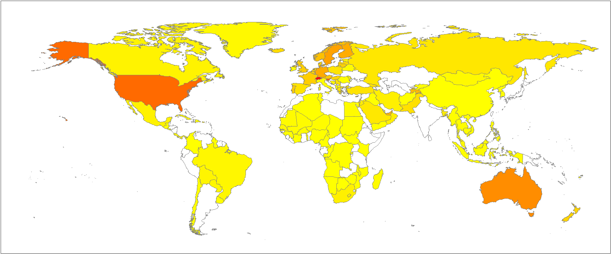
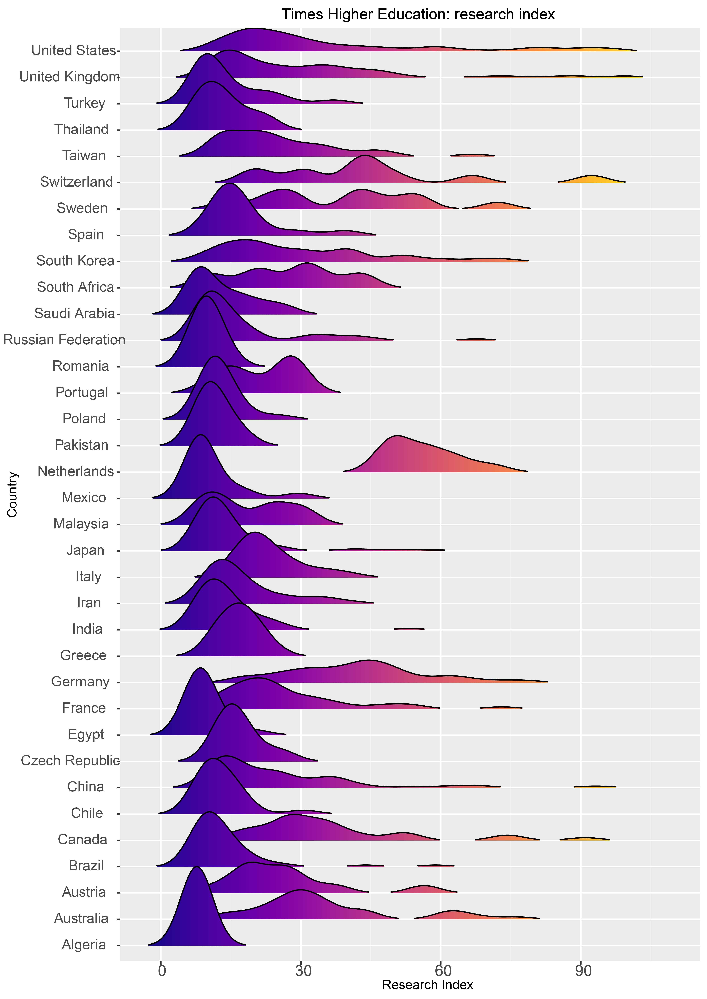

---
output:
  html_document: default
  pdf_document: default
---


\mainmatter

# Introduction  {#intro}

Right from the very start of your PhD, it is important for you to become familiar with the goal of what you are trying to achieve, how you plan to achieve it, and (believe it or not) what you plan to do afterwards. There are a lot of things to think about as you start your PhD, and for many of these it is far easier to make informed decisions from the outset. For example, reconciling yourself to using the [statistical package R](useR.html) will be much easier from the start, rather than only realising under pressure at the end of your PhD that there is no way that you can finish unless you take it on. Preparing yourself into the right mental framework will also be very important for your ability to work under pressure. Getting into good habits at the beginning will put you in a commanding position later. The aim of this first part of the book is to help you assess your current position, and realign yourself toward an optimum mindset.

## So you are doing a PhD? {#beforeyoustart}

Universities are worried about two major aspects of those who start PhD studies: 

 - The time to completion in many countries worldwide is much longer than it should be. For example, 7.5 years is the median time to completion in the USA [@geven2018how], Europe universities have largely adopted the Salzburg Principles that doctoral programmes should be three to four years for full-time candidates  [@christensen2005bologna]. Following this, an average is recorded as being between 3.5 and 4.5 years, with most institutions having reduced this time over the last 10 years [@hasgall2019doctoral].
 - Completion rates are shockingly low. As bad as 50% in the USA [@litalien2015improving], 66% (within 6 years) in Europe [@hasgall2019doctoral], but generally better in the sciences [@park2005new]. 
 
This has spurred many responsible for postgraduate students to try to ensure that they receive more support for their studies. But there is also the need for students to comprehend right from the start that they are undertaking a major commitment that will likely impact many different parts of their lives.

In this first chapter of the book, I intend to make you familiar with what a PhD is, how to approach thinking about it, and what to look for in an institution and advisor. You may already have some or all of these things fixed, but there is still some use in going over these basic points. Try to keep an open mind. Doing a PhD will take several years of your life, and may well define your future career prospects. Therefore, to say that this is a big decision is an understatement. It is not a substitute for getting a job or a way of remaining a student for longer. If after reading this section you are in any doubt about whether or not a PhD is right for you, then I would suggest that you do need to think about it further. Don't take my word for it, go and talk to people who have done a PhD (whether or not they now have a job), or those who are doing a PhD now. Especially if their experience is in your focal research area, they are likely to know a lot more about it. 

## What is a PhD?

PhD comes from the Latin _Philosophiae Doctor_, and means "Doctor of Philosophy". All doctorates derive from philosophy which is essentially the mother of all academic subjects. 

Obtaining a PhD allows you to (legitimately) call yourself a Doctor, and/or put the letters PhD after your name. You likely already have other letters (BSc, MSc, etc.) after your name, so this won't be anything new). Becoming a Doctor is (in most parts of the world) the last step in your formal training as a researcher. However, in some countries (see list [here](https://en.wikipedia.org/wiki/Habilitation)) a further process (Habilitation) is required to lead research groups and/or teach at universities (leading the way to a professorship).

PhDs are granted by universities (for the most part) and those are the institutions that set the standards. In many countries, these universities are required to meet the criteria of national bodies. Essentially, the top-down control is to ensure that the PhD qualification adheres to national and international standards. You may be aware that there are mutterings of whether qualifications are what they used to be. This has also been said of PhDs. However, I'm of the opinion that the standards are much as they were. You will really set the level on the bar of your own PhD. You either pass or fail. If your intention were to do the 'bare minimum' required to get a PhD, then you would have to look carefully for an advisor that would be happy to preside over such a thesis. Suffice it to say that this would be a very poor place to start, and if this were your attitude there may be lots of other reasons why doing a PhD really is not appropriate.

## Is a PhD more than a thesis?
Yes. The thesis is really only the final evidence of all of the work and experience that you undertake while doing your PhD. The time that you spend doing your PhD will likely include participating in conferences, giving talks, participating in journal clubs, seminars, workshops and working groups. In addition to all of the writing skills, on which this book focuses, you will develop skills in techniques that relate to your particular subject area, and learn to communicate this to different types of audience. You will also learn and develop your skills in presentation, analysis and treatment of data. It is an intense learning experience. It should also be a fun and positive experience. 

While your PhD thesis will be a crucial and focal product of your PhD, and producing it will require a large amount of work, the thesis cannot be considered equivalent to the PhD. 

Having said all of this, we have not really answered the question: 

__What is a PhD?__

Because every PhD is different, it's quite a hard question to answer. Instead, I think that a better approach is to ask for the qualities that examiners are asked to assess when examining your PhD thesis. Again, this will be different in different institutions and countries. Some countries require an oral defence where a specialist jury is presented with the PhD dissertation and can grill the candidate for hours in public. Others, like my defense at Bristol University, happened behind closed doors with just two specialist examiners: an internal and an external. 

## Criteria used to judge PhD studies {#criteria}
In order to provide you with some general idea of what is required, I list below the (edited) questions asked of examiners for a PhD thesis by my university (you should ask for the criteria at your own institution):

- Has the motivation for the objectives of the study been formulated satisfactorily?
- Do the research results constitute a meaningful contribution to the knowledge of and insight into the relevant field of study?
- Does the dissertation distinguish clearly between own, new contributions to, and known results in the relevant field of study?
- Is the candidate capable of evaluating the scientific meaning of their results and of placing this in context within existing knowledge in the field of study?
- Does the candidate show signs of independent, critical thinking or other signs of originality?
- Does the candidate show that they are sufficiently capable of doing independent research?
- Does the dissertation show that the candidate is sufficiently familiar with the relevant research techniques and methods?
- Does the dissertation show conversance with, and a critical attitude towards the pertinent literature?
- Is the material presented in a clear, systematic and logical manner?
- Is the linguistic, stylistic and technical editing of the dissertation acceptable?
- Are the research results acceptable for publication?

If you compare these PhD requirements with those of an MSc, the key difference is that for a PhD you are required to produce a "meaningful contribution to the knowledge of and insight into the relevant field of study", and show that you are "...capable of doing independent research". Thus, a PhD degree prepares you to be an independent researcher, and so you are expected to have a critical attitude towards other research.

## Who are the examiners?
The next question to ask is who the examiners are? Again, different institutions will have different guidelines about who can be an examiner for a PhD. It is likely that most will agree that they should be holders of PhDs, in tenured positions (sometimes universities insist on full professorial appointments for examiners), and with experience of advising PhD students as well as having a proven record of their own publications. Hence, most PhD examiners will likely be senior academic figures. Their views are likely to have been informed by their own experience in academia, their own institutions and systems and prior experience of examining PhDs at other institutions. 

I can tell you that many examiners will treat the exercise the same irrespective of the questions asked of them. They will treat the examination as an extra-large task in peer review. This is not unfair. Personally, I think that there are some special extra hurdles required for a PhD (over and above 5 data chapters that are publishable): 

- First is the clear ability to conceptualise and carry out a body of scientific work that is novel. Here I mean novel in that it has not simply been a repeat of some previous work on a different taxon or system. This is easier to judge from an oral defense, over reading the thesis. 
- Second is the clear knowledge of how the work that is conducted fits into the bigger picture. That is, that the work demonstrates that the person is a scientist at a broader level than the narrow focus of their research.
- Third is whether the student has been able to bring the study together in a way that shows that it is more than the sum of its parts. In essence, together the 5 data chapters should provide a bigger overview of a broader topic, and show the direction of future work.

I prefer a thesis that fits together within an explicit [conceptual framework](PhDintro.html). I like PhD students to conceptualise how their chapters are interlinked, and to present this as a figure in the introduction of their [proposal](proposal.html). A useful concept to be aware of is the 'Hierarchy of Hypotheses' [@heger2018hierarchy]. In this approach, you are encouraged to consider the '[bigger question](bigidea.html)' in your research area, identifying both what studies have produced compelling evidence, and identifying knowledge gaps from a theory driven approach. Generally, it is only possible to consider these types of concepts once you are familiar with the literature (both theoretical and experimental).

## What will you do after your PhD?
It sounds silly to think about what comes after your PhD just as you are just starting, but the reality is that you always need to be planning ahead in order to make the most of what you are doing now. During your PhD you will have lots of opportunities in many different areas of academia, teaching and practically applied areas. Knowing what you want to do when you finish will help guide your decisions so that you can maximise opportunities as they arise. Both inside and outside of academia, it is likely to be the contacts that you make that will help in your next career move. 

### Doing a PhD actually reduces your chance of employment and lowers your pay
The reality is that most employers don’t want someone with a PhD, because it is a very academic qualification. It will take you so far down an academic rabbit hole, that for an employer there’s very little to use. Most employers want people who understand the nuts and bolts of doing research, but who can apply this knowledge outside of the academic system. Employers who want people with PhDs (and there are a few) generally want professional researchers who are essentially academics. Good work if you can get it, but it tends not to pay well. You might end up only being fit to be an academic, and that life is getting increasingly harder without any end to the expectations of the employers… like the equivalent of doing a PhD every year. Something only very few people will enjoy.

At the same time, governments the world over, and especially developing countries, are providing bursaries for people to do PhDs. Why? The number of PhDs in a country is considered  (by the [World Bank](https://datacatalog.worldbank.org/dataset/world-development-indicators)) to be one of many measures of the development of that country. As the percentage gets larger, so countries can convince the World Bank that they are developing (and then get granted its favours, see Figure \@ref(fig:PhDMap)). This is all well and good, but strategically, governments should consider why they want these researchers in their populations, and more particularly for what kinds of jobs. It seems somewhat unfair to produce lots of young PhD holders that have no careers to join, or prospects to use their PhD just so that your government can tick a check box on their road to development, and so borrow more money from the World Bank. If you are from a developing country, you cannot assume that just because you are given a bursary by your government it follows that they will give you a job or a career. This will likely always be your own task.


(ref:PhDMap) **Where in the world are there most PhDs?** In this map of the world, countries shaded are those that have data declaring the proportion of PhD (or equivalent) in their population (max percentage between 2010 and 2020 (Data from the World Bank). This ranges from 2.97% in Switzerland (dark red) to 0.02% in DR Congo (light yellow). Notably, there is no data held in these years for many countries in Asia, Africa and South America.

```{r PhDMap, fig.show='hold', out.width = '95%', echo=FALSE, fig.align='left', fig.cap="(ref:PhDMap)"}

```


In a recent report from the UK, it was found that by age 35, the earnings gap for those with PhDs was lower than the same cohort that left academia after their BSc or MSc [@britton2020earnings]. Women who obtain PhDs tend to increase their earnings by ~8%, while men _reduce_ their earnings by ~9%. However, for those in Biological Sciences women seem likely to earn no more than those with undergraduate degrees by age 35. Men earn around 10% less. The point here is that you should not be doing a PhD in Biological Sciences because you think you will earn more money in your following career. Having made this point, I also feel that it is important to point out that how much you earn may not be directly related to job satisfaction or lifetime happiness. To my knowledge, this is not (yet) reported, but could be a lot higher for those with PhDs, even though they earn less.

It is important to realise that many academics are looking for good students to do PhD work. This is because they need someone to do research within their groups, and students or postdocs do most of this work [see @chamberlain2016ten]. For this reason, an academic you know while you're doing your MSc studies may start to try to persuade you to do a PhD. This could be fantastic for you, it could be just what you're looking for. But the reality is that you will never do a PhD for somebody else, you are always going to be doing it for yourself. If the only reason you are doing a PhD is because someone else told you that you should then you are likely to have a really hard time. By the time you graduate, you may have a PhD but without any idea of what you're going to do with it.

## Think about your career before you start your PhD
The last thing a PhD should be is a stop gap for you to fill your time because you can’t think of anything else to do. Although this does sound ludicrous, there are many people in academia who did PhDs for this reason, or simply because they were offered an opportunity to do a PhD and felt that they couldn’t turn it down.

You should be aware by now that there are lots of people in academia who are ‘institutionalised’. By this, I mean that they have never had a job (or a life) outside of academia. This is not something that I can recommend for anyone. Such people are quite peculiar in many ways, and they tend to operate outside of the norms and standards of the rest of society. In particular, they make academia a more difficult place to work, because they tend to accentuate and maintain a lot of the silliness within these institutions. If you are worried about becoming such a person, then I think it would be advisable to take some time outside of academia. For example, if you have never worked but are thinking of doing a PhD, consider taking a year (or two) to do a job before starting a PhD. If it is in a related field it will likely help you greatly. I suggest that it will certainly help keep your feet on the ground, and in touch with some level of reality or normality, during your PhD. You’ll also have some experience and connections to go back to once you’ve finished.

## Don't rely on becoming an academic
Academia is getting more competitive. Whereas once it was almost certain that you would be employed as an academic after finishing your PhD, this is no longer the case. Indeed, the number of people who get PhDs is greatly increasing the world over, and most are in direct competition for a decreasing amount of academic posts. In 2019, 39% of respondents to a survey said that the most important reason they decided to enrol in a PhD programme was to pursue an academic career [@woolston2019phds]. Further, 56% wanted academia as their first choice for a career. Yet in Belgium, for example, the numbers of PhD graduates entering the market nearly doubled (in the first 15 years of the 21st century) while academic positions remained static [@levecque2017work]. Universities appear to be exploiting this excess of qualified people to hire them on contracts, reducing the number of full-time positions. Essentially, this means that in most places your time as a PhD student, postdoc and junior lecturer will keep you outside the employers core staff. Joining those on the inside (with well-funded posts) becomes increasingly more difficult. Some have suggested that the world of academia is becoming more like a gang producing drugs, with those tenured academics earning good, secure salaries at the top of the pyramid, while increasing numbers of insecure poorly paid doctoral students and post-docs do most of the actual work [@afonso2014academia].

## Doing a PhD is really hard work
It’s not an MSc with an extra year. It really is much harder and tougher on you [mentally and physically](#healthy). The chances that you’ll end up jaded and malcontent with the entire academic system are very high (maybe even obligatory). At times, you are probably not going to be very happy while doing it (there are some exceptions of course), and it will likely have negative impacts on all the good things that you currently have in your life (think family, friends and relationships, as well as free time and fun). On the other hand, it can simultaneously bring joy and start you off on a lifetime trajectory.

## Your mental health will likely suffer
Doing a PhD will be the cause of stress not only in your working life, but will also impact other areas of your life. Being aware of this at the outset will allow you to alert close members of your non-working life (think partner, family and friends) that they may well need to act as a support network. It is worth tracking your mental health during your PhD to check that you are not getting into difficulties, and I show you later [how to do this](#healthy).

## Any PhD has to be yours
It’s entirely useless to do a PhD for someone else. You must take complete ownership in order to do it. In fact, you need to be obsessed with the PhD subject and really want to do nothing else at all. A PhD is an obsession where you can be unwavering and manic in your fascination with a subject. Very few people really understand what a great privilege this is. If you don’t feel like a total maniac for learning, a PhD is not for you.

## Does it matter where you do your PhD?
Not all universities in the world have a PhD program. This means that you cannot do a PhD in some institutions. Larger institutions are more likely to hold PhD programs, have more potential advisors, and may even have funds for bursaries to conduct PhD studies. It is likely that you are going to need to do some work at the university in order to justify any bursary that they may want to give you. Typically this kind of work is the teaching of undergraduates which is a generally good and positive experience in the world of academia.

The country where you study a PhD does not determine the quality of institution (see Figure \@ref(fig:THEreseasrchcountry)). Rather look at the merit of the particular institution that you are interested in. Surveys like that from the [Times Higher Education Supplement](https://www.timeshighereducation.com/world-university-rankings/2021/world-ranking) can help give you an overview.

(ref:THEreseasrchcountry) **It’s not the country that determines the quality of your university.** In this plot, you see the Times Higher Education (THE) World Ranking (2021) score for Research plotted by country (with ≥ 10 universities). Note that most universities in most countries have mean THE Research scores in the lowest quartile. Almost all countries that have institutions in the top quartile, have most of the institutions in that country in the bottom quartile. The point here is that you should look at the quality of the institution that you want to attend, rather than assume that all universities from certain countries have high or low research profiles.


```{r THEreseasrchcountry, out.width = '95%', echo=FALSE, fig.cap="(ref:THEreseasrchcountry)"}
 
```

Depending on where you study might mean that you have different amounts of course time. There are some institutions that will carry on funding you for as long as you want to carry on studying. This is unusual. Most countries now have a restriction on the amount of time that you can spend studying a PhD, and given that completion times are so long [@litalien2015improving], there will be added pressure to finish. It may be important to consider the institutional support given to postgraduate students, outside of their research sphere.

It does make a difference where in the world you do your PhD. There are some beautiful places to work. Some places are more expensive to live and therefore survive. If you are a biologist then you might want to consider where your study animals or plants are in order to decide your place to study. But most of all your choice of where to study is likely to be dictated by the presence of an advisor that you want to work with, and who wants you as their PhD student. Advisors are tied to their institutions, and any principal advisor will need to register you at their own institution, meaning that this will be where you spend your desk time. Some advisors might be more flexible than others, but it will be most likely that you will need to move to the institution where your advisor is based.


## What to look for in an advisor
Throughout this book, I will call the person who is the academic in charge of your PhD studies your ‘advisor’. I will not call them your supervisor. The reason for this is because I think it is much better for you to think of this person as giving you advice and not the person who tells you what to do. This comes back to the idea that the PhD is yours. It is not your advisor’s PhD. They will not write it. They will not do all the work that's required for it. That will be yours alone.

Just as I've attempted to do in this book, that person will give you advice. It will be up to you whether or not you follow that advice. Many of my students have not followed my advice. For some, this has been the right thing to do. For others, it has not. No one can know what the best thing to do is in different situations, because they will almost always be unique. You will be the expert on your project. That means that as the person closest to your project, you are the person who is best placed to make a decision. But your advisor can, and should, help you to make those decisions.

Your advisor can help because your advisor has experience of doing research themselves. They hopefully have some experience of advising other students. And they should have some experience of having done research in your chosen study area before, including having published papers in appropriate journals. 

The advisor that you're looking for should be offering or doing projects in which you are interested. There may only be a few people in the world that are doing this type of research, and you may end up having to choose between them. Hence, while you're reading about how to pick a good advisor, your shortlist may only be of two or three people in the world. The project and subject area are going to be strong reasons driving your choices moving forwards.

One of the best ways of picking a good advisor is by talking to past students, or current students that have been in the lab a while. You should ask them how happy they are with their advisor and whether they are receiving the support that they need to do their projects. A good advisor should have an open door so that you can talk to them whenever you need to. Thus, once you have talked to the students in their group, you should also make an appointment to talk to them about your project. It might not be one meeting, there may be several. The more contact you have with them, the more likely you are to be sure that this is the person whose help and advice that you want when conducting research over the next few years.

Good advisors tend to have good strong research groups that work well together. You can look through the publications of a research group to see how well they work together. You should see the names of many of the graduate students appearing on publications demonstrating the level of collaborative engagement within the research group.

A good advisor should have a good network. Both during your PhD studies and after them, you will rely primarily on the network of your advisor as a basis to building your own network. For example, you will go to meetings that they go to, you will be introduced to people that they know, and you may have opportunities to collaborate with people within their networks [see @adams2012rise]. Doing a PhD with an advisor that has no network and that does not link up with other academics (or worse is disliked by other academics) might mean that your own work is not recognised, or even sidelined. You can easily check on the network of a potential advisor by looking at the collaborators in their publications, or on their website. 

Having said this, the best academics also tend to be very busy, and that may mean that they do not make good advisors. The balance is definitely very tricky, and one of the best ways for advisors to make sure that you have enough time for all of your students is to limit the number of students you have. Clearly, this works against prospective students.

## What to avoid in an advisor
Remember that relationships occur on a one-to-one basis, and it may be that not every advisor gets on with every student. There are some advisors who have many problems with many students, and these are best avoided no matter how high their profile is [see @malaga2004meyer;@abbott2004junior; but also see @vences2004meyer for alternative viewpoints]. There are other advisors who are so busy that they are never able to meet with their students, and pass this task on to somebody else in their group. Again no matter how high profile these people are, if they can't advise their own students they are best avoided. Chamberlain [-@chamberlain2016ten] suggests that there are 10 types of academic advisors, implying that 9 of these are rather disfunctional.

At the end of the day, there is no such thing as the perfect advisor. You will likely have to make a trade-off on the above points with someone who has a project that they are willing to advise you on, and your chosen area of research.

## What makes a good project?
The most obvious point to make here is that a project should be something that you want to do and that you're prepared to dedicate yourself to for ~3 years. 

Projects that are cross-disciplinary are likely to lead to more opportunities in more disciplines. You may want to make sure that you do not narrow your focus entirely into a single technique or method. If you view your PhD as a training experience, then it is better not to be doing exactly the same techniques that you have mastered previously, for example during your MSc. It is worth bearing in mind that academia has trends and fashions and that becoming an expert in a brand new technique could land you a job and career. It could equally mean that your entire knowledge of a subject area is replaced by a better approach within one or two years. 


## Funding your PhD studies
Funding may be one of the biggest obstacles that you come across when wanting to do a PhD. It's important that you consider the funding of your PhD in two separate ways.

### The funding that you need to live 
This money is typically called a bursary or stipend depending on where you are in the world. It seems to me that many countries offer bursaries that are not actually enough to live on (e.g. buy food, rent a house, etc.). If you're offered a PhD bursary, especially if it's in another country, then do check on the living cost at that location and whether or not the bursary that you are being offered will be sufficient money in order for you to survive. Also, be very careful to check how long the bursary is for. For example, at my university a PhD bursary is given only for 3 years. After this three-year funding period, you will be expected to have submitted your PhD for examination. If you need further funding to live while your PhD is being examined, and before you graduate then you will need to get a job. There is no more money!

It's a really good idea to talk to people who have already done a PhD to find out more about the different available bursary opportunities, and how people manage with and without them. There is no one single model, and the more people you talk to the more likely you are to discover one that might suit you. Of course, conferring with other people can include reading the accounts of many different people who share their experiences on social media. There are blogs and Twitter accounts dedicated to this stuff. Try and be as open-minded as you can. 

### The cost associated with your studies. 
The money associated with the project that you are doing also needs to come from somewhere. Depending on where in the world you can do these studies there will be different expectations of where this money comes from. This is a very important topic for you and your potential advisor to discuss. During the proposal phase of your PhD you'll be expected to put together a budget to determine the total costs of your studies. You or your advisor should have a ballpark figure of how much this is going to cost and have some idea about where the money is going to come from.

Again if you are moving to a new location to do a PhD then beware that costs are not the same in different countries. For example, you might be used to paying very little money for accommodation and travelling in the field, essentially meaning that you can do as much fieldwork as you like. But in some countries fieldwork will make up such a substantial proportion of the funding that you may be limited in the amount of field work that you can afford to do. 

It is possible that your potential advisor will tell you that they don't have any funding for a project that you may want to do. This is both a curse and an opportunity. There are many opportunities to raise money to fund PhD projects. Raising the funding yourself is one way of making sure it really remains your project. But the availability of this kind of funding does vary from country to country and you may want to embark on the fundraising side of your PhD before you register. Especially if you have a limited amount of time once you have registered in order to complete your PhD studies. 
Some projects are much cheaper than others. For example, if your intention is to sequence genomes of every animal or plant that you work with, the finance required will likely be far greater than your bursary. If however your intention is to do a PhD that models distributions of populations of animals and plants, then the entire costs for your study may only add up to a computer, remote access to a computing cluster and data storage.

Funding, and the availability of funding, may well be the tipping point that makes you decide where you will do your PhD studies, and with whom. If you haven't already got the message (see above) then these are important decisions and you may be better off postponing the start of your PhD in order to raise money, and do the project you want, in the place you want, and with the person you want to advise you. 
