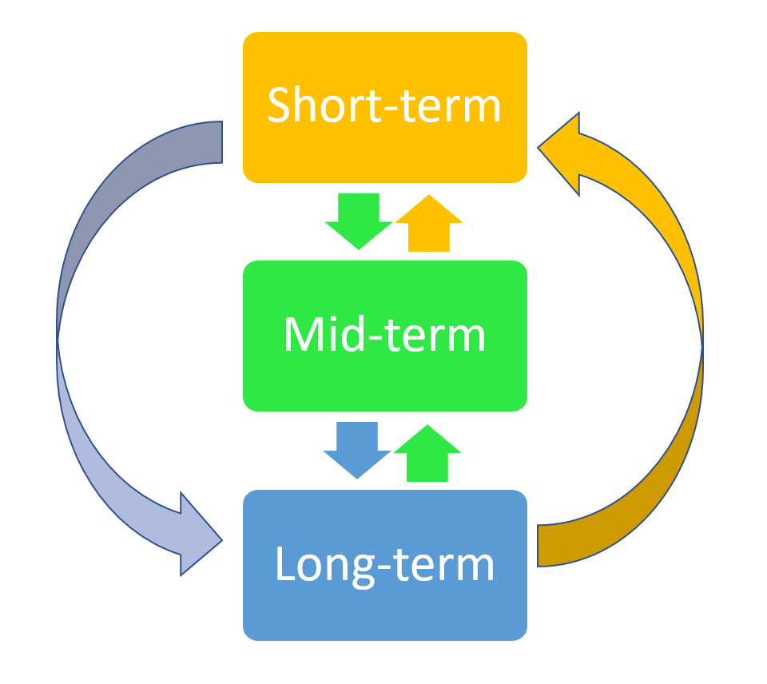

# Make sure you have a plan {#plan}

> “The Cylons were created by man. They rebelled. They evolved. There are many copies. And they have a plan.”
>
> [Battlestar Galactica](https://www.imdb.com/title/tt0407362/)

Having a plan is an essential part of your PhD strategy. You might think of it as a shining star guiding your way through the dark times. Or, perhaps like me, you are prompted to remember the Cylons in the sci-fi series Battlestar Galactica. However it takes you, having a plan will hold you in good stead throughout your PhD as it will ensure that you have something beyond your PhD to focus on. 

There is a temptation, once you have started and invested many years in academia, to simply fall into step and see where it leads you. This lack of a plan will see your life collapse around you once you finish your PhD and wonder what it was all for. Or, more likely, you will get part way through your PhD and start questioning exactly why it is taking up so much of your life. 

This chapter aims to help you build a plan for [your future career](#career) and aid you to see how you can improve your chances on reaching your goal. 


## What is a long-term plan?

A long-term plan sets a goal for you in 10-15 years from now. This is likely to be a career choice, like joining a particular business or having a position in a certain company. Beware of having a long-term plan to become an academic, as there may not be opportunities (see [Part I](#relyacademic)). Equally, your long-term plan could be about the lifestyle you want to achieve in the long-term, or about where you want to be in the world. All of these are valid plans and they are totally up to you to envisage. 

This may be the first time you are thinking about it, or you may have always known what your long-term plan was. In either case, once you have decided on your plan you next need to decide on medium- and short-term goals that will guide your decisions during your PhD years, and the moves that follow.

## Long-term plans need medium- and short-term goals

You need to consider your three time periods (see Figure \@ref(fig:plan)): 

 - **Long-term** (10 - 15 years)
 - **Medium-term** (5 years)
 - **Short-term** (2 years)

The first thing to realise when you are planning for your future is that long-term plans need action in the short- and medium-term. It is only by achieving these actions that will help you reach your long-term goal. Personally, I like the three time period idea as short-term plans might only include getting something ready for the medium-term, and not necessarily doing that action. 

If you don't like to think of specific time periods, you can think of the short-term as the time during your PhD. Medium-term is the years after your PhD and long-term is your career path. Short-term planning will consist not of having to find your primary occupation, but adding tools to your tool-box in order that you have a complete tool box for the long-term. Similarly, you can think of medium-term not as being employed in the actual job you want to do, but in a step along that particular career path.


(ref:plan) **Having a plan during your PhD is invaluable** This diagram shows how your short-term plan is related to your medium-term planning, and how that will influence your long-term goals. In turn, your long-term plans will impact on what you do in the medium- and short-term.

```{r plan, fig.show='hold', out.width = '65%', echo=FALSE, fig.align='centre', fig.cap="(ref:plan)"}

```

***

### Teaching example

If your goal after completing your PhD includes teaching in secondary or tertiary education, you are going to want to make sure that you have teaching experience. Planning to have a teaching experience sufficient to put on your Curriculum Vitae (CV) in the next 2 years is probably unrealistic as you may well be in the midst of your PhD studies (obviously, in some institutions you may get immediate opportunities). But you can plan that within the coming two years you will know exactly when in the medium-term your teaching experience will happen. In turn, this will require that in the short-term you need to actively look for those opportunities. 

### Research example

If your goal after completing your PhD is for a career in research, then there are definitely steps that you can take in the short- and medium-term that will increase your chances of success. Most research positions require fundraising as a central component of, what is essentially, project work. This means that you will want to have experience of fund raising, probably through [grant writing](#funding). You might not need to write a grant in the short-term, but you should be looking for opportunities of granting bodies to apply to, and projects that you have the capacity to undertake in the medium-term. Such projects might not be you on your own, but with other people in your group or institution, or connections in [your network](https://howtopublishscience.org/advisorless.html) from another institution. 

You will also want to look for opportunities to publish. Publishing your thesis chapters is likely to follow in the medium-term (i.e. once you've finished your thesis), but there are likely to be opportunities before this to start getting publications on your CV. Remember that these might not be research papers, but could be publishing a [literature review](https://howtopublishscience.org/whattowrite.html#reviews) or [another type of paper](https://howtopublishscience.org/whattowrite.html) [@measey2022how]. 


### Other additions to your CV

Teaching, grant writing and research papers are all solid items to add to your CV during your PhD studies, but you may want to consider having some additional items if these will be skills required in your long-term plans. For example, you may be interested in having experience in administration and management. It may well be that you can volunteer to fulfil these roles in your research group or department. For example, you may want to get elected into a student representative role and sit on the department's management committee. Or it may be that someone has some administration exercise that you can help them with. You won't know unless you ask.

***

## Consider the letter of reference that your advisor will write

An important consideration for your medium-term plan is that you will likely be asking your advisor to write a letter of reference for you. In the short-term you can find out from people who already work in your long-term career choice what the ideal reference letter consists of. Once you know what is needed, you can in the short-term begin to make sure that you have all of these elements in place. For example, your advisor can't write a letter of reference that says you have great organisational skills unless you have helped them with organising something. If, like me, you have a bad memory for things that you have done, you will also need to write down these activities and examples of when you did them so that you can remind your advisor when the time comes for them to write a letter of reference.

Advisors are busy people, and they don't always notice all of the different things that you are doing. So make sure that you remind them what you have achieved during your time with them, especially when it comes to writing that letter of reference. Don't rely on them to remember!

## Changing your long-term plans

Don't worry about changing your long-term plans. Life often happens, and you may want or have to change your plans. In the short-term, changing long-term plans is easy. You should realise that the further you go down a particular career path, the more difficult it becomes to make long-term changes. However, if you do, then it is not impossible, and will need you to make some short-term plans in order to make those changes. 

The other book has advice for [getting a job inside academia](https://howtopublishscience.org/jobinacademia.html), as it also does for [leaving academia for a job outside](https://howtopublishscience.org/leavingacademia.html) [@measey2022how]. 


## Share your plans

Don't forget to tell the people around you of your plans for the future. Remember that they may know about opportunities that they can only pass onto you if they know what your plans are. They may also be able to provide you with specific advice about exactly what experience you need. 

Having a plan is probably one of the most valuable assets that you can hold throughout your PhD days. If you have read all of this and still don't know what yours is, then I'd suggest that you start to think about this now, and don't push it into the future when not having a plan is going to be increasingly problematic.
