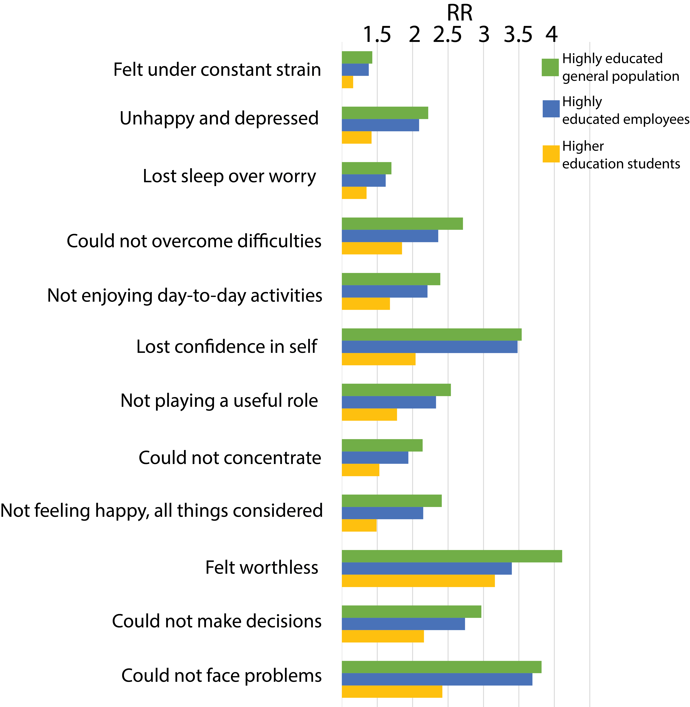

# Keeping track of your mental health {#healthy}

Stress is a natural part of life and many people are at their most productive when they are under some degree of pressure, such as a deadline. Although deadlines don’t work for everyone. 

>Douglas Adams famously claimed: 
>
>“I love deadlines. I like the whooshing sound they make as they fly by.” 

Problems arise when we become overwhelmed by stress and are unable to fully respond. When this occurs, productivity can drop off and survival responses can be triggered as if responding to an actual physical attack. These responses include fight, flight or freeze responses. Anxiety and panic can be triggered. In this state, additional demands on your time may also push your life off balance, so that you start to neglect your personal wellbeing which can negatively impact on relationships, exercise regime, or even nutrition and personal hygiene. Some people can find that the additional stress can cause physical symptoms that may even need medical treatment. Your sense of competence and mastery can be negatively impacted such that you may even suffer from feelings of inadequacy or imposter syndrome ([see part 2](#fear)).

Although there are not many studies on mental health for PhD students, those that exist (as well as surveys: [Nature 2019](https://www.nature.com/articles/d41586-019-03459-7)) all suggest that there is a significant toll, which is proportionately higher than for others in society [@levecque2017work]. Whatever your prior experience of stress in a working environment, academia is known to be particularly stressful, and as a PhD student, you are likely to absorb a significant amount of this stress into your own life [@stubb2011balancing]. 

The General Health Questionnaire (see GHQ-12 in Table \@ref(tab:GHQ)) is an instrument used to measure psychological distress. It is quick, reliable and simple to score, so you can use it at any time during your PhD studies as an indicator of whether you need to reach out to personal, occupational or professional support networks. 

Right now, I suggest you complete the GHQ-12 (Table \@ref(tab:GHQ)) and record your answers as a baseline. Keep the scores somewhere safe. During the course of your PhD, if you feel that your scores may have changed, take the test again and compare them with your baseline scores. Although there are no hard rules, if three or more of your scores have moved by two or more points it could be worth discussing with your support network to help you decide whether or not to seek professional help.  

Table: (\#tab:GHQ) **A General Health Questionnaire with 12 questions (GHQ-12) that you can use to keep track of your mental health.** Answer the questions in this table now, and compare your answers to answers in your future when you are feeling more under strain. Write down any explanations you have for your choice of answers.

| General Health Questionnaire: Have you recently... | 0 | 1 | 2 | 3 |
|-|-|-|-|-|
| been feeling reasonably happy, all things considered? | Better than usual | Same as usual | Less than usual | Much less than usual |
| lost much sleep over worry? | Not at all | No more than usual | More than usual | Much more than usual | 
| been feeling unhappy and depressed? | Not at all | No more than usual | More than usual | Much more than usual |
| felt you couldn’t overcome your difficulties? | Not at all | No more than usual | More than usual | Much more than usual |
| felt under constant strain? | Not at all | No more than usual | More than usual | Much more than usual | 
| felt capable of making decisions about things? | Better than usual | Same as usual | Less than usual | Much less than usual |
| been able to face up to your problems? | Better than usual | Same as usual | Less than usual | Much less than usual | 
| been thinking of yourself as a worthless person? | Not at all | No more than usual | More than usual | Much more than usual |
| been losing confidence in yourself? | Not at all | No more than usual | More than usual | Much more than usual | 
| been able to enjoy your normal day-to-day activities? | Better than usual | Same as usual | Less than usual | Much less than usual |
| been able to concentrate on whatever you are doing? | Better than usual | Same as usual | Less than usual | Much less than usual |
| felt that you are playing a useful part in things? | Better than usual | Same as usual | Less than usual | Much less than usual |

  

Even if you don't feel you need the support of your institution now, it is worth finding out how they can support your mental health in the future if needed. Although there has been some stigma attached to difficulties with mental health in the past, most institutions accept that pressures are mounting on postgraduate students and that they may require support. Most institutions have experienced councillors available to support you if needed. Importantly, you should realise that none of these symptoms are unusual and that there is a high probability that many of your colleagues may also be struggling. Knowing that your problems are shared and reaching out to support networks early is an excellent way to prevent them from escalating beyond your control. 

A study into the mental health of PhD students in Belgium exemplifies the kinds of difficulties that they face when compared with other similar groups (@levecque2017work; Figure \@ref(fig:Mental-health)). 

(ref:Mental-health) **How does the mental health of people in different sectors compare?** A comparison of the mental health of PhD students [data from @levecque2017work] with highly educated general population, highly educated employees and higher education students using the General Health Questionnaire. The Risk Ratio (RR: adjusted for age and gender) in PhD students in Flanders, Belgium, is consistently higher (>1) when compared to any of the other surveyed groups.

```{r Mental-health, echo=FALSE, out.width='80%', fig.cap="(ref:Mental-health)"}
 
```


No matter how well you think of your own abilities to cope with mental health issues, doing a PhD will cause you additional stress and can trigger maladaptive coping mechanisms. Learning how to cope with additional stress early in your career can be beneficial for future personal development.

Academia is recognised as a particularly stressful environment; you will likely take on some of this environmental stress in addition to any stress associated with your studies. Additional stressors come from home and family situations. Your best means of coping will be to try and develop a support network and to understand where and with whom you can discuss any difficulties as they arise. Knowing who this is and how and when to approach them will put you in a stronger position if you need them in future.


## Being physically active improves mental wellbeing

The positive relationship between the amount of physical activity and higher mental wellbeing is well established [e.g. @grasdalsmoen2020physical; @gerber2014increased], but the kind of exercise required to achieve this improved result is varied. For example, a study of college students showed that an hour of Thai Chi twice a week for 3 months was enough to have significantly improved physical and mental health scores [@wang2004effects]. Increased levels of physical activity were also found to be associated with improved sleep quality in another study [@ghrouz2019physical; @gerber2014increased]. There are plenty of studies out there that suggest there are multiple benefits from physical activity. 

If you don’t do it already, then when you start your PhD start regular exercise. Getting fit was the best thing I ever did to improve my work. The first thing I found was that I could sit and concentrate on work for longer. Before I got fit, I was constantly distracted and needed to take lots of breaks. Now I find that my concentration is much better and that as my fitness stamina increases, so too does my ability to concentrate. 

There are other ways to achieve these benefits, including mindfulness or meditation. 

## Time to think

I used to think that the time I spent exercising was unproductive with respect to work. Now I have begun to realise that this represents some of my best thinking time. I use the time I spend trail running to turn ideas over in my head and especially to think through the logic in arguments, and potential flaws in experimental design. This isn’t to say that I don’t need to put time in at the computer writing it all down, or talking through ideas with colleagues. But I find the meditative time I spend exercising to be especially productive. Don't take my word for it, see this great new book by Caroline Williams [-@williams2021move]. 

## Balancing work with life

Having already told you that doing a PhD might unbalance you mentally, regular exercise is a really good way to make sure that you retain that balance with life [see @hotaling2018publishing]. By life, I'm referring to everything away from your academic work. This might include family, friends, sport, hobbies (even fishing). If you don't have friends outside your academic life, then it would be a good idea to find some so that you can keep in contact with the 'real world'.

If you already exercise, then you likely know how important this is. But if you don’t then, my best advice (above anything else that you might read in this book) is to start as soon as you can. Do whatever is right for you. If you don’t already know, then try out different clubs or activities at your institution. There are normally lots to choose from. Make sure that you schedule regular time for your activity, even if that means that you run in the mornings before field work starts, or you spend your evenings doing tai-chi on the beach after a day at sea doing research on dolphins. Take your exercise with you wherever you go for your studies. Take it as seriously as you do your studies and you’ll find that both will benefit. 

Once you have a healthy body, you’ll find that there are all sorts of things that go along with this. The desire to fill it with healthy food resulted, and this later tied in with my interest in the gut microbiome. I now have many fermented foods in my kitchen (much to the horror of my kids), and the improvement of my digestive system. I could go on, but I’ll spare you. Instead, I just want to emphasise that I consider that not only will your quality of life improve, but so will your work if you include regular exercise as part of your PhD regimen.
