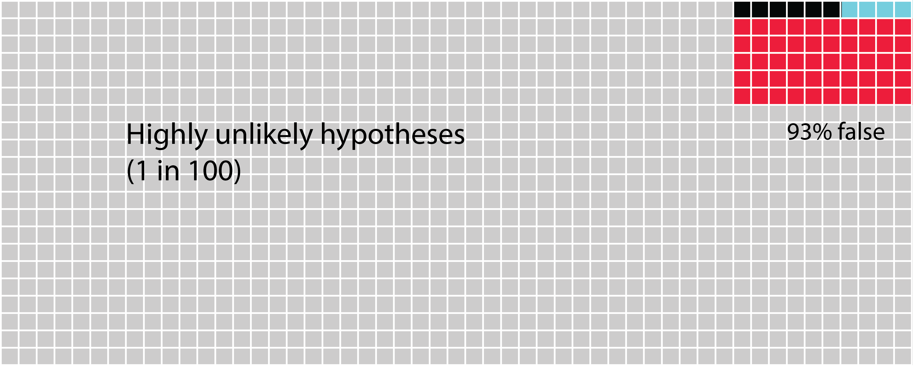

# Being aware that you can get it wrong {#TypeI}

**Type I and Type II errors **

With all the will in the world, when you are testing your hypothesis using statistics there is a chance that you will accept your alternative hypothesis when it is not valid. This is known as a ‘false positive’ or a Type I error (see Figure \@ref(fig:TypeITypeII)). It is also possible that you will accept your null hypothesis when you should have accepted your alternative hypothesis, also known as a Type II error, or a ‘false negative’. While it won't be any fun to get a Type II error, as scientists we should be more worried about Type I errors and the way in which they occur. This is because following a positive outcome, there is more chance that the work will be published, and that others may then pursue the same line of investigation mistakenly believing that their outcome is likely to be positive. Indeed, there are then lots of ways in which researchers may inadvertently or deliberately influence their outcomes towards Type I errors. This can even become a cultural bias that then permeates the literature.

Humans have a bias towards getting positive results [@trivers2011folly]. If you’ve put a lot of effort towards an experiment, then when you are interpreting your result you might feel motivated towards your reasoning making you more likely to accept your initial hypothesis. This is called [‘motivated reasoning’](https://youtu.be/w4RLfVxTGH4), and is a rational explanation why so many scientists get caught up in Type I errors. This is also known as a confirmation bias. Another manifestation of this is publication bias which also tends to be biased towards positive results, with as many as 84% of studies supporting their initial hypothesis [@fanelli2010positive]. Put together this means that scientists being human are more vulnerable to making Type I errors than Type II errors when evaluating their hypotheses. Although there are deliberate or inadvertent ways of making of Type I errors, here it is important to understand that simply by chance you can make a Type I error: accepting your alternative hypothesis even when it is not correct. To minimise this possibility to a reasonable level, most biologists set α (alpha) to 0.05 as an acceptable risk that they will encounter a false positive (Type I error).

(ref:TypeITypeII) **Type I and Type II errors.** In this figure, the columns refer to the truth regarding a hypothesis, even though the truth is unknown to the researcher. The rows are what the researcher finds when testing their hypothesis. The blue squares is what we are hoping to achieve when we set and test our hypothesis. The grey squares may happen if the hypothesis we set is indeed false. The other two possibilities are the false positive Type I error (red), and the false negative Type II error (black). In the table it seems that the chances of getting one of the four outcomes is equal, but in fact this is far from reality. There are several factors that can change the size of each potential outcome to testing a hypothesis.
 
```{r TypeITypeII, echo=FALSE, out.width='90%', fig.cap="(ref:TypeITypeII)"}

```


In the following figures (Figures \@ref(fig:HighlyUnlikely), \@ref(fig:Unlikely) and \@ref(fig:Likely)), you see the outcome of 1000 hypotheses. You could think of these as outcomes of 1000 attempts at testing similar hypotheses in a global scientific effort by individual scientists. The power of the analysis is set at 40%, and α is set at 0.05. It is important to realise that α applies to all the tests that are made (whether or not the hypothesis is actually correct). This means that when α is set at 0.05, 5% of the time scientists will find that their hypothesis is correct whether or not this is actually true is, as we shall see, an interaction of several variables.

(ref:HighlyUnlikely) **The likelihood that highly unlikely hypotheses you test are accepted.** This figure has been redrawn after figure 1 in Forstmeier et al [-@forstmeier2017detecting]. This is a graphical representation of an argument first made by Ioannidis [-@ioannidis2005why]. 


```{r HighlyUnlikely, echo=FALSE, out.width='90%', fig.cap="(ref:HighlyUnlikely)"}

```

## Changing the likelihood of a hypothesis

The difference between Figure \@ref(fig:HighlyUnlikely) and Figures \@ref(fig:Unlikely) and \@ref(fig:Likely) is the likelihood that the hypotheses are correct changes. In the first one (Figure \@ref(fig:HighlyUnlikely)) we see highly unlikely hypotheses that will only be correct one in a hundred times. The blue squares denote the proportion of times in which the hypotheses are tested and found to be true. The black squares denote false negative findings, i.e a Type II error. The red squares denote false positive findings, i.e. a Type I error. Because the hypothesis is highly unlikely to be correct the majority of squares are light grey denoting that it was correctly found to be untrue. Because α is set at 0.05, we can expect that 5% of the 990 incorrect hypotheses will give us a false positive (49 or 50 times). Although it might seem unlikely that anyone would test such highly unlikely hypotheses, there are increasing numbers of governments around the world that create incentives for researchers to investigate what they term blue skies research, which might be better termed high risk research or investigations into highly unlikely hypotheses. The real problem with such hypotheses is that you are more likely to get a Type I error than actually find that your hypothesis is truly correct. 

(ref:Unlikely) **The likelihood that unlikely hypotheses you test are accepted.** In this figure we see a scenario of unlikely hypotheses that are found to be correct approximately one in 10 times. Now we see that the possibility of committing a Type I error is roughly equivalent to a Type II error and to the probability of finding that the hypothesis is truly correct. Thus, if your result comes out positive, you are unlikely to know why.

```{r Unlikely, echo=FALSE, out.width='90%',  fig.cap="(ref:Unlikely)"}

```


(ref:Likely) **The likelihood that likely hypotheses you test are accepted.** In this figure we see a scenario of likely hypotheses that are found to be correct approximately every other time.

```{r Likely, echo=FALSE, out.width='90%',  fig.cap="(ref:Likely)"}

```


Now imagine some groundbreaking research (probably published in a high impact factor journal) that finds a highly unlikely (but presumably desirable) hypothesis is correct (our first scenario of 1 in 100). Researchers from other labs try to repeat the experiment, and some of them also find that they get positive results and get these published. None of the negative results get published, or the investigators don’t bother to submit them and move onto other areas of science. The positive results are written into text books and future generations of scientists test these types of hypotheses expecting them to be correct (our last scenario of 1 in 2). When the negative result is produced, a reasonable assumption is that a Type II error has been found, and that these scientists need to increase the power of their tests, inevitably increasing the cost of the experiment. But there are plenty of other ways that researchers could end up finding that their negative result is in fact positive, especially if this is what they are expecting. Simmons et al [-@simmons2011false] refer to this as the ‘researcher degrees of freedom’ in which researchers inadvertently or deliberately end up getting positive results because of the way in which they treat either their hypothesis or analyse their data. It is easy to see how a false scientific culture can be erected in these mistaken beliefs, and it is important to be aware of this possibility.

## Increasing the statistical power

In all of these figures the power of the analysis is set at 40%. The statistical power of any analysis depends on the sample size (or number of replicates) you're able to use. Some research has suggested that in most ecological and evolutionary studies this is actually more like 20% [see references in @forstmeier2017detecting]. What is important to notice in the next figure \@ref(fig:20PowerHyp) is that when we change the power of the analysis (in this case from 40% to 20%) we influence the proportion of Type II errors over finding that the hypothesis is correct. While the overall numbers of Type I errors does not change, if your analysis tells you to accept your alternative hypothesis, there is now a 1 in 5 chance (20%) that it will be a false positive (Type I error).

(ref:20PowerHyp) **The likelihood that likely hypotheses you test are accepted when you increase the power.** Here we see the scenario in which the hypotheses are quite likely to be correct one in two times. Now we can see that the possibility of creating a Type II error is highest. Next the blue squares show us the chances that we find the hypothesis is truly correct. Lastly, there's only 11% chance of a Type I error. 

```{r 20PowerHyp, echo=FALSE, out.width='90%', fig.cap="(ref:20PowerHyp)"}

```


What you should see when you look at these figures is that there is quite a high chance that we don't in fact correctly assign a true positive hypothesis. There's actually much more chance that we will commit a Type II error. Worse the more unlikely a hypothesis is, we are increasingly likely to commit the dreaded Type I error.

From the outset we should try to make sure that the hypotheses you are testing in your PhD are very likely to find positive results. In reality, this means that they are then iterations of hypotheses that are built on previous work. When you choose highly unlikely hypotheses, you need to be aware that this dramatically increases your chances of making a Type I error. The best way to overcome this is to look for multiple lines of evidence in your research. Once you have the most likely hypothesis that you can produce, you need to crank up your sampling so that you increase the power of your analysis, avoiding Type II errors. 

In biological sciences we have more options than many scientific disciplines to investigate potentially false culture beliefs by using different model species, and looking at problems through different mechanisms. Presenting complimentary results from multiple lines of evidence within your thesis is an extremely powerful way to build evidence for your hypothesis. However, this requires creativity of experimental design as well as an open mind. It may mean that you have to draw upon the most fundamental of scientific abilities: to be comfortable with being wrong. It may also require dogged determination in terms of publishing negative results against the currently prevailing culture. As we shall see (in parts 4 and 5), publishing has another set of challenges. 

If your appetite is piqued by this subject, be sure to read the references cited, and read around this subject. 
