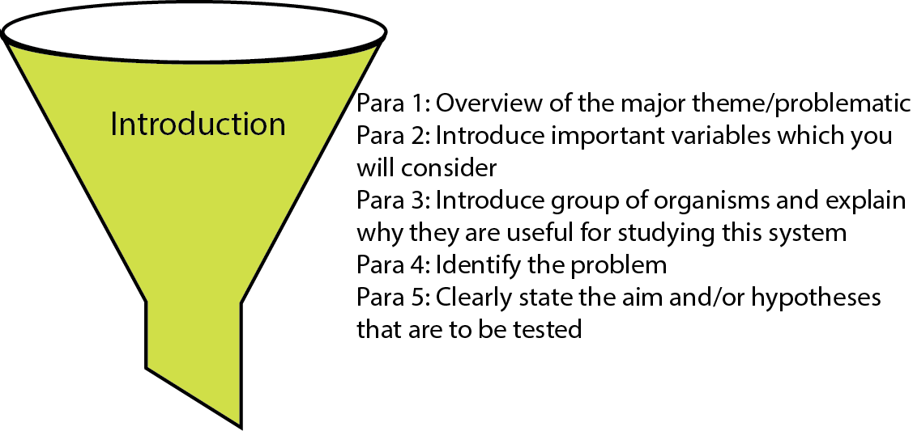
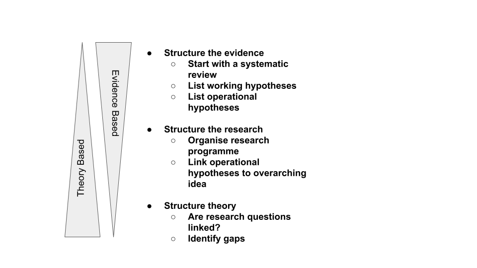

## What's the big idea? {#bigidea}
In the previous chapters, I've talked about the importance of having a hypothesis, and building that hypothesis in a logical framework within the introduction (see part 3). The introduction serves to inform the reader about why this particular hypothesis was chosen, introducing both the response and determinate variables, as well as the presumed mechanism by which the hypothesis can be falsified (or upheld).

### The funnel introduction 
But so much of what you read doesn't have any clear hypothesis, and there doesn't seem to be any thought about building on bigger concepts or ideas. In this chapter, I suggest that this might not be true only of papers on herpetological invasions (my specialist area), but also of herpetology in general (although I concede that some areas, such as herpetological physiology are actually quite good). Further, I contend that using these wider hypotheses or theories would actually be good for the authors concerned, as it would likely garner them a wider audience. Moreover, a greater number of biologists might come to realise how valuable reptiles and amphibians are as models in biology.

(ref:Introfunnel) **A framework for writing your introduction starts with the big idea and ends with the hypothesis.** The funnel introduction is so called because it resembles a funnel in which you channel the reader from their own interest in a wider subject area into the relevance of your particular study.

```{r Introfunnel, echo=FALSE, fig.align='left', out.width='90%', fig.cap="(ref:Introfunnel)"}

```


### So where would we find all of these big ideas?
There are quite a few papers that synthesise hypotheses in various areas of biology. Here I provide two to get you started. Ask your advisor about relevant reviews of hypotheses in your area of biological sciences. The first is by Mark Velland [-@vellend2010conceptual] on theories in community ecology. The next is by Jane Catford and colleagues [-@catford2009reducing] on hypotheses in invasion biology, but I encourage you to look for more up to date versions. Each of these papers will give you a list of big ideas, together with the citations for seminal papers that have built them. You will note that many of these theories are very old with some dating back to Darwin. You can think of the way that such ideas are structured as a hierarchy of hypotheses (Figure \@ref(fig:JeschkeHagar61)).

(ref:JeschkeHagar61) **A hierarchy of hypothses can be used to help determine your Big Idea.** A useful structure for thinking about how hypotheses are structured was presented by @heger2018hierarchy in what they termed the _Hierarchy of Hypotheses_

```{r JeschkeHagar61, echo=FALSE, fig.align='left', out.width='90%',  fig.cap="(ref:JeschkeHagar61)"}

```


Of course, there are many ways to approach and test these theories, but if you don't know about them, your work may actually make a considerable contribution to upholding or refuting them, but go totally unrecognised. When the significance of your work isn't realised, it's unlikely that it'll be widely read and cited. 

Let's face it, if all the effort of the work that we put into papers is just going to get buried, then is it really worth it? The work that we do is also expensive, so making it as relevant as we can to as wide an audience as possible is something that we should be concerned about.  

So, I encourage you to **stand on the shoulders of giants** (Figures \@ref(fig:Googlescholar) by using big ideas in your introduction. Make sure that the data that you collect can actually be used to respond to some of these big ideas. Then make sure that you cite them, giving them the importance that they deserve (yes, even as key words) so that others can find your work, and you might even find that one day, your work has shoulders that are broad enough for others to stand on!

**The take home message**

Reading the literature can really expand your mind and broaden your horizons. When undertaking a literature review [or when reviewing a paper], take the time to think about not only what has been tested, but what could have been. Make a list of theories and hypotheses in your own field and try to rank them in a hierarchy. 
