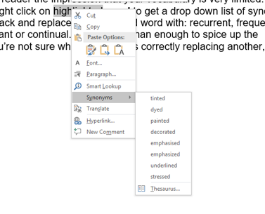

# Writing a paragraph {#paragraph}

Writing paragraphs has a skill all of its own, and the aim of this chapter is to go over the basics of how to put a paragraph together.


**This paragraph starts with a topic sentence which contains the principle idea that citations are needed for examples.** The following sentences put this idea into the context of your study. This should be based on examples from existing literature with the corresponding in-text citations provided (Smith et al. 2017; Jones 2018). You can use examples in your paragraph to make your point. For examples, Smith and Jones (2017) carried out a study that showed that examples without citations have no credibility for readers. And this was backed up by another study by Jones and Smith (2018), which provided further evidence for the need to provide examples. Once you’ve provided your evidence, and introduced any covariates that you need to, like the use of literature for examples, then you are ready to sum up and link. *After reading this paragraph, the reader will know why citations are needed for examples, and they’ll be ready to read more about the topic of writing a paragraph in more detail.*

In the paragraph above, the topic sentence is **bold**, the supporting sentences are normal font, and the clincher is in *italics*.

## Topic sentence
A topic sentence allows the reader to understand quickly the idea/topic you are putting forward in the paragraph. It must be in the context in which you are going to develop the same topic. There’s no point in just mentioning a topic in passing or using it in a different way than you will later.

Make your topic sentence relatively simple. Don’t be tempted to add multiple clauses. If the topic sentence is too complex, you’ll lose your reader right at the beginning of the paragraph.

## Supporting sentences
Supporting sentences convey all the relevant information to the reader. They are going to be statements that are well cited, showing readers where the original ideas came from. Be sure to keep these sentences on topic, and regularly refer back to your outline to make sure that you keep to the original objective of the paragraph. These are the meat of the paragraph and it’s really important to get them right.

If you are writing about differences, then state which way the difference is. For example, if tulips are larger than lillies, then say this. Telling your audience that something is different than something else only ends up leaving them guessing about the directionality. There’s no point in drip dripping this information through. Set it down in as little space as possible so that your reader doesn’t get bored.

Sentences within the meat of the paragraph interact, and there’s a great example to show how this is done here. These interactions usually dwell around pertinent variables (such as those that you are going to deal with in your paper). By using the same or similar words within the paragraph, you are able to demonstrate to the reader how those different points interact.

While repeating the names of the variables, or their abbreviations, can be helpful, repeating descriptive words becomes quite tedious to the reader. Repeatedly reading the same ideas repeated over and over quickly bores the reader. Bored readers are less likely to take in what you write, even if you are repeating the same information (yes, I'm repeating myself - boring isn't it). It will also give the reader the impression that your vocabulary is very limited. These days you can do a quick right click on a highlighted word to get a drop down list of synonyms (Figure \@ref(fig:synonym)). This can allow you to go back and replace your repeated word with: recurrent, frequent, recurring, repetitive, constant or continual. That’s more than enough to spice up the paragraph. However, if you’re not sure whether a word is correctly replacing another, ask a friend to read it.

(ref:synonym) **How to quickly get a synonym to make your paragraph more diverse.** An example of the synonym function in Microsoft Word (other wordprocessors are available) - right click on the highlighted word.

```{r synonym, echo=FALSE, fig.align='left', out.width='50%',  fig.cap="(ref:synonym)"}

```

Your supporting sentences are best built in the formula of an [argument](#argument).

## The magic of threes
We can learn a lot about writing convincingly in science by borrowing from storytelling, and one of the greatest lessons in storytelling involves the magic of threes [@angler2020telling]. 

In putting together your paragraph, you can use the magic of threes to break your dialogue into three parts: thesis, antithesis and synthesis (a, b and a+b). Think of it this way: there’s a standard explanation of how a phenomenon that you want to investigate interacts with the variable of your choice (thesis). Then there’s some contradictory evidence that suggests that the standard explanation is not necessarily correct (antithesis). Lastly, there is your approach to investigate exactly how the variable and phenomenon interact which should explain (or at least advance our understanding) of how the variable and the phenomenon are related (synthesis). It may be that this construct should be fleshed out into three paragraphs instead of three sentences within a paragraph. 

You won’t be able to construct every paragraph with the magic of threes, but once you have learned this rule, you’ll be able to use it to help emphasise important points in your manuscript that you want the reader to remember as they move forwards. What if your list is two instead of three? Well, then you’ll lose the magic, but maybe you can think it through it again? If you have two, then you normally have three by means of the combination of the two (a, b and a+b).

What follows is more advice about telling a good story: using an example and avoiding being boring: i.e. replacing those long lists with a maximum of three items. 

## Use an example
Examples are a very powerful way of conveying ideas in a short amount of space. Don’t replace your paragraph with an example, but do use an example if it shows the reader just what you want. You should be able to do this in a sentence (or two), but if you’re tempted to go on, it’s probably not a good example. Because the first paragraph sets out ideas, it's unlikely that an example there will be a good idea there.

## Avoid lists
I’m not a big fan of paragraphs which are simply a long list with little or no thought offered. The worst ones are where there are so many citations along the way that it’s really hard to pick out what is a sentence and what is citation. I understand that it’s important to show precedent and that there is merit in showing how widespread an idea is over taxa or in different disciplines. You never find these lists in journals where words and/or citations are limited, which suggests that you can dispense with them.

Instead, you can avoid long lists by pulling them into themes. Once you’ve managed to get three themes, you’ll find that you can work them into your paper time and again. For example, each theme might well be worth a separate paragraph or section in the discussion. 

## The last sentence of the paragraph: the clincher
Once you’ve conveyed all of the information that you planned to impart in your outline, it’s time for the last sentence. This should conclude the evidence that you’ve provided on your topic. Try not to make it lame. For example: “This shows that little work has been done.” One of my pet hates is authors who insist on telling us that “little work has been done”, as if this was a justification for doing anything. Instead, make it a real clincher about why the topic is important, or how and why you will tackle it. Instead (or as well if you can), you may want this sentence to link on to another paragraph (topic), especially if flow is important at that part of your outline (see below). If you have just constructed a paragraph with thesis, antithesis and synthesis, then your clincher might be simply to underline that your approach in the paper is to investigate the synthesis. Either way, make sure that your last sentence is on topic, and one that sticks in the readers’ minds.

## Above all - read it!
Your paragraph is not finished until you've read it. Reading is an essential part of writing that cannot be emphasised enough. Does your paragraph say what you planned in your outline? If your paragraph and any other text doesn't make sense to you, it sure won't impress anyone else. If you can't bear to read it through immediately, then do it after you've written two or three paragraphs. I suggest that you don't wait until you've finished the manuscript. Rather get the text right as you go along.

## How does the paragraph fit into the flow?
So now we’ve gone over the formula, it’s time to take a step back and look again at the paragraph in the context of your outline. Remember that the paragraph represents a single subject but that it is still just part of the manuscript as a whole and you need that to flow from beginning to end. This means that it’s not enough to write each paragraph in isolation, but to think of the way in which they link together as a whole, especially when you are trying to make a logical argument.

You should be using the outline to provide the logic in the flow of your argument, fleshed out with the relevant references. If you already know this well, then writing the paragraph will just be a question of styling the outline. Remember that there is a purpose to your paragraph. You have an argument to make the reader understand. Don't be tempted to include information that is distracting or moving away from the flow of that argument. 

I am very fond of ending a paragraph on a linking sentence. Essentially, this shows how two ideas are connected in the last sentence. This really helps with getting the flow of an introduction or discussion, but linking sentences are not always the best way to end a paragraph. Sometimes there’s no option but to change the subject completely, and then you should go for the clincher idea (see above). For example, you may want to end the paragraph by seeding a new twist on the paragraph’s idea.

## Seeding ideas
The introduction sets out the established literature in order to put your study in context, but your discussion provides you with an opportunity to present new ideas, or to turn and twist existing ideas in a new way. Once you’ve got a good idea of what these are, I like to seed the introduction with hints as to what these might be. Sowing seeds early in a manuscript will provide the reader with hints as to where you are going. Writing these seeds as questions is a really good way of sowing them into an introduction. You can then go on to answer them (if only partly) in the discussion. Beware though, there’s no point in asking a major question in the introduction to which your data has no relevance!

## Breaking the rules
Just as in the other instructions on formulaic paper writing, when writing a paragraph, you shouldn’t feel totally constrained so that you can’t break the rules. Breaking the rules can set you free, and much of what you read that really stands out will do this. However, it’s much easier to break the rules and get it wrong, than break them and get it right. The idea of this chapter was to help you get started, not to communicate with those who are already writing great stuff. So if you're already great, don't break it!

## Some common paragraph mistakes
- Don't start your paragraph by linking back to the previous point. Start with your new topic sentence. If you aren't ready to change the topic, you aren't ready for a new paragraph.
- Don't start the paragraph with an unsubstantiated or over-inflated claim (keep it calm and within the bounds of what you are citing). Similarly, don't start with a trivial caveat. And don't start with a list or a long string of citations.
- Don't let your paragraph get too long. It is said that 250 words are the threshold. If you haven't covered what you wanted to in your outline within 250 words, then you need to rethink your outline for that paragraph! Definitely don't split a paragraph that's too long into two!
- If you started without an outline, it's never too late to go back and write an outline. Simply write down what you are trying to say (as a set of bullet points), and why (see below for an example).
- Your paragraph should have more than one citation in it. If you find yourself citing the same paper several times in the same paragraph, then there's something wrong with your outline, and the way that you are reading and citing papers (see below). Remember that what you write is about making your own argument from the literature, and not copying others' arguments.

The English grammar rules apply when writing science. I can’t go into these in detail here as they are legion and complex. However, here are a few mistakes that are often made by those writing in science:

- You should not start a sentence with an abbreviated genus. Instead, write the genus name in full.
- You should not start a sentence with a numeral. If you have to use the number as the first word, write it out. Otherwise, rearrange your sentence. .
- Make sure that acronyms are spelt out on first use (this may be needed for each section)
