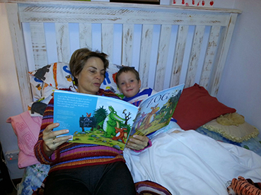

# Storytelling in science? {#storytelling}

I started thinking about this topic some years back as I often need to write popular articles that make some of the science that we do more generally accessible. But then I came across an article by Nick Enfield [-@enfield2018our] that made me think again.

“No storytelling” is a comment that I sometimes make when reading drafts of manuscripts, chapters, and even when editing for journals. What do I mean by this? Stories are deterministic. That is to say that the storyteller has an end in mind when they start telling the story, and the telling is a way to get to their goal. A story that’s ‘pointless’ will frustrate the audience and won’t engender them to listen to that storyteller again. In a good story, reaching that goal will often result in lots of twists and turns with the goal shrouded in mystery until it is revealed. In a teaching story (like a parable), the goal may be overt, such that the audience relates to the narrative and buys into the same conclusion.

If we did science like we tell stories, we would decide on the way the system works before we studied it, and then design the experiment in order to reach our desired goal. You should have recognised by now that this is not the way we do science. This is clearly an undesirable way to go about doing science because we should never prejudice the result that we’ll get from a study before we do it. Hence, writing stories and writing science are different processes. 

(ref:Storytelling) **It's story time.** Are you sitting comfortably? Then I'll begin.... but it won't be science

```{r Storytelling, echo=FALSE, out.width='95%', fig.cap="(ref:Storytelling)"}
 
```

## The danger of a teleological argument

Teleological arguments are those which have their end point as the aim. While it is generally acknowledged that this is a good way to tell a story, it can be a trap when it comes to conducting scientific inquiry. Here, we need to approach science in a very different way to storytelling. When I was doing my PhD I was very frustrated as I had the impression that my advisor knew what result he wanted and designed the study to show it. What probably happened is that he was displaying “motivated reasoning”, but the result is known as “confirmation bias”. When an experiment failed to meet the expected result, he declared that it had failed. As Frances Bacon so elegantly put it:

>__“Once a man’s understanding has settled on something (either because it is an accepted belief or because it pleases him), it draws everything else also to support and agree with it. And if it encounters a larger number of more powerful countervailing examples, it either fails to notice them, or disregards them, or makes fine distinctions to dismiss and reject them, and all this with much dangerous prejudice, to preserve the authority of its first conceptions.”__ 
>Francis Bacon [-@bacon1620novum]

In our work, we read other studies and observations to formulate a question that we frame as a hypothesis. We then devise an experiment that will test this hypothesis in the most objective way, so that we can fairly accept or reject our null hypothesis.

## Science is the very opposite of storytelling. Or is it?
I often tend to think of the answer to the question as the goal of the study. That I don’t know what the answer is, doesn’t spoil the story for me. The important thing is asking the question. An unexpected answer might send us back to thinking more about the system that we are studying and result in a greater revelation.

A good example of this is the study published by Becker et al [-@becker2018extreme]. Francois found a (spookily) strong relationship between probability that Rose’s dwarf toadlets survive and local rainfall in the breeding season. More rainfall equals greater survival is what one would automatically think (because frogs like rain), but that wasn’t the result obtained. Francois found that survival increased with less rainfall. It wasn’t until we made the connection between the fact that increased rainfall during the breeding season meant that the toadlets spent more time in puddles, that we understood why their survival was decreasing. As the toadlets aren’t feeding during this time they lose weight, and also expose themselves to increased predation pressure. In a dry year, the toadlets will head back to their subterranean refuges much earlier and continue to pursue ‘safer’ feeding and hiding habits. While we might intuitively feel that a ‘safe toadlet’ is a better life-strategy, reduced rainfall means reduced reproduction, and so results in a failure for toads that don’t manage to pass on their genes that year. The result is a variable life-history with the weather, something that was previously unknown. To me, that’s a great story!

But the scientific paper that was written about this ‘story’ [@becker2018extreme] doesn’t have a narrative style, and doesn’t fit the description of a narrative that we discussed above. Instead, it follows the formula that we set out below: Introduction, Materials and Methods, Results and Discussion. This style does not treat the experiment as a complication on the way to the story’s goal. The structure introduces the rationale behind conducting the experiment, then objectively explains the findings, and lastly discusses their meaning in relation to what is already known. From this study, I can spin the story (above), because I know what the endpoint is. But this storyis just one interpretation of the correlation that was found. [Correlation is not causation](argument.html), and more studies would be needed to test the hypothesis concerning the underlying reasons suggested for the relationship observed. The key differences in the storytelling style from the scientific formula are the absence of a known goal at the start of the process (see a more detailed discussion of this by Yarden Katz, [-@katz2013storytelling] here).

There is a role for stories when communicating science as this increases interest, facilitates understanding, and enhances memory. This is particularly true when communicating science to the public and making it more accessible, but it also applies to interactions between scientists, for example at conferences. The [presentations](#proposal-presentation.html) that tell a story and entertain are those we tend to remember. Not easy, but if we do want to communicate well with each other, then we need to learn the art of storytelling, without compromising our scientific objectivity. In addition, there are lots of lessons from storytelling that we can use within scientific papers, and to which I subscribe wholeheartedly. For example, don’t be boring, don’t [bamboozle](style.html), write an active narrative (not in the passive tense), use the magic of threes, and many more. 

I've taken the deterministic interpretation of storytelling (a story with a known ending), and I've used this to argue why it is not a good tool for science. But it is a great tool for communication. And storytelling can be used to improve the way that we write science, and especially the way in which we communicate science. 

There are other fundamentals in stories that are particularly useful and should not be ignored. One notable feature of stories is that they make facts easier to understand and remember. Indeed, there is even the idea that this is why storytelling evolved in human societies. For example, most religions are based on stories that are geared to understanding of societal morals and rules. Martin Angler’s [-@angler2020telling] excellent book about how to turn science into stories should be consulted to give you some deeper insight into why stories are more powerful than science. Or try the exercise described by Torres and Pruim [-@torres2019scientific].

## Can storytelling help memory of science?
Some argue that it can, and should be an integral part of scientific writing. In her [blog post](https://www.annaclemens.com/blog/elements-of-a-story), Anna Clemens argues that stories should be used within the scientific context. I'll let you read this for yourselves, and ask you to make up your own minds. If you like this way of thinking, you can get deeper into the depths of story thinking with Angler [-@angler2020telling]. 
