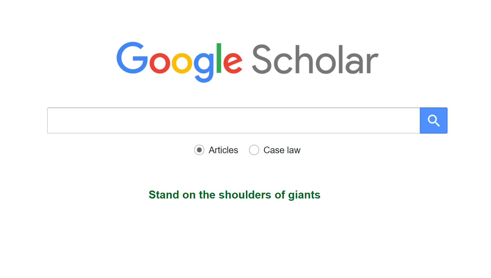
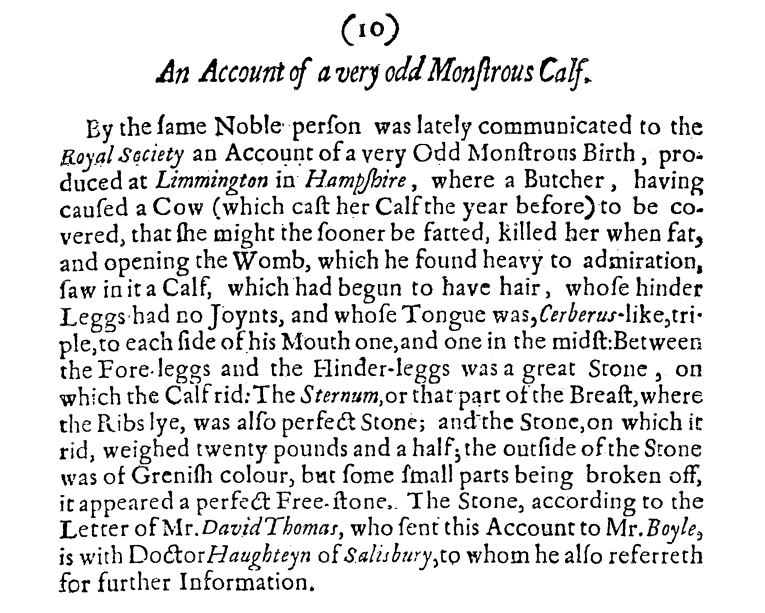

## Why do you need to cite? {#citations}

Citations are a means of recognising that your work is built on the work of others. They are part of the fundamental tenets of science that we don't start from scratch each time we conduct a study. 

(ref:Googlescholar) **Google Scholar home page.** Have you ever wondered what the blurb on the front of Google Scholar means? Who is standing on whose shoulders? Google and the Google logo are registered trademarks of Google LLC, used with permission.

```{r Googlescholar, echo=FALSE, out.width='90%', fig.cap="(ref:Googlescholar)"}
 
```

> Isaac Newton (in a letter to Robert Hooke in 1675) wrote:      
> **"If I have seen further it is by standing on the shoulders of Giants."**

Although the phrase is often attributed to Isaac Newton, it turns out that it was well accepted in Newton's time and has been traced back to the 12th century.

Essentially, standing on the shoulders of giants (Figures \@ref(fig:Googlescholar) is a recognition that all research is built upon research that has gone before it, and this is the basis for citations in the text of scientific papers. Patrick Dunleavy [@dunleavy2017citations] argues that citations are required to meet 7 criteria with respect to academic writing. Others have suggested that there are more criteria [see @harwood2009interview], and that these are a fundamental premise of academic work. But it was not always thus. If we dwell a moment longer, we can look back at the World's longest running scientific journal: *Philosophical Transactions of the Royal Society.*

You can download the first of those papers of 1665 and note that there are no citations (other than to books or letters) because there were no previously published articles from which to draw. However, even then authors noted that ideas came from previous authors and we can regularly find acknowledgements that refer back to Aristotle (~350 BC).

(ref:Boyle) **A page from the first volume of the Philosophical Transactions of the Royal Society.** Robert Boyle An Account of a Very Odd Monstrous Calf, _Phil. Trans. R. Soc._ 1665 1 10; https://doi.org/10.1098/rstl.1665.0007

```{r Boyle, echo=FALSE, out.width='90%', fig.cap="(ref:Boyle)"}
 
```

### Research is built on existing work and ideas

It would therefore be very unlikely that your idea/ideas has no basis in existing literature. If you can’t find it, the chances are that you haven’t looked in the right way. Try Google Scholar, Scopus, Web of Science and vary the search terms or try searching for articles citing something similar.

Citations demonstrate to readers where your ideas have come from. Citations can also be used to reduce what you need to write – especially with respect to methodology. If you (or others) have already provided the methodology in full then you can give a much simpler description and the citation.

Citations need to be used to back up any statements of fact that you make in your PhD chapter. Any examples need citations for where the examples came from, and when you make [arguments](argument.html), you add credibility to your arguments from each side by citing that these are from published works. 

### Your citations say a lot about you

When you choose to cite one paper over another, you are making a statement about what you find credible in the literature and what you don't. For example, if you choose to cite a poorly conducted study as the cornerstone for one of your arguments, then others may interpret that your arguments are built on shaky foundations. Experienced (often senior) readers who know the literature well will be able to judge the quality of your work not only by what you've written, but on what you've based your ideas through your citations. As we will see later on, there's a lot to think about when deciding what to cite, and what not to cite.

### Cite while you write (not afterwards)

Automatically, I'd suggest that you cite whenever you write. Using citations becomes habit forming, and you’ll end up wanting to use citations everywhere. Popular scientific writings tend not to have citations, but they can still be there but subtly different. 

Within a manuscript for a scientific journal or in your thesis, you can expect that your [introduction](introduction.html) and [discussion](discussion.html) sections are going to be full of citations. The methodology will likely also be citation rich. By using a lot of citations in your methods, you can often save your needing to write a lot of sections which would otherwise be very detailed.

Later in the book ([Writing with a Formula](formula.html)), I explain how to start writing with an outline, then flesh out the outline with citations from your reading, and plan which citations you are going to use carefully before you start. This won't stop you from adding more later, but this ensures that your work is built on your scholarly endeavour. 

I've seen many students try to write their text first and then only later fill in citations. I've had students hand in thesis chapters and manuscripts that have [ref] written strategically at the end of many sentences. I've even had the experience of doing this myself when I was a early career researcher (I probably still have those manuscripts somewhere because it's a sure way of never getting anything finished). I suggest that you **do not do this.** The reason is that if you write first and try to insert citations later, you are going to spend lots of time looking for the citation that fits your text. This is clearly not the right way around. Your text should be based on what's present in the literature.

I was planning to write that no-one would ever write an entire manuscript without references, and then put them all in at the end. Then I came across a video by [Pat Schloss](https://youtu.be/yk54_j3-4RM), and realised that I'm wrong [@schloss2018riffomonas]. Pat states early on (in the video) that he prefers to write first and cite later. He's clearly a very experienced researcher and knows his literature very well. Indeed, he knows it all so well that he already knows what citations fit what statements without needing to look them up. However, later on in the video Pat admits that even he sometimes gets it wrong, and that means that he ends up having to rewrite text when he finds the publication that he was thinking of and notes that what they actually found did not fit what he wrote. Although I can identify with what Pat is saying, I would find this re-writing far too time consuming to take this approach myself. I am familiar with most of the pertinent literature in my specialist area, but I'd rather check things before I start writing than leave it until later. I find that my memory is not only wrong about what other people have found, but also about what's in my own work. Therefore, I'd suggest that while you may aspire to write like Pat later on in your career, right now it'd be better for you to plan your writing with citations in mind, and cite while you write (not afterwards). 

When you submit a draft of your chapter to your advisor, they may suggest additional citations that are known to them. Don't simply add blindly, but look them up and check their relevance to the statement concerned. They may require recrafting of the statement, or a query back to your advisor.

### Citation Styles

There are a number of different styles, and this is likely to depend on the journal that you are writing for [see @pandey2020methods]. The two most prevalent styles in biological sciences are often referred to as Harvard (name, year) and Vancouver^1^ (superscript numbers that are listed in the reference section). Most universities and journals require Harvard style. The intricacies of how exactly this will get carried out will change from institution to institution and journal to journal. You will have to find out what is relevant to you.


#### Vancouver Style

Vancouver style dates back to medical journals in the 1970s and refer to conventions to avoid fraud in medical sciences. In biological sciences, they are not used as widely as Harvard style, but are chosen as they don’t impede the flow of the text for the reader. 

Each style has its pros and cons. Vancouver style is more equitable and anonymous, as all cited people are represented only in the references and do not have their names plastered throughout the text. The diminutive numbers take up less space, allowing the reader and writer to concentrate more on their prose. On the other hand, if you are familiar with the literature, or you are interested in learning more about the literature, you’ll find that the little numbers take much more time to cross reference with the list at the end, than does Harvard style. Reference strings in Vancouver style can either be separate numbers, or numbers listed as a series. Because citations are numbered in the order in which they first mentioned, citation strings later in documents often end up as a list of non-sequential numbers separated by commas.

Here is an example of text [from @measey2016global] with citations in Vancouver style:

>Amphibian populations are currently declining across the globe^1-3^ and alien amphibians are at least partially driving these declines through competition^4^, hybridization^5^ and introduction of novel pathogens^6-9^.

^1^Berger L, Speare R, Hyatt A. _Chytrid fungi and amphibian declines: overview, implications and future directions. Declines and disappearances of Australian frogs_ Environment Australia, Canberra. 1999;1999:23–33.

^2^Collins JP, Crump ML, Lovejoy III TE. _Extinction in our times: global amphibian decline_. Oxford University Press; 2009.

^3^Daszak P, Cunningham AA, Hyatt AD. Infectious disease and amphibian population declines. _Diversity and Distributions_. 2003;9(2):141–50.

^4^Dufresnes C, Dubey S, Ghali K, Canestrelli D, Perrin N. Introgressive hybridization of threatened European tree frogs (*Hyla arborea*) by introduced _H. intermedia_ in Western Switzerland. _Conservation Genetics_. 2015;16(6):1507–13.

^5^Kupferberg SJ. Bullfrog (*Rana catesbeiana*) invasion of a California river: the role of larval competition. _Ecology_. 1997;78(6):1736–51.

^6^La Marca E, Lips KR, Lotters S, Puschendorf R, Ibanez R, Rueda-Almonacid JV, et al. Catastrophic population declines and extinctions in Neotropical harlequin frogs (Bufonidae: *Atelopus*) _Biotropica: The Journal of Biology and Conservation_. 2005;37(2):190–201.

^7^Martel A, Spitzen-van der Sluijs A, Blooi M, Bert W, Ducatelle R, Fisher MC, et al. *Batrachochytrium salamandrivorans* sp. nov. causes lethal chytridiomycosis in amphibians. _Proceedings of the National Academy of Sciences_. 2013;110(38):15325–9.

^8^Pimm SL, Jenkins CN, Abell R, Brooks TM, Gittleman JL, Joppa LN, et al. The biodiversity of species and their rates of extinction, distribution, and protection. _Science_. 2014;344(6187):1246752.

^9^Wake DB, Vredenburg VT. Are we in the midst of the sixth mass extinction? A view from the world of amphibians. _Proceedings of the National Academy of Sciences_. 2008;105(Supplement 1):11466–73.


#### Harvard Style

The standard way is to use the name and year in parentheses at the end of the statement to which the citation is relevant. Names of three or more authors are frequently reduced to “et al.” (often written in italics) which is short for the Latin et alia, meaning “and others”. References strings in Harvard style can go on for an entire line of text or more. Some journals have rules that mean on first mention the citation should have all authors (up to a certain number). This can become tedious when citations start taking up more space than text. 

A repeat of the above example, except with Harvard style shows how much more space these same citations take up.

>Amphibian populations are currently declining across the globe (Wake and Vredenburg, 2008; Collins et al., 2009; Pimm et al., 2014) and alien amphibians are at least partially driving these declines through competition (Kupferberg, 1997), hybridization (Dufresnes et al., 2015) and introduction of novel pathogens (Berger et al., 1999; Daszak et al., 2003; La Marca et al., 2005; Martel et al., 2013).

Berger, L., Speare, R., Hyatt, A., 1999. _Chytrid fungi and amphibian declines: overview, implications and future directions. Declines and disappearances of Australian frogs_. Environment Australia, Canberra 1999, 23–33.

Collins, J.P., Crump, M.L., Lovejoy III, T.E., 2009. _Extinction in our times: global amphibian decline_. Oxford University Press.

Daszak, P., Cunningham, A.A., Hyatt, A.D., 2003. Infectious disease and amphibian population declines. _Diversity and Distributions_ 9, 141–150.

Dufresnes, C., Dubey, S., Ghali, K., Canestrelli, D., Perrin, N., 2015. Introgressive hybridization of threatened European tree frogs (*Hyla arborea*) by introduced _H. intermedia_ in Western Switzerland. _Conservation Genetics_ 16, 1507–1513.

Kupferberg, S.J., 1997. Bullfrog (*Rana catesbeiana*) invasion of a California river: the role of larval competition. _Ecology_ 78, 1736–1751.

La Marca, E., Lips, K.R., Lotters, S., Puschendorf, R., Ibanez, R., Rueda-Almonacid, J.V., Schulte, R., Marty, C., Castro, F., Manzanilla-Puppo, J., others, 2005. Catastrophic population declines and extinctions in Neotropical harlequin frogs (Bufonidae: *Atelopus*) _Biotropica: The Journal of Biology and Conservation_ 37, 190–201.

Martel, A., Spitzen-van der Sluijs, A., Blooi, M., Bert, W., Ducatelle, R., Fisher, M.C., Woeltjes, A., Bosman, W., Chiers, K., Bossuyt, F., others, 2013. *Batrachochytrium salamandrivorans* sp. nov. causes lethal chytridiomycosis in amphibians. _Proceedings of the National Academy of Sciences_ 110, 15325–15329.

Pimm, S.L., Jenkins, C.N., Abell, R., Brooks, T.M., Gittleman, J.L., Joppa, L.N., Raven, P.H., Roberts, C.M., Sexton, J.O., 2014. The biodiversity of species and their rates of extinction, distribution, and protection. _Science_ 344, 1246752

Wake, D.B., Vredenburg, V.T., 2008. Are we in the midst of the sixth mass extinction? A view from the world of amphibians. _Proceedings of the National Academy of Sciences_ 105, 11466–11473.


From here on (and throughout the book - because the book uses a form of Harvard style), I concentrate on Harvard style as this provides more freedom for how citations can differ.


### Moving from Harvard to Vancouver

Essentially, every time you would have had the year and date, you will replace this with a superscript denoting the number for that particular citation. However, Vancouver style does not allow for much variation in how you cite. You can’t use (e.g. ^1,2^) or (see ^3^ for a review). This means that when you originally wrote for a Harvard style journal, but then change the manuscript to submit it to a journal that uses Vancouver style, you’ll need to remove any explanations of citations. That doesn’t mean removing the citations themselves, but it may mean re-writing some sentences. Simply changing your reference manager to use the different referencing style will only be the start of your work.


### Where within a sentence should the citation come?

There are a number of different styles, and this is likely to depend on the journal that you are writing for. The standard way is to use the name and year in parentheses at the end of the statement to which the citation is relevant.

The impact of all invasive amphibians is similar to that of invasive birds and mammals [@measey2016global].

You’ll see that sometimes the names are brought into the sentence and become the central agents of the text. The phrase et alii (often abbreviated to et al.), literally means "and others" referring to the other authors (typically used when there are more than two - but check the journal format!).

Sometimes, instead of "et al." you can write "and colleagues" or "and others". This is something to do occasionally when you are looking to diversify some text. Don't over do it though.

>Measey et al. [-@measey2016global] found that the impact of invasive amphibians is comparable to that of birds and mammals.

This technique is very useful when you then want to add another sentence or two about this same study.

>Measey et al. [-@measey2016global] found that the impact of invasive amphibians is comparable to that of birds and mammals. They did this by constructing GISS scores for all individuals in all groups.

Because the authors are the subjects of the first sentence, the citation becomes implicit in the second sentence. Then you don’t need to use the same citation again within the paragraph.

What about page numbers?
Sometimes you'll see a citation with a colon and page number after. This really only needs to be used if you are quoting specific text on a particular page:

>Measey et al. [-@measey2016global: 976] proposed that using GISS scores could show that "some amphibians can have devastating impacts to the environment".

### What about the order of the citations in a string?

A citation string is a list of two or more citations that all assert the statement given. When you provide a string of citations you will need to decide which one comes first. Normally, this is given in the order of precedence: the oldest citation comes first, the youngest last. However, journals have their own styles and these may dictate how citation strings are ordered. For example, they could be alphabetical. If your referencing software has a style then you can relax. Otherwise, you'll need to look it up!


### What about citations as taxonomic authorities?

Taxonomists have special rules for this, and I'll do it in another chapter (see section on [Scientific names and taxonomic authorities](taxonomy.html)). These are not the same as regular citations (because they don't appear in the literature cited and you don't have to have read the descriptions), and only some journals ask for them.

### Is it possible to mis-cite?

Yes. One of the most common ways in which students mis-cite a paper is to use statements made in the introduction (or discussion) which were not the subject of the study. For example, in the introduction of their paper, Measey et al. [-@measey2016global] make comments on amphibian decline.

>Amphibian populations are currently declining across the globe [@wake2008are; @collins2009extinction; @pimm2014biodiversity] and alien amphibians are at least partially driving these declines through competition [@kupferberg1997bullfrog], hybridization [@dufresnes2015introgressive] and introduction of novel pathogens [@berger1999chytrid; @daszak2003infectious; @lamarca2005catastrophic; @martel2013batrachochytrium].

However, it would be wrong to give a statement on amphibian decline and cite Measey et al. [-@measey2016global]. They did not study amphibian decline. Instead, you should read the papers that they cite [e.g. @wake2008are; @collins2009extinction; @pimm2014biodiversity], and read around those to find studies on amphibian decline that are appropriate for your context. This underlines one important aspect of choosing citations where the statement that you make relates directly to the study carried out in the citation.

Another common mistake is to forget which paper has which information. You can try to make sure that you don’t do this by taking better notes or a more accurate plan.

### Should I cite without reading the paper?

No. When you are citing a study, you should be sufficiently familiar with the publication that you are endorsing the study in relation with the statement that you make (but see below). If you are not convinced by the nature of the study that you are tempted to cite, then rather don’t cite it and use another one. If you can't get hold of the paper, this is another reason why you might not cite it. This is a regular reason given for why Open Access journals attract more citations.

### What should I not cite?

This does depend on the journal you are writing for. Some journals don’t permit citations to unpublished data or web sites. My suggestion would be to avoid such sources anyway (with particular exceptions – see below), unless it is really important that you include it. Other examples of texts to avoid are: text books (use the original paper instead), newspapers or magazines, blog posts, facebook pages (or other social media sites), predatory journals (or any non-peer reviewed article). These are all examples of __grey literature__. 

There are of course exceptions. When you are writing about social media sites, or newspaper coverage, you will want to cite those sources.

I don't like citations to guide-books or general text books. This has become very common, but really smacks of laziness. Most of what's written in a guidebook has already been documented in the scientific literature, but guide-books generally don't provide sources for the information that they provide. Thus, it's easy to look up and find something in a guide-book, but suggests (to me) that you haven't spent enough time or effort reviewing the literature. Some guide-books are excellent and the authors have gone to a lot of trouble to incorporate original data and observations. But this is unusual, and most data can be found in publications.

One exception to the not citing websites relevant to our work is the IUCN Red List. Note that all entries on this site now have DOIs, and this might be a good guide for what is available to cite. The Digital Object Identifier ([DOI](doi.html)) is very useful as it means that there is a consistent record of that version. Otherwise, you could cite any website (even this one) and then the owner can go and change the site and it no longer says what you thought it did. The DOI removes this problem; there will always be an archived version with that particular DOI.

You should not cite papers that have been retracted.

### Do I cite the review or the primary literature?

The primary literature are studies or experiments that are done in order to test a hypothesis. Secondary literature includes reviews, syntheses or meta-analyses. Primacy (see below) is important, but this depends on the space you have and whether the review contains all the information you need to cite. Sometimes reviews (especially meta-analyses) provide more information. It’s preferable to use primary literature, but sometimes reviews (or meta-analyses) are actually more expedient to use, especially if they are not the focus of your study. You can even cite both when relevant.

### What is primacy and why does it matter?

Primacy in the literature is the paper/s where the authors provide the original idea or concept that you are citing. It is important in that you should give credit to original ideas over those who copy or simply repeat them, or even those who review them. Sometimes primacy is less important, especially if the concept is well known and has changed substantially. Then you should cite the most recent work that shows the ideas that you are wanting to show. Other times, primacy is important - especially when few have built on ideas or concepts since they were put forward. If in doubt place a citation to the original study and the most recent study, then flag this using a comment for your advisor to consider. The important point here is for you to give credit where it's due and not to overlook those who put in the hard work to publish original content.

### How many citations is enough?

Some journals have a word limit, or even a limit to the number of references that they allow. Others do not, and you should probably use what is recently published as a guide to what is acceptable. For the chapter of a thesis, you should err on the upper end; from 50 to 100 references. Note that citations may well be more as you may cite a paper more than once.

Obviously, everything you cite needs to be in the References (or [Literature Cited](references.html)) section, and you may well need to spend time deleting extra stuff. You can get around this common issue by using a citation manager like [Mendeley, Zotero or EndNote](references.html). I’d always suggest that you use one of these tools as they can really help with your reading too. These days they are busy turning into a kind of scientific social network. They regularly make suggestions of what you could be reading based on what you read. This can be useful.

If you are looking for multiple examples of a statement that you’ve made and there are many possible, I’d suggest that you aim to produce three. Make sure that you use a suffix (like “e.g.”) to show that you are aware that these are examples of a widely reported phenomenon. You can choose these as you like, but may want to consider using what you consider to be ‘the best’ examples, and/or references that you are planning to use elsewhere in your paper/chapter. This can drive the total number down considerably, and helps to keep the citations more relevant to your work.

### Should I cite myself?

If you are publishing relevant and appropriate papers, then there is no reason not to cite yourself. In many cases (such as with your thesis work), your own publications are likely to be more relevant to methodology and subject matter than much of the other work that is out there. However, if you’ve previously published on termite fungus and now you’re publishing on frog toes, it’s unlikely to be relevant. Choosing citations should include your comfort with being transparent. If you know when citing yourself that citing another article would be more correct in showing where an idea came from, but citing your own is more relevant to the application, then you should feel comfortable in citing both.

I would avoid citing your thesis if possible, rather put it all into papers. There are times though when citing your thesis is unavoidable. Within your thesis, I would suggest that you do provide citations to different chapters as this will help the examiners see how the chapters relate to each other.

Take a look at this article on self-citation. They claim that self-citations in the Natural Sciences run at 33% [@vanraan2007scoping], which provides you with a nice idea of what is acceptable. Remember that this would include not only your citations to your articles, but all citations to your co-authors articles too.

### Should I cite my friends?

It may be easier to cite your friends if you already know their work well. You may have heard them talk and know that the subject is relevant. They may be encouraging you to cite them, but should you?

In these days of scientometrics, we do need to acknowledge that citations act as a kind of currency. They count towards your H-index [@hirsch2005index] and this can reflect on your prospects as a postdoc or employee. What’s also clear is that cited papers get cited more, so it could really help your friends if you cite them. Obviously, the inverse is also true, so beware of the politics of citing. However, the most important points have already been raised, but will be tackled [in detail later](impactfactor.html). The study must be relevant and appropriate before it gets included as a citation in your work.

### Does the impact factor of the cited article matter?

Papers in journals with high impact factors are more likely to be cited because their contents are already thought to be of interest to a wide range of people. Indeed, there is evidence that identical statements published in many journals, those with higher Impact Factors are cited more [@perneger2010citation]. That is something that the editors of that journal will have considered even before sending the manuscript to review. Sometimes (but not always) the impact factor of the journal can be an indication of the quality of the study. But you should judge this for yourself when you critically read the paper.

I find that the first paragraph of a paper is more likely to contain citations of higher impact journals. This is in part as these are likely to be more cross cutting (as is often the case for the first paragraph). In the end, if you need to make a choice, choose the paper that is most relevant, irrespective of impact factor.
