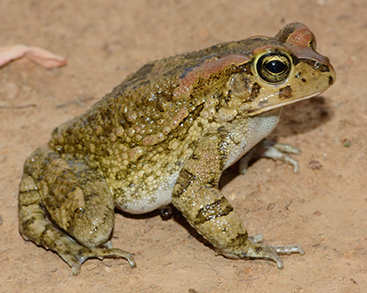
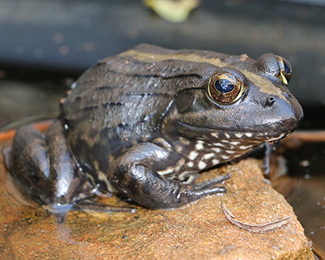

# Scientific names and taxonomic authorities {#taxonomy}

There are quite a few conventions that it's worth being aware of when it comes to using names. When talking about common names, it is a bit of a quagmire as there are few standards that are followed by all journals. Scientific names can also be in great (taxonomic) flux, but at least there is definitive help. Here I will outline my interpretation of what's what in using names.

## Scientific names

There is only one valid scientific name for a species. This is expressed in a binomial: two names, first the genus (with an initial capital letter) and then the species name (lower case). This name is italicised by convention (or, in some cases, underlined). Note that no other taxonomic names (e.g. Family, Order, Class, Phylum) are written with italics (although they all get capital first letters), only the genus and species are italicised. The single name is a hard rule as taxonomy can't survive in any other way. The most recently published version is the one to use, but happily with many vertebrates ([mammals](https://www.mammaldiversity.org/), [birds](https://avibase.bsc-eoc.org/avibase.jsp?lang=EN), [fish](https://www.fishbase.se/search.php), [reptiles](http://www.reptile-database.org/) and [amphibians](http://research.amnh.org/vz/herpetology/amphibia/)) there are well curated databases to which you can refer for the latest taxonomic treatments. Also, see [WoRMS](http://www.marinespecies.org/) for marine species. My suggestion is that you defer to these (with citation) and you won't go far wrong. If you do this early on in your thesis, remember that you may need to update it later.

### Consider this example:

When my former student started his PhD in 2013, he worked on three species, and over time these changed so that at various points in his thesis they had a variety of names. You can see the combinations he had to contend with in Table \@ref(tab:taxonomy).

Table: (\#tab:taxonomy) **Taxonomy is dynamic which means that species names change over time.** The way in which genus and species names can change in only a period of 5 years.

|  |  |  |
| ---- | ---- | ---- |
| *Amietophrynus rangeri* | *Amietia angolensis* | *Xenopus laevis* |
| *Amietophrynus rangeri* | *Amietia quecketti* | *Xenopus laevis* |
| [*Sclerophrys capensis*](https://amphibiansoftheworld.amnh.org/Amphibia/Anura/Bufonidae/Sclerophrys/Sclerophrys-capensis) | [*Amietia delalandii*](https://amphibiansoftheworld.amnh.org/Amphibia/Anura/Pyxicephalidae/Cacosterninae/Amietia/Amietia-delalandii) | [*Xenopus laevis*](https://amphibiansoftheworld.amnh.org/Amphibia/Anura/Pipidae/Xenopus/Xenopus-laevis) |

The taxonomy of two species changed such that he had to constantly revise the names in his thesis. Luckily, he could simply conduct a 'replace all', but it did become quite confusing. There's a chance that they've changed again, so I've provided hyperlinks for you to check out what the current name is. The lesson is that if you want to avoid this, work on *Xenopus laevis* or conduct your PhD in as short a time as possible!

In taxonomic papers, and certain journals with a taxonomic focus, there is an insistence that you cite the 'taxonomic authority' after the species name when used for the first time. This is essentially a citation in which you acknowledge the original description that accompanies the name. Let's take the above examples again:

> *Sclerophrys capensis* Tschudi, 1838             
> *Amietia delalandii* (Duméril and Bibron, 1841)     
> *Xenopus laevis* (Daudin, 1802)       

It might seem that there's a mistake above, because Tschudi, 1838 isn't in brackets. This is actually deliberate. Tschudi, 1838 isn't in brackets because the genus name hasn't changed since the description by Tschudi [-@tschudi1838classification] placed *S. capensis* in *Sclerophrys* in 1838. But it is clear in the table above that the genus name did change to *Amietophrynus*, and it was recognised under a different species name (*A. rangeri*). Unlikely as it may seem, the original description of the species was by Tschudi in 1838, but this was long forgotten (or ignored because the type specimen was so poorly preserved), and the species was regularly referred to as *Bufo rangeri*. When the genus *Bufo* was broken up into lots of newly named genera by Frost et al [-@frost2006amphibian], Tschudi's description was once again disregarded [@ohler2016identity]. However, in 2016 new work on the type specimen revealed that it was the same as *Amietophrynus rangeri,* but because Tschudi's description was older, the taxonomy deferred to the rule of precedence. If you want to read more about it, you can look at all the changes on the amphibian taxonomic database.

To clarify, the use of brackets around the taxonomic authority only happens when the species is no longer in the genus in which it was originally placed by the person who described the species. Daudin [-@daudin1802histoire] originally described *Bufo laevis*, and Duméril and Bibron [-@dumeril1841erpetologie] originally described *Rana delalandii*. Hence you will see that both of these authors are within brackets after the names of their respective species.

The generic name of a Latin binomial is often abbreviated to the first letter (e.g. *X. laevis*). This should only be done once it is well established in your writing what the full name is. Or, in other words, you should refer to the species in full on the first mention, and then switch to the abbreviation. Because sentences shouldn't start with an abbreviation, you might need to relax this from time to time. You also need to treat the abstract as a stand-alone document in this respect. You might find that you have two species, which belong to different genera that share the same first letter. In this case, most authors use a different abbreviation: for example, *Ap. rangeri* and *At. angolensis*. This is exasperated when both species' names are the same. 

I have seen some comments that suggest that once a generic name is abbreviated in a paper, it shouldn't be written in full again. In my opinion, this is rather a silly idea. It is up to you (the writer) to avoid ambiguity. If there is no ambiguity, then you may write the genus and species in full to increase the readability of your piece.

You should not start a sentence with an abbreviated genus. *X. laevis* would not be good, because your first word of the sentence is abbreviated (*X.* ). *Xenopus laevis* is a perfectly admissible way to start a sentence.

Lastly, there is a convention that when referring to the generic name alone you should always mention that it is a genus. So you shouldn't write about those *Bufo* that hop around the house, but instead about those members **of the genus** *Bufo* that hop around the house.

## Different codes for the nomenclature of different taxa

Nomenclatural codes exist to ensure stability in names. At first glance, this might seem like quite a trivial (academic) matter. But think about what happens when a particular species is named in law. That name could (in theory) be changed by some unscrupulous biologist to open up a legal loophole, or at least some ambiguity. Once you are aware what can go wrong with taxonomy and the implications that it can have on many lives, you will understand the need for stability. Happily, there are associations of very serious people who guard the stability of taxonomy through the codes. It is important to realise that there are codes governing the naming of different levels of taxa. 

 - Viruses – [International Code of Virus Classification and Nomenclature](https://talk.ictvonline.org/information/w/ictv-information/383/ictv-code)
 - Bacteria & Archaea – [International Code of Nomenclature of Prokaryotes](https://www.the-icsp.org/bacterial-code)
 - Algae, Fungi & Plants – [International Code of Nomenclature for algae, fungi, and plants](https://www.iapt-taxon.org/nomen/main.php)
 - Animals – [International Code of Zoological Nomenclature](https://www.iczn.org/the-code/the-international-code-of-zoological-nomenclature/)

There are many peculiarities for each taxon, and if your PhD involves taxonomy explicitly you should consult the specific code. Otherwise, it's unlikely that you'll need to be aware of the contents of each or any code. 

### Peculiarities of plant taxonomy

Plant taxonomy is considered the taxonomic mother discipline as the work of Linneaus in 1753 was the first botanical work that consistently used Linneus' binomial (two names: Genus species) nomenclatural system [@linnaeus1753species] which pre-dated the more inclusive (and better known) landmark publication in 1758 [@linnaeus1758systema]. Until the Botanical Code was revised in 2012, all new botanical diagnoses had to be written in Latin. In addition to the Latin binomial name (Genus and species), plants (and some other taxa) often require further descriptors or **ranks** that denote subspecies, varieties, subvarieties, etc. I have included a (non-exhaustive) list of these in Table \@ref(tab:plantrank), together with some examples. 

Unlike animal authorities, for plants, if the combination of Genus and species has changed, both the authority for the original genus placement, and the author responsible for the new combination are given after the species name (with the former in brackets see Table Table \@ref(tab:plantrank)). In addition, for plants no year is given, and the name of the authority is usually abbreviated. Because Linneaus named so many plant species in his landmark publications, instead of writing out the full taxonomic authority after the species names, botanists abbreviate this to "L.". Like Linneaus, other prolific plant taxonomists can have their names abbreviated, but plant taxonomists became so numerous that there needed to be some standardisation of names and their abbreviations. A database of these **Standard Forms** can be found at [the International Plant Names Index database](https://www.kew.org/data/authors.html). Note that Standard Forms in plant taxonomy can include initials.

Table: (\#tab:plantrank) **Plants often need more information than the simple Latin binomial.** This table provides the required abbreviations that you will need to add in order to properly describe the rank of your plant taxa. Note that the taxonomic authority (last column) can include two names with the first in parentheses if the second changed the placement of this taxon. 

| Rank | Abbreviation	| Example | Authority |
|-----|-----|-----|-----|
| Subfamily | subf. | Poaceae subf. Pooideae | Benth.  |
| Subgenus | subg. | _Metrosideros_ subg. _Metrosideros_ (Myrtaceae) |   |
| Section | sect. | _Senecio_ sect. _Senecio_ (Asteraceae) |   |
| Subsection | subsect. | _Stachys_ subsect. _Swainsonianeae_ (Labiatae) |   |
| Series | ser. | _Mimosa_ ser. _Paucifoliolatae_ | Benth.  |
| Subseries | subser. | _Palicourea_ subser. _subcymosae_ | (Müll.Arg.) C.M.Taylor  |
| Subspecies | subsp. | _Trichophorum cespitosum_ subsp. _germanicum_ | (Palla) Hegi |
| Variety | var. | _Closterium acerosum_ var. _elongatum_ | Brebisson |
| Subvariety | subvar. | _Hieracium vulgatum_ subvar. _oblongatum_ | Sudre |
| Form | f. | _Prunus cerasifera_ f. _atropurpurea_ | Diffel |

Algae sometimes exist in association with other taxa (such as lichens which are an association between an algae or cyanobacteria and one or more fungi. For these associations, there is a specific code for their nomenclature: International Code of Phytosociological Nomenclature [@theurillat2021international].

There is also a code for cultivated plants, and if you study any kind of agronomical system, you will be familiar with not just the normal binomial name, but also a specific cultivar or variety (*var.*) that follows the binomial: [The International Code of Nomenclature for Cultivated Plants](https://www.ishs.org/scripta-horticulturae/international-code-nomenclature-cultivated-plants-ninth-edition). 

## Other times to use italics

In general, italics are used when names are derived from Latin or Greek. A number of subdisciplines have international codes for how the names should be written: Anatomy, Histology, Embryology and Neuroanatomy. There is often confusion about these correct terms, but luckily four major publications are here to help you. These are maintained by the international groups who specialise in standardising the nomenclature, and they are republished from time to time (so look out for updates). I provide directions to these citations should your research require them:

- Terminologia Anatomica. [@terminology1998terminologia]
- Terminologia Histologica. [@terminology2008terminologiaa]
- Terminologia Embryologica. [@terminology2013terminologia]
- Terminologia Neuroanatomica. [@terminology2017terminologia]  

## Common names 

Common names have a different set of problems to those that we've seen for scientific names. These are largely focussed on: what name to use, and whether or not to capitalise the common name.

What name to use - This is tricky. My suggestion would be to take the most commonly used common name, as that's likely to be the one that most people will recognise. However, it's not always that simple and because there's no 'correct' common name, you have some leeway to choose the one you prefer.

Let's take an example: The African Clawed Frog is a very widely used name for *Xenopus laevis* which is used all over the world as the model amphibian. However, African Clawed Frogs is also the commonly accepted name for the entire genus, *Xenopus*. Thus, shouldn't we avoid using this for the species *X. laevis*? So, let's look at the alternatives. Frost [-@frost2020amphibian] lists 13 common names for this species. Names such as Platanna and Common Platanna are difficult to use in scientific papers as they are only regularly used in South Africa. Clawed Toad is not appropriate, as it is not a toad (reserved for members of the family Bufonidae), a confusion that dates right back to Daudin's 1802 description. Clawed Frog has the same problem as African Clawed Frog, and other variants such as Upland Clawed Frog and Smooth Clawed Frog also seem inappropriate as this species is neither confined to uplands, nor the only member of the genus which is smooth (although 'laevis', the species name, does mean 'smooth').

There has been a recent movement to formulate common names into genera (or even families) such that the specific common name takes on a specific epithet of the generic or familial common name. In a world of stable taxonomy (such as that enjoyed by ornithologists), I can understand that this is possible. But imagine the requirements in common name changes for frogs in Table \@ref(tab:taxonomy) over only a few years. Surely the useful thing about common names is that they are used commonly by normal people who don't worry about taxonomy? If we insist on common names constantly changing, don't we risk alienating the public?

I eventually decided to use 'African Clawed Frog' as this is the most widely recognised common name for this species. It does become an issue when writing about *X. laevis* and other *Xenopus* species (as we have), but we've managed to resolve this without too much difficulty.

## Should common names have capitals? 

**Warning: lots of people get very upset about this point and there are two views:**

### View 1 - Yes, use capitals for common names

Common names are proper nouns and proper nouns start with capitals. The Western Leopard Toad is not any toad, and the African Clawed Frog isn't any frog. The Cape platanna is any platanna living in the Cape, but the Cape Platanna is *Xenopus gilli*. In this last example, you can see how capitalisation reduces ambiguity and differentiates between adjectives and nouns.

Personally, I find that capitalising common names helps them stand out in the text, and as a reader it helps me immediately recognise that a word is a name, and not a regular adjective. As many common names contain strings of words including adjectives, I find that I might need to re-read a section when I realise that a common name is being used, and that the author is not describing an attribute of the species.

Note that many common names are hyphenated, and if this is the case then you should only capitalise the first part of two in a hyphenation: i.e. **White-throated Sparrow** (_Zonotrichia albicollis_), not White-Throated Sparrow.

### View 2 - No, don't use capitals for common names

Common names are not proper nouns (like scientific names) and so should not be capitalised. Many journals do not capitalise common names and insist on lower case unless they are proper nouns, like African in African clawed frogs. This seems to have arisen from editors who dislike superfluous capitalisation.

Other reasons why capitalisation might not be implemented for common names include: 

- They are not proper nouns, and so (according to traditional English grammar rules) should not be capitalised
  - Countries publish style manuals for what is acceptable (e.g. see [here](https://www.stylemanual.gov.au/)), and these often state that common names should not be capitalised
  - I suspect that many publishers follow these official national guidelines when making decisions about scientific journals
  - Many publishers and their editors hate superfluous capitalisation and attempt to eliminate it. This simply comes from sloppy writers who tend to overcapitalise. 
- The capitalisation of common names implies some sort of official recognition: that it is **the** common name, and not **any** common name. Some groups, such as ornithologists, have only one common name for each species that they officially recognise. They take this to absurd lengths when they insist that all common bird names **must** be capitalised while common names for other taxonomic groups must not be capitalised (see [here](https://www.worldbirdnames.org/new/english-names/spelling-rules/capitalization/)).
  - Even when ornithologists get their own way, and bird names get capital letters, these are changed to lower case when they are in a list with other animals and plants that carry lower-case (see [here](https://www.stylemanual.gov.au/style-rules-and-conventions/names-and-terms/plants-and-animals#write_common_names_in_lower_case_and_roman_type))
- You may notice that Wikipedia does not use capitalisation for common names (see [here](https://en.wikipedia.org/wiki/Wikipedia:Manual_of_Style/Capital_letters#Common_names)). They state that this is because they avoid superfluous capitalisation in English (much as editors do - see above). 

On balance, I'd say that it's likely that your usage will be dictated by the policies of your faculty, advisor or journal.

### Changing scientific names to English names

There are many examples of names of scientific taxa that are changed to English derivatives of the original Latin names (see Table \@ref(tab:derivative)). While the official Latin version of the scientific name almost always carries a capital letter (see [above](#taxonomy)), these anglicised versions do not.

Table: (\#tab:derivative) **Latin names can be changed into English versions.** You may not realise it, but many English names have been derived from scientific names. While the Latin names usually carry capital letters (see [above](#taxonomy)), these anglicised versions do not.

| Taxonomic rank | Latin name | English derivative |
| ---- | -- | --- |
| Kingdom | Animalia | animal |
| Phylum | Arthropoda | arthropod |
| Order | Carnivora | carnivore |
| Superfamily | Vespoidea | vespoids |
| Family | Bufonidae | bufonid |
| Subfamily | Felinae | feline |
| Genus | _Eucalyptus_ | eucalypt |

Turning a Latin taxonomic rank into an English derivative is a useful mechanism in which to bring variation into your writing. While there are distinct rules about the use of taxonomic ranks (see [above](#taxonomy)), there are not with these anglicised derivatives, and you can use them as you want. Even if they haven't been used before for your study group, there is no reason why you should not erect an English derivative for your own purposes - as long as this enhances readability and does not cause more confusion.
