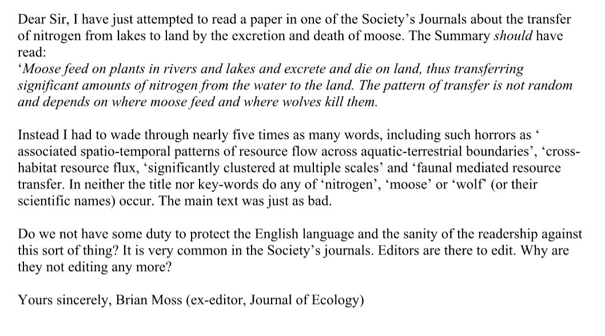

## Writing style {#style}

**Did you ever feel that reading a paper was like trying to solve a puzzle?**

During my PhD I read a lot. My study species was the subject of tens of thousands of papers, and I was convinced that I'd find what I'd need somewhere in those musty old reprints and heavy volumes that came from the library shelves. It was easy to believe that the authors of those papers had set great puzzles for me to try to understand their content. The realisation that this is not the best form of communication came as a personal epiphany some years ago.

> “The goal of good writing is straightforward: to make your reader's job as easy as possible” 
>      Kevin W. Plaxco [-@plaxco2010art].

This great quote from a paper by Plaxco [-@plaxco2010art] cuts to the heart of why it’s essential to write well. As an editor, I once experienced an author who thought the opposite, and for me this was an epiphany. The submitted manuscript was an impenetrable mess. I could tell that there was good work in there, but as an editor I felt that the information had been made so obscure by the authors that my readers were unlikely to get much out of it. The author was a colleague, and so I decided to phone him and chat about the need for much greater clarity in his manuscript. Experience with email has taught me that they can often be taken in the wrong way; usually in the worst possible way.

The response I got surprised me. The author recognised that his text was dense and was unapologetic. “Let the reader work to make sense of my data,” he said. My epiphany came not because this was a totally alien concept, but because during my PhD days this was exactly how I had thought scientific writing should be done. I had spent so many hours slogging through dense and dreary papers by well-respected figures. The reward when I finally understood what it was that they were trying to communicate felt so great that I believed the puzzle they had set me was what I should set my own readers. Happily, my advisor didn’t feel the same way, but for years I continued to believe that a paper should be a decent puzzle for my readers to crack. This might seem a crazy concept, but it’s not an uncommon problem. For a great take on this in Chemistry, see this great article by Murray [-@murray2011skillful].

This has led to a general perception that "academics stink at writing" - as Steven Pinker put it. But, I think that Pinker is outdated. Certainly, as Plaxco [-@plaxco2010art] has it, there are a lot of ways that academics can improve their writing, for each other. But the belief that all academic writing is going to be accessible to the general public is far fetched. This is because there are a lot of terms when writing journal articles that are there for precision and brevity. These terms will exclude a larger audience, especially when they get so dense that looking them up is simply too arduous. What Plaxco [-@plaxco2010art] urges us to do is to make the rest of the text as accessible and easy as possible. 

Any good writing is an artform, and that includes good academic writing. You can't expect to be the best until you've spent some time at it.

There are still authors out there who attempt to set puzzles for their readers, but they aren’t in the mainstream any more. Instead, biological sciences has some inspiring writers, and many more are taught how to inspire future generations towards communicating great science. That’s not to say that there are no puzzles left. Much of what we do requires great puzzle solving abilities. However, let’s keep the puzzles away from communicating with our audience, make their job as reader easy or even pleasurable, and they’ll keep coming back for more.

### Don’t bamboozle

It’s easy to use jargon. The whole point of jargon is to convey a (usually complex) idea in a short amount of space. Using a word (or two) instead of using several sentences clearly has some advantages. However, there is such a thing as too much jargon. Simply put, it’s unnecessary to use jargon when you can use plain English in the same amount of space. My old tutor at Liverpool University, the late, great Brian Moss, shared the following example of too much jargon [@bump2009large], when plain English would have been much shorter. Do yourself a favor and read the abstract of Bump et al [-@bump2009large]. The fact that it gave Moss a chance to write about moose wasn’t lost on anyone (see Figure \@ref(fig:moss))!

(ref:moss) **Bamboozled Moss takes on the moose.** Brian was so unhappy after reading Bump et al (2009) the above that he felt compelled to write a letter to the British Ecological Society Bulletin.


```{r moss, echo=FALSE, out.width = '95%', fig.cap="(ref:moss)"}

```
