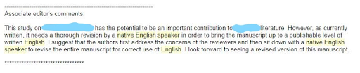

# Writing a PhD if English is not your first language {#foreign}

Reading this book, you will learn of some biases in biological sciences and how you need to be aware of them in order to properly interpret your work. Be aware also that biological sciences is biased in where studies take place [among [a lot of other biases](https://howtopublishscience.org/pubbias.html): @measey2022how], and who publishes them [@culumber2019widespread; @nunez2021monolingual; @martin2012mapping]. What we really need then are more studies from less studied parts of the world, and we need these to be researched and published by people from those countries. Why then do we insist that science be written in English? 

English may be one of the most difficult languages to learn to write as a foreign language because rules are so inconsistent, and the vocabulary is so large. At 171 476 words, English has an enormous vocabulary, followed closely by Russian (150 000), Spanish (93 000) and Chinese (85 568: although you should note that counting words isn’t very accurate and as for counting dictionary entries, Korean wins). I cannot defend the use of English as the language of science, but I can assert that having a universal language for communicating science is massively helpful, and makes a large swathe of the literature available to those scientists who are prepared to become proficient in a second language. However, none of this really helps you to prepare writing in English as a second language.


## Do I need to write in perfect English? 

The best news is that the plethora of translation tools from various languages to English is getting so good that although learning how to read and write good English is always going to be useful, it is not essential. I would suggest that instead, you put your efforts into learning scientific writing style (as taught in this book and others) instead of learning the rules of English grammar. What we are interested in is being able to communicate your science to a global (mostly non-English speaking) audience. There is a world of difference between being able to write good English and being able to write scientific English, and most English speakers struggle to make this change unless they are taught. The aim of this book is to teach people how to change their style into scientific English. 

One of the major difficulties for non-English speaking students learning to write scientific English is that they don't appreciate the difference between good English and scientific English. Actually, you don't need to learn to write English, you can learn to write in the scientific version of your own language. But that must encompass the same scientific style that is being taught in this book. If you want to learn what the scientific style reads like in your own language, then I suggest making a translation of a paper in a journal that forms part of your [core target reading](#critical). Then examine this translated paper using the [critical reading](#critical) tools you'll find later in [Part II](#critical). 

If you are not confident in writing in English, then write in your own language and have it translated. But you must make sure that the style used is the correct scientific style. 

As a reviewer, I read plenty of manuscripts submitted by people who are writing English as a second (third or more) language, or writing in their own language and having it translated. Those that have learned the scientific style generally do very well with minor issues in grammar. They will not get penalised for these minor grammatical issues, even though they could clear most of these up with a [good grammar editor](https://www.grammarly.com/). Those who don't produce manuscripts are not suffering with language as much as a failure to understand the scientific style. 

Specifically:

 - Their [citations](#citations) are poor or incorrect
 - Their studies often lack a [hypothesis](#hyp) or [clear aim](#nohyp)
 - Their [arguments](#argument) are poorly made or inconsistent
 - The study approach or study design is unclear
 - The writing is not [concise](#concise)

The good news about all of these deficiencies is that it is possible to learn how to do these well in your own language, and that none of them really have anything to do with English, but everything to do with writing in a good scientific style. Solving these problems can be done in combination. First, take a good guide to scientific writing ([like this one](#contribute)) and try to incorporate the lessons taught into your writing. Second is [critical reading](#critical) which should tell you all you need to know about how to write well. My suggestion is to do both. The book can help you to demystify the scientific style, and [critical reading](#critical) is a great skill to acquire and will take you forward with all you need to learn. Lastly, and perhaps most important, is to put into practice what you learn in your own writing. Don't let having to submit in English hold you back. Move forwards in your own language and apply all of the tools you learn and then translate once you've finished. As time goes by and your English improves, you'll learn that it's really not as hard as it seems.

## Message from an editor 

One of my 'pet hates' is that many non-English speaking editors seem to insist that you have your work checked by a 'native English speaker' (see Figure \@ref(fig:editor)). In my experience, having advice from a 'native English speaker' is no guarantee to getting a well-written chapter or manuscript. I have had many native English speaking students who are not able to spot very obvious mistakes, and make many of their own. Most of the world’s scientists did not grow up speaking English. Yet, rightly or wrongly, English is the language in which science is currently written. So, if English isn’t your mother tongue, should you expect to receive help during peer review?


(ref:editor) **The message from the editor: "your work should be checked by a native English speaker"** Should you expect to receive help with your English when you submit a manuscript?

```{r editor, echo=FALSE, out.width = '95%', fig.cap="(ref:editor)"}

```


Perhaps I should make it clear that English is my mother tongue, and that I have spent many hours correcting the language of colleagues for whom it wasn’t. However, most of these hours were spent when I was a postgraduate student or postdoc. I no longer think that correcting English is my role either as an editor, reviewer or as an advisor.

As I’ve stated above, I did not study English, and would be the first to admit that my grasp of grammar and syntax is by no means perfect (those of you with better English will have picked this up by now!). I have read enough correct English to know when something is incorrect, but that doesn’t mean that I know how to correct it. I have spent many long hours trying to decode what others have written, and in some cases, this has involved me rewriting entire manuscripts. I still do this as a co-author, although I do remember asking one colleague to please send any further drafts in their native Spanish as it was easier to translate than it to re-write.

The time component is at the crux of my reasoning why, as an editor, reviewer and advisor, I will not provide an English language service. It is time consuming and an unsatisfying experience. We all have our own voice, and correcting while maintaining other people’s voices is a painstaking task. There’s an entire profession that specialises in this (think translator). These days there are also services available from publishers to non-English authors to help them correct their English.

In addition, there turns out to be research suggesting why peer review is not the best way to improve writing [@shashok2008content]. Peer review works much better at screening technical content than it does at improving the communication of that content. And this agrees with the opinions of some non-English speakers who ask for editors and reviewers to concentrate on the science, a sentiment with which I agree.

No matter how you might hope that it isn’t true, a poorly written manuscript will not get a good review. If your reviewer is struggling to understand what you have written, this becomes the overall impression that they will likely pass onto the handling editor. I try to separate my difficulties with English from my review of the science. But this isn’t always possible. Frequently, a poorly written manuscript will mean that I won’t be able to understand why the research was undertaken, what was done or what it means. This is bound to impact the review negatively.

The more I struggle to read, the more negative the review becomes. I see this as inevitable. What shocks me is that some senior researchers consider it to be their right to submit poorly written manuscripts and have reviewers or editors correct them [if you don’t believe me, see @statzner2010negative]. Worse, I’ve received manuscripts that are co-authored by people I know are native English speakers, but are full of glaring mistakes that appear never to have been checked. For me, this violates the terms that all authors have approved the final manuscript.

But I've also got to admit that it's not easy. There are other places where you might be better to go to get advice on writing a paper or thesis as a second (or even more!) language [see @firth2017writing]. I'm full of admiration for those of you that have to do this. 

## Must a ‘native English speaker’ check your work?

Being a native English speaker, I am not above having people complain about my English. I do get it wrong, and my English can often be improved. I’m always happy to receive help, and see it as a sign of how I can improve the clarity of a manuscript. However, I hope that my manuscripts are never so poorly written that a reviewer or editor cannot make sense of them. So it is a matter of degrees.

There are many people who are not native English speakers who write far better than I do. My ‘pet hate’ is that reviewers and editors insist that a manuscript must be corrected by a ‘native English speaker’. I’ve seen so many very poorly written essays, theses and manuscripts written by native English speakers that I know that having one correct your manuscript is unlikely to be of much help, unless they themselves are good writers.

Being a ‘native English speaker’ doesn’t automatically qualify you to write well, edit well or do any of the things that non-English speaking editors think that it does.

That non-English speaking editors often comment that a ‘native English speaker’ should read my text, simply underlines the problem that many editors themselves are incapable of knowing whether or not something is well written. 

## So if not a native English speaker, who should do it?

First, I would suggest that you check out the wide array of tools available online. Some may be behind paywalls, but provide you with a free trial. If the service that they offer is good, then consider subscribing so that they can help you in future. 

Your university may have a facility to help you with English language translations.

Anyone you know who writes good English and is willing to help you. One option is the service offered by **AuthorAID** (http://www.authoraid.info/en/). Using AuthorAID, you can find a long-term mentor who will help you with your English. You can read more about this approach here [@freeman2006publishing].

Failing that, the best route will likely be to pay for help. There are many services available to help you, and many scientific publishers now promote these if you are submitting a manuscript. 

## But surely my native tongue can be used for something?

Yes. It is essential that you use other languages to communicate your science with the wider community. Most of the world doesn't speak English, and so there is a real need for this to be done in your language. Many journals now allow abstracts to be submitted bilingually. Obviously, the second language should have some relevance to the study itself. Even if there is nothing in the instructions to authors about submitting the abstract in another language, I'd encourage you to do it. The more we scientists are exposed to the reality that other languages exist, the more it will rub off on those that need to understand. [Read more on this blog @taskin2020long]

Lastly, consider the words of 

>Kurt Vonnegut [-@vonnegut1982how]:
>
>"No matter what your first language, you should treasure it all your life. If it happens not to be standard English, and if it shows itself when you write standard English, the result is usually delightful, like a very pretty girl with one eye that is green and one that is blue."
