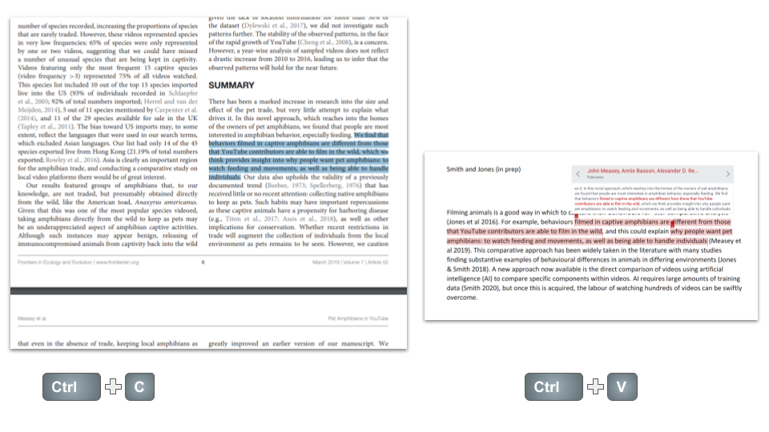

## Making sure that you don’t plagiarise {#plagiarise}

Essentially plagiarism is when you copy somebody else's work. We're most commonly familiar with plagiarism of writing and these days this is especially easy with the copy and paste function. Most people are not even aware that they have plagiarised because sometime in the past they copied and pasted the work of somebody else into a document and this later became incorporated into their text without them being aware of it. 

Plagiarism is a problem because essentially you are taking somebody else's work without attributing it to them. 

### How to know if you have plagiarised

Today there are several pieces of software that are used to scan text that's written and available on the internet to discover plagiarism. One such example is Turnitin. One of the outputs of TurnItIn is to highlight text that matches other text already on the internet. As almost all journals published on the internet TurnItIn can accurately determine if text has been copied from another article or website.
I usually set TurnItIn to determine plagiarism with five or more consecutive words.

Remarkably it is very difficult to come up with exactly the same words that someone else used to describe a phenomenon. Most people when they think about it feel that it wouldn't be that surprising if they came up with exactly the same words as somebody else.

When caught plagiarising most undergraduates claim that they simply read an article and then later happen to write the same words that were in the article. They categorically deny that they ever copied or pasted text from the article into their work.

__Try it. When you try it you will learn what plagiarism is all about.__

Read an article, and then try to write text that is exactly the same as that in the article without looking back at the article itself. 

Unless you have an eidetic memory you will fail at this task. 

(ref:plagiarism) **It's always tempting to copy and paste, but it is likely to lead to plagiarism.** Copy (Ctrl + c) and paste (Ctrl + v) have become so easy that it is tempting to pick up portions of appropriate text directly from papers and then slot them into our own work (Figure \@ref(fig:plagiarism)). However, this is plagiarism and can easily be found by using software like TurnItIn. Most institutions will require checks for plagiarism on your thesis after submission, with dire consequences if your text fails.


```{r plagiarism, echo=FALSE, out.width = '95%',  fig.cap="(ref:plagiarism)"}

```


This is not to say that no 5 or more words can ever be the same as someone else's. There are situations in which this happens. Think of addresses, quotes, certain laboratory equipment or protocols, and certainly references at the end of your paper. So there are many times when TurnItIn will come back with matching text. This is not what we're looking for in plagiarism.


###  What to do if plagiarism is detected in your work


It's remarkably easy to remove plagiarism from your work. 

__Here's what you do:__
- Read the sentence that has been plagiarised several times to yourself. 
- Now without looking at that sentence, write another sentence that has the same meaning. Because it's very hard to replicate somebody else's words without copying them, what you should find is that you've written a fresh plagiarised sentence. 
- This can now be added to your text, changed as appropriately to fit your existing text. And that should be the end of your plagiarism worries.

__Here's what not to do:__
- Take the sentence swap out some of the words for synonyms and pass it off as your own. 
- The sentence will still have the same structure that you copied and essentially this is still somebody else's work. Moreover TurnItIn will still recognise this as plagiarism.

### How can you make sure that you never plagiarise?
Quite simply if you never cut and paste, you won’t plagiarise. It’s that easy. I understand why people copy and paste as a way to get started, or because someone else has written something so well, it’s hard to believe that you could ever write it any better. But actually, you can write it just as well, and writing it in your own words is worth so much more.

Don’t forget that the penalty for plagiarism in your thesis might well be that you fail.

It still seems amazing to me when I submit a student manuscript to TurnItIn and see that it is completely free of any plagiarism. There are so many words in English (>643 000 according to the Oxford English Dictionary) and so many different ways of putting them that you really can have your own writing style. Your writing style will be as unique to you as a fingerprint, and it will be entirely free of plagiarism. It's something you can celebrate.

Want to read more about plagiarism to understand what it is: Louw [-@louw2017defining] 

### What is grey plagiarism?

I would maintain that there is not really any grey area in plagiarism. So what are people talking about when they refer to a grey zone? The nominal grey zone within plagiarism comes when you copy your own text, this is sometimes referred to as self-plagiarism, but this also refers to the associated practice of ‘manuscript recycling’ [@geraldi2021self-plagiarism]. Essentially this is really just the same as plagiarism but obviously if you are the original author then if you use your own text it's not the same as using somebody else's, because the work is still yours. However this is frequently complicated by multiple authors on a paper. For example, if I wrote a paper with five other people, even though the words were mine, if I use them again they would actually be attributed to all six authors and not just to me. Thus, if I use them again with five different authors it would still be plagiarism. 

This is a particular problem in biological sciences (and some other sciences) when it comes to the methodology section ([see part 3](methods.html)). Many students believe after having written the [Materials and Methods](methods.html) once, they can’t possibly write it again in another way. Actually, you can and you should. It’s good practice, but remember that you can also cite the methods in a previous chapter. For example, chapter 2 has one method written out in great detail. Chapters 3 and 4 then reference chapter 2 while giving only a brief section on that methodology. You should already have seen some examples of how people do this in the literature, especially when citing their own previous work. 

This is further complicated by having different publishers for your papers. Let's say I wrote a paper, I was the sole author and it was published by a journal that retained the copyright. If I use the same text again in another paper where again I was the soul author, but it was published in a different journal and they retained the copyright, that would be a breach of copyright to the first journal. It would be regarded as plagiarism.

Obviously, this situation really shouldn't occur because if you are the author of your own work then you should retain the copyright it should never be given to a publisher or a journal. The fact that many journals want to obtain copyright on work that they don't pay for is a complete disgrace but it's something that we're not going to go into right now (you can see rants here and here about science publishing scandals). 

### Manuscript recycling

Manuscript recycling is the practice of re-publishing the same manuscript (or with minimal changes) in different journals. Manuscript recycling is a bigger problem in other subject areas, notably economics [@geraldi2021self-plagiarism], publishing issues in economics appear to need a lot more professionalism. 

### Overall - just don’t plagiarise

The simple way around this problem is not to plagiarise any of your own text (self-plagiarism) or any of anybody else's. This is, as I've explained above, relatively easy because as long as you don't copy and paste any text you'll find it very hard to actually use somebody else's words. However it can get a little bit tricky when you are writing the materials and methods section of a paper, and especially when that paper uses exactly the same materials and methods as a previous paper. The temptation is great to go and copy the text that you've written before. But be aware that, however grey, this is plagiarism and you should not do it.

The likelihood is that because you're using the same names and their relationship is staying fixed as shown in the example above in materials and methods you are more likely to come up with text that a piece of software like turn it in will show is plagiarised even when it isn't.
