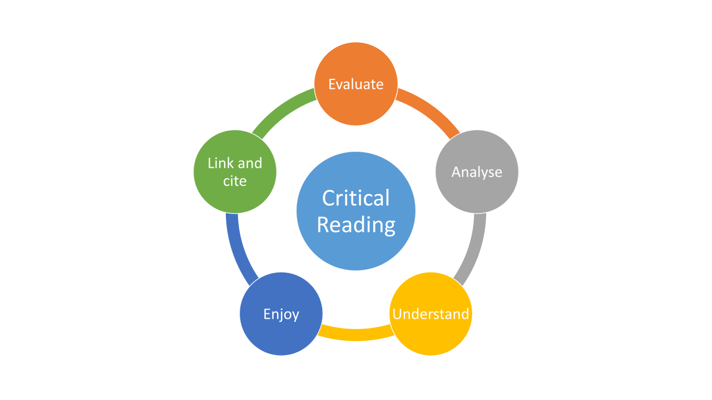

## Why critical reading is crucial for improving your writing {#critical}

It is hard to emphasise exactly how important your reading will be, when it comes to your writing. If you are sitting with a blank page in front of you and feel that you have nothing to draw on, then think again. All of the reading that you have done to get to this point has already helped you more than you think. As I’ve pointed out elsewhere, your chapter or manuscript is likely to resemble the formula that many others already follow, and standing on the shoulders of those giants will help you again. But it’s possible that your reading isn’t helpful if you aren’t being sufficiently ‘critical’ when you read: and by critical I am talking about the methodical approach that you take to reading that improves your comprehension of a paper (Figure \@ref(fig:Criticalreading)).

(ref:Criticalreading) **Critical reading is seen as being made up of five important aspects**. This diagram shows how each of the five aspects feeds into the next.

```{r Criticalreading, echo=FALSE, out.width = '95%',  fig.cap="(ref:Criticalreading)"}

```


### Making notes on good and bad styles

When you read, it’s worth making all sorts of comments about what you’re reading. It’s tempting to think that the only aspects of a paper that you should take notes on are the science (questions, approach and findings), but this is only part of your mandate as a critical reader. Of course you should be taking notes on the science, but you should also be using it as an opportunity to learn tips and tricks of writing. Once you are actively writing, and I’d suggest that this should have been right from the very beginning of your studies, you should be actively thinking about how the authors are writing. Are they writing well? Are parts written poorly? Then the critical part is to cogitate, albeit briefly: what works, what doesn’t and why.

Some papers will only offer the science that they contain. Others will stand out because you’ll realise that you enjoy reading them. As a critical reader, your task is to decide why you enjoy reading a paper: 

- Is it the style? 
- Is it the way in which they formulate the logic of their argument? 
- Could it be that they’ve broken the standard formula? 
- Is it just the title, or the first sentence that you enjoy?

Once you’ve decided what it is, make these notes on the paper and file them on your referencing system (however you do it) under a style heading. I’d suggest that this be completely separate from your notes on the science. This is as simple as highlighting or making a quick note each time you see something that you like, or dislike (use different colours consistently). I used to underline text in pencil, and then make an illegible comment in the margin. It worked for me, not because I could read the comment, but because I could remember writing the comment.

You can also learn from badly written papers. Again, ask yourself exactly what it is about the writing style that doesn’t work for you? If you don’t know then comment in your database and make a group of papers that don’t read well. Do they have anything in common?

It won’t be every paper you read that you make notes about the style. It will probably only be a minority of papers in your area. However, this critical reading where you make notes on the ones that do stand out will help you greatly when it comes to your own writing. 

#### Some examples

- Instead of using a taxonomic list (I don’t like lists) and long citation string to describe lots of different studies that had previously made the same point, a co-author (in a recent review study) organised them all into the same categories we were presenting in a review. The result was that the reader was reminded of our categories at the same time as seeing how well others had already covered these same topics.

- Being able to sum up a paragraph with a clincher sentence that also has a segway into the next paragraphs is a great skill to have

- Some authors are able to generate a theme that they develop over several paragraphs or pages

If you’ve spotted what it is that you like, write it down and commit it to memory. The very fact that you start to see things in other people’s writing that you like and admire means that you’ve managed to start reading critically. Keep this up, and it will help your writing no end as you open up your mind to critical reading.

You don’t have to restrict yourself in what you can learn while reading other people’s papers. Think about the stages in writing a paragraph. Look at the paragraphs you are reading and see if you can spot the subject and summary sentences. Maybe they are absent from the entire paper, or maybe they are present in every paragraph. Does it help enhance the readability of the paper? What about the times when authors break the rules? Can you see in your reading that the majority of authors follow rules? Do they follow the formula? What is the power in shaking it all up? If it works, try and analyse why it works. Then you will be reading critically.

### Make handwritten notes
  
When I started reading papers, I made photocopies (1 sided was as sophisticated as it got) from volumes of bound journal issues, and made notes in pencil on the back and front of those pages as I read. I understand that most of you will be working on pdfs which offer possibilities to add notes in text boxes that go alongside. But there still may be more advantages to writing notes using your own handwriting. A study by Mueller and Oppenheimer [-@mueller2014pen] showed that students who typed retained less of the content from a lecture than those that made notes by hand. They showed that this was because those who used a keyboard tended to take notes that were more shallow, while those that wrote their notes had a deeper thinking. My take on this is that the brain is making extra connections when you are taking notes by hand. Those extra connections will benefit you when it comes to trying to recall the study. 

Another advantage that making notes by hand brings you is that you can deliberately associate the location in which you read, and practice your handwritten notes, with the place where you want to eventually write and recall what you’ve learned [see @bouton1993context]. Thus you can manipulate this facet of human memory to do all your learning, for example, at your desk in the department, or in the university library. Eccentrics may want to link it to reading in the bath, or another place of great comfort. But be careful not to make your ‘place’ too specific. You could move house or have someone else allocated to your desk, and that wouldn’t work out well. However you decide to make your notes, make sure that it works for you both in the present, and for the later stages of your PhD studies.

Similarly, if you make notes on style, you are likely to remember them in the same way that you remember the paper and its contents. An alternative to writing everything onto a printed copy is to make notes in a notebook. That way you get the advantage of building your memory with your own writing, and you can easily find everything in the same place when you forget where you read the fascinating insight. Alternatively, you may want to print the most important papers in your area, and make notes in pencil all over them. 

It’s important to emphasise that you should not copy and paste parts of someone’s paper that you like. It’s easy to do, but any copying could be your undoing if you later forget and paste your ‘notes’ into your manuscript. It’s so easy to plagiarise like this that the only way to really avoid it is by being very strict with yourself. Making notes by hand will force you to look away from the written text while you write, and you’ll be unlikely to inadvertently copy anything. The advantages of writing notes by hand then make it greatly advantageous to restricting yourself to your computer (tablet or cell!).


### Recognising good or bad in what you read

It’s going to be hard to read and think at the same time. A little like walking and chewing gum, it comes with experience. And if you do fall over, stop chewing for a while and wait until you’ve got into your stride before having another go. Thinking is all part of the reading process, and while I agree that it might be hard to think on multiple levels while you read, it is possible. For example, consider what other worthy things you’ve thought about while reading this book. If you’ve not stopped to check your phone, or think about eating or drinking something, well done. It might be worth creating an atmosphere with less other stimulants while you read. If you only have your reading material and notebook, you’ll be able to concentrate all of your thinking on them instead of getting distracted.

If you can’t decide what it is that you enjoy from one paper, take it further. Take a look at the first author (likely to be the person responsible for the writing style). Have they written other papers, and do these have those same qualities? Or maybe it’s the lab that they came from. Try to find the lab’s pages on the internet and see if there are other inspiring papers there.

There is also a possibility that you are struggling to get insight with your reading because English isn’t your first language. The subtleties of some of the usage of English may be passing you by. Because of the large number of words, it is possible to write something in English in many different ways. The overall aim is to convey the largest amount of information possible in the smallest number of words, while enhancing the context, meaning and readability. It’s not easy, but the only way you’ll ever get good is by starting, and reading and writing as much as possible.

 If you are still struggling, a really good way forward is to start a journal club with your colleagues. It is probable that you aren’t the only one who is having difficulties. There may already be a journal club in your institution which may (or may not) be a good place to go. What you do need is a safe space in which you aren’t afraid to say when you don’t understand. Think of it as a book club for scientific papers. After all, it may be that no-one understands and the paper is badly written. Alternatively, it can be that someone is able to help you quickly and easily. They can then give you extra insights into how and why they think the author is crafting their paper. This will then help you with your reading as well as your writing.

If you are looking for good fodder for your journal club, consider reviewing a preprint and publishing your review with a doi [@teixeiradasilva2017fortifying]. This will make the whole exercise a lot more worthwhile and produce a net output for your club. 
