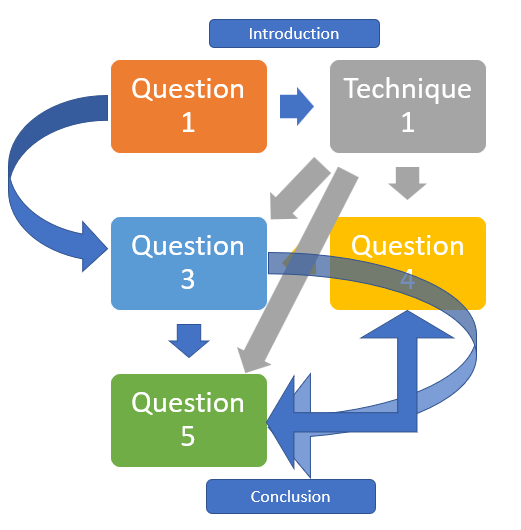
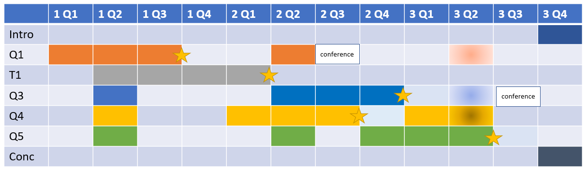

# Creating a conceptual framework of your PhD thesis {#concept}


Explaining your PhD is going to be a constant throughout the duration, and beyond. Getting that explanation correct, and being able to do it for audiences at different levels will be really critical from the outset. The best way that you can do this is to get the conceptual framework for your thesis straight in your own mind as soon as you can. 

Once completed, your PhD will have an audience of [examiners](#who-are-the-examiners), but eventually you'll get to [publish](https://howtopublishscience.org/) all the chapters of your PhD to an audience of scientists and potentially a much greater audience of people around the world. In each case, if you can contextualise your work and how it fits into your thesis, it will help increase your confidence.

## Planning your thesis as a concept and a practical timeline

An important phase at the outset of your PhD project is to plan the chapters that are going to be in it. Think about the contents of your PhD and commit as many thoughts and ideas as you can to paper. If you aren't sure how to get started, then think about how to answer the following questions: 

- What questions are you going to ask?

- What is your study system? 

- How will you collect your data?

- What are the most important variables that you will measure?

- What techniques will you use?

- Do you have hypotheses, or do you have another approach?


All these ideas (and more) are going to be swirling around your mind at the beginning of your PhD and you're going to need to commit them to paper, and doing this right now at the start is the best time. If you haven’t done so already, write them all down. If you can do a [mind map](https://www.mindmaps.com/how-to-make-a-mind-map/) or some kind of graphical representation, this will be good for you if it suits the way that your mind works. Otherwise, you can use a series of lists and bullet points, if that is more your style. The important point here is be able to move from a jumble of ideas and thoughts into a formal plan for your thesis.


A thesis typically has five data chapters that are presented in a linear fashion (book format), bookended by an [introduction](#PhDintro) and [conclusion](#PhDconc). At the heart of each chapter is going to be a [hypothesis](#hypothesis), a [question or a technique](#nohypothesis) that the following chapters implement in order to get their results. 


It may help you to use distinct colours and short titles (just a couple of words) for each chapter so that you can efficiently communicate them to your advisor, and use them as file names for the sections (don’t use “Chapter 1” as your chapter name!). You should then use these same colours and short titles in your thesis timeline (Gandt diagram) used in [your proposal](#proposal).


Once you have some rough ideas for your thesis plan, discuss it with your advisor and get their opinion. Then map it out on a piece of paper. But, be warned, it probably won't be anything simple or linear - it’s likely to be more complex that the one illustrated in Figure \@ref(fig:concept). It should have a lot of links and arrows that join all of the chapters to each other in different ways. It may help to code these links so that it’s clear what they represent. For example, you may want to use one colour for data and another for techniques and results. Although the detail is important, remember that the conceptual thesis plan is supposed to give an overview of the way in which the thesis works. This means that you might need to remove some of the minutiae in order to provide a clearer overall picture that others can easily follow.

(ref:concept) **A conceptual thesis plan will be placed in the introduction to your thesis**. In this (fictional) example, I show how how the different chapters are linked by a single technique (developed as a chapter of the thesis: grey arrows), and data that results from each of the chapters (blue arrows).

```{r concept, echo=FALSE, out.width = '95%',  fig.cap="(ref:concept)"}

```

### Dependencies

Make sure that your conceptual thesis diagram makes clear exactly where and how chapters depend on each other to provide data, the outcome of results and/or the successful development and implementation of techniques. These dependencies must be very clear to you and your advisor at the outset so that you are able to make contingency plans in case any of these don’t work out in the way that you think that they will. 


### Your thesis must add up to more than the sum of its parts

You can't just have a thesis that consists of five manuscripts bound together. Your PhD must be something greater, and you will need to be very clear about how it does this from the start. Indeed, this is a key requirement in the [rubric of most universities](#criteria) for you to pass your PhD examination. To do this, the thesis is definitely going to have the kind of interconnectedness shown in Figure \@ref(fig:concept) from the outset. 


### Using your conceptual thesis plan

Once you've got your conceptual thesis plan, and both you and your adviser agree on it, keep it. It's going to be a figure in the [introduction](#PhDintro) of your thesis (like Figure \@ref(fig:concept)). You are also going to be able to use this conceptual plan as a reference guide for your own explanation to yourself, and anyone else that you propose your thesis to. If you have a thesis committee, this may well be a diagram that you use in every meeting to remind them of what your thesis is about and how it fits together. As you progress along the course of your thesis timeline, you will be able to demonstrate what has been done. It may also be useful if you need to [raise funds](#funding) for your work, and to anyone who needs to understand your entire thesis such as an ethics committee.

Perhaps the most important need for your conceptual thesis plan will be to explain to you PhD [examiners](#who-are-the-examiners), the layout of your PhD and how the chapters relate to each other. 


### Evolving your thesis concept plan

Don’t be afraid of making changes to your plan during the course of your thesis. If you need to rely on one of your contingency plans, it is likely that you will have to change the layout of your timeline as well as your conceptual plan. This is normal in the course of any PhD thesis.


## Your thesis timeline {#Gantt}

Whether or not you are used to managing your own time, you are going to need to learn how to plan your time during your PhD. This is not only because you will need to know what you must do on a month to month basis, but more that you will need to plan what you need (materials, chemicals, equipment, etc.) and when you will need it. If you plan to do a lot of fieldwork, then you may also need other people to help you with this. Thus you will need to know when to train and organise this group.


### Producing a Gantt chart
The timeline of your thesis will be an important guide throughout the 3+ years that you are conducting your PhD. This means that it is worth getting this onto the record as soon as you are able. One of the standard ways of doing this is to produce a Gantt chart. This takes each of the chapters along the entire timeline of your PhD and shows when you will work on each one. It may be that you want to break down each of these chapters into sub areas such as literature review, data collection, data analysis, write-up. 

Remember that [planning  your time](#Plan) is empowering and something that you should be considering not only during your PhD (short-term), but also mid-term and long-term (see [Part I](#Plan)). To achieve your goals, you need to (a) know what they are, and (b) actively pursue them.

Below you will find a very simple version of a Gantt chart (Figure \@ref(fig:Gantt)) that I put together for a fictional PhD. Note how the colours used for each chapter are the same as the thesis concept diagram (Figure \@ref(fig:concept)). It's always useful to follow such colour conventions once you've started them. Maintaining consistency throughout your thesis will help you when you explain it to others, such as during your proposal or whenever you present to your thesis committee.


(ref:Gantt) **A Gantt chart used to help thesis plan how you will use your time during your PhD**. In this (fictional) example, I show how how the different chapters (Q1, T1, Q3, Q4, Q5) will take up different time during the three years of a PhD. Each year (1 to 3) is divided into four quarters (Q1 to Q4). This example is set out to show the need for seasonal sampling (in the second quarter of each year). Stars represent goals that you have set. 

```{r Gantt, echo=FALSE, out.width = '95%',  fig.cap="(ref:Gantt)"}

```


As you're doing your thesis in the biological sciences, you're much more likely to have some kind of seasonal quotient that constrains the work that you're doing. So in Figure \@ref(fig:Gantt) I've used the second quarter of each year as the key field period that is needed for all of the chapters. 

You will note that as soon as you build in a seasonal aspect to your timeline, your life will get much more complicated, especially if you have more than one chapter that depends on the results from a field season. This should help you know when you need to plan each field campaign well in advance of actually going to do it. 

### Set yourself goals

It's really useful to set down goals that you want to achieve on the Gantt chart plan, and to share these with your advisor. Milestones in your PhD are really useful when planning, and psychologically enhance your ability to finish different components. 

Note that none of the goals occur in the same quarter as any other goal. This is important as it enables you to know where to concentrate your time and when. Note also that the goals don't occur in the same order as the chapters. Part of this is the need to be realistic about what you need to achieve and the time that it will take to do this. 

### Map on significant events

If you plan to attend workshops or conferences during your PhD (or even plan to organise these yourself), you should plan such significant events onto your timeline. For example, If you are presenting the results of your first chapter at a conference, you need to make sure that you have the necessary results well in advance of needing to write the abstract. In Figure \@ref(fig:Gantt), the first conference is in the third quarter of the second year and you should have already achieved your main goal for this chapter well in advance to write the abstract. You might also be able to add in the results of the second year's seasonal field work to present at the conference. Similarly, for the second conference, you should have all the results from the third chapter well in advance to write the abstract.


### Contingency planning

If you can, it's a good idea to build in some contingency planning during this planning stage so that you know where you have options, and especially if your thesis relies on weather or having a particular set of results to continue. 

In Figure \@ref(fig:Gantt) I have shown how a contingency might be mapped onto Chapters Q1, Q3 and Q4 with the potential addition of another field season in the second quarter of the third year in case one of the previous field seasons fails.

### Dynamic timeline

As your thesis progresses, so too might you need to change your timeline to reflect changes in its implementation. Make sure that your advisor (and possibly your thesis committee) is aware of any significant changes to your timeline.
