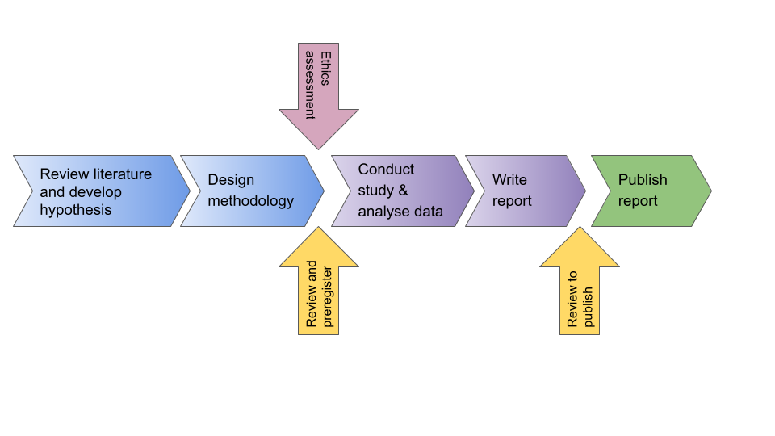

# Starting out transparent {#transparency}

The scientific method requires us to pose a falsifiable hypothesis, design a controlled, rigorous and repeatable methodology, and report and interpret our results honestly. In theory, it’s all pretty straight forward. I’d like to think that in a world where science is adequately funded, we’d have already reached a situation where transparency was endemic in the scientific system. However, science has not been so lucky, and where there are shortcuts, some people will take them in order to get ahead of others. One of the objectives of this book is to demystify what happens in biological sciences. In other words, the demystification in this book is only really needed because so much of what happens does so behind closed doors, and out of the gaze of less privileged scientists. As you read through this book, you will see countless examples of where things are not as they should be. I have always tried to insert solutions when I highlight problems, but these are admittedly piecemeal, rarely proven, and even in a best case scenario might be best thought of as temporary solutions. The logical antidote to all these shady scientific dealings is to turn to transparency.

We would do better moving to open and transparent science. The open science movement is gaining traction [@sullivan2019open], and I hope that it will become the norm in the very near future. Those of you who are reading this now are likely to be students during an interim period prior to open science becoming mainstream. Therefore, you will be instrumental in adopting this process as soon as possible to ensure that science becomes a fairer place for scientists from all backgrounds, and with all results. The idea is that this will impact research all the way from planning to publishing in a set of [Top Factors](https://topfactor.org/), which are likely to be increasingly adopted by funders (see [here](https://youtu.be/MLbgSGA581Q)).

In this book, I have tried to consistently encourage you toward transparent and open practices in science. Here my aim is to introduce this topic and provide an overview of the main areas in which you can currently make a difference by opening up your research. As the Centre for Open Science explains (COS: [see here](https://youtu.be/9YuNGB3vNOw)), this will take a shift in the culture of the scientific community, which is why you need to understand and adopt a transparent approach from the outset of your research career. There are much better and more comprehensive guides and online resources so I encourage you to look through the literature cited here. Although I advocate hard for the COS, please be aware that this is not the only set of guidelines (see also [recent moves by the Public Library of Science](https://plos.org/open-science/preregistration/)) and [Peer Community In](https://peercommunityin.org/).

## Preregistration

You will spend a considerable amount of time at the beginning of your PhD studies planning what you want to do. In many institutions, this will take the form of a formal proposal. It will be agreed with your advisor, and may well pass the inspection of a committee. You will put a lot of effort into reading the literature in order to ask the best hypotheses possible. You will design your experiments with rigor and control, and potentially redesign them after your advisor and committee comment. The effort put into your proposal is totally disproportionate if it’s never looked at again. Yet, this document is of historical importance, because it says what you think before ever doing the experiment and collecting or analysing the data. Thus, it can in future prove that you were not conforming to confirmation bias, for example by [HARKing](TypeI.html): rewriting your hypothesis after getting your results in order to get a significant result [@kerr1998harking; @forstmeier2017detecting]. 

Confirmation bias is a problem in science because of the way that science is published. In brief, articles for journals with higher impact are regularly selected based on significant results. If you don’t have that significance, they are unlikely to want to take your manuscript. For this reason, many scientists have sought to have significant results to report, and this is called confirmation bias. Confirmation bias is bad because it violates the assumption that we are answering the hypothesis that we started with, or it could cause scientists to manipulate their data until a significant result is achieved. For example another form of confirmation bias is p hacking: repeating tests with different approaches in order to a significant result. Rubin [-@rubin2020does] gives a good list and set of explanations. As there are a lot of known ways in which researchers have been thought to deliberately or accidentally report false-positive findings, one solution can be archiving your intentions, referred to as preregistration [@forstmeier2017detecting] see Figure \@ref(fig:preregistration). If you register your proposal (or any research plan), you can present this historical document to a journal (probably 4 to 5 years later) to show that you have done what you planned to do (see [webinar on preregistration here](https://youtu.be/8QK2-udwoK8)). 

What have you got to lose? With a good proposal that you feel confident with, you have nothing to lose. By registering your proposal, you are most likely to gain, especially in the future if more journals require preregistered hypotheses and methods in order to submit to them. What this does mean is that you will need to do a good job of your proposal. This can be daunting when starting a new PhD, especially with respect to the analyses if you are not from a strong analytical background. Your proposal period should be time to make sure that your knowledge of analyses that you will do is sufficient. I would suggest that the best way to make sure that you are proficient is to obtain a working knowledge of how to handle a dataset such as the one you are going to generate in your experiment during your proposal period. If your lab already has similar datasets, borrow one. If not, generate some data that you can use. 


(ref:preregistration) **Preregistration of your research proposal is a step towards transparency in research.** Preregistering your proposal formalises the first review process, while publishing your manuscript formalises the second [after @scheel2020registered].


```{r preregistration, echo=FALSE, out.width = '95%', fig.cap="(ref:preregistration)"}

```


What if new analyses appear during the period, or you are forced to change your experimental protocol. Certainly, most analytical software will be updated over the course of your studies, and some might be superseded. None of this is a real problem to your preregistered content. Logging the software that you intend to use will demonstrate the approach and type of analyses that you intend to take. While it is unlikely that you will ever be held to account for minor changes to equipment or protocol, things do change along the way. It doesn’t mean that you won’t be able to report your results, or that your research won’t be viable. But it does mean that you will need to be transparent about why it changed. For this reason, it is a good idea to document the changes to your proposed research plan and why they happened. It is surprisingly easy to forget! There are some great tools on different platforms for adding this information, together with a timestamp so that it’s clear when it was done. 

### Does this mean that you can’t perform any data exploration?

Although at first sight, preregistration appears to confine you to only testing ideas that you had before you started a study, actually the opposite is true. When you preregister your proposal (or research plan) it places a time-stamp and therefore a historical trail on your ideas. If as you go along with your study you gain new insight and ideas, you can register these with their own time-stamp. When it comes to analysing your data, you use a separate section labelled “exploratory analyses”. You can then apply post-hoc rules to these findings, which will not stop you from reporting them, but gets around the awkwardness of [HARKing](TypeI.html). This serves to reinforce the distinction between prediction and postdiction. 

### Will preregistration of research eliminate the bias from science? 

It is probably too early to tell [@rubin2020does], but it is certainly a good place to start [@nosek2018preregistration]. The more researchers know and subscribe to [transparency](transparency2.html) in their research, the more it will shift the culture in science for the better [@forstmeier2017detecting].However, there are more biases existing in science, and the system needs buy-in from stakeholders to promote equity by elimination of bias.

A new initiative from [Peer Community In](https://peercommunityin.org/) is the possibility of submitting to their [Registered Reports](https://rr.peercommunityin.org/), which goes much further towards removing the confirmation bias. The Registered Report (RR) is in effect the registration of a proposal (i.e. preregistration) with review. If the RR is approved by reviewers then the study is, in principle, given the green light for publication whether or not the hypothesis posed is accepted or rejected. I say "in principle" because those same reviewers are shown the ms again once the results are in. They need to check that the methods proposed were followed, the analyses were conducted in the same way they were proposed, and that the conclusions are justified by the results. In terms of figure \@ref(fig:preregistration), Peer Community In are offering to organise the two yellow review arrows. In addition, there are a bunch of journals that have already signed up to accept RRs that are signed off after completion (notable among these is [PeerJ](www.peerj.com)). To me, this represents an important step in the right direction toward transparency, and the elimination of confirmation bias. What would be great to see is the number of conventional journals sign up with RRs based on the quality of the study design and execution, and the concomitant abandonment of Impact Factor as a driving force in publishing.

### What Platform should you use?

When choosing where to archive your proposal (or any of your data, analyses, etc.) there are lots of platforms to choose from: [Bitbucket](https://bitbucket.org/product), [Figshare](https://figshare.com/), [Github](https://github.com/), [OSF](https://osf.io/), [Zenodo](https://zenodo.org/) and the list will undoubtedly grow. Making a decision about what you are going to use now may not require that you stick with this same platform for you entire career, but there are some things that you should consider:

__Here are some of the considerations that you should take on board:__

- What do people in your lab and institution use? It’ll be easier to use the same platform as your advisor and other lab members
- Some platforms require a subscription, check whether your institution is a member.
- Avoid using any platform that is tied to a publisher. 
  - Although it’s not possible to future proof this (as publishers have been shown to buy up anything they think will help them control the academic market), you can check how the platform is set up and opt for those that are non-profit organisations. 
  - Other important aspects are “open source”, free to use and access. 
- Can the platform function for more than one aspect of transparency?
- As the need for transparency in science grows, it will become important to have more aspects of projects archived. Does the platform that you’ve chosen cover all the stages from conception to publication?
- Is it easy to use?
  - Some of the platforms will be more intuitive to use, while others require a steep learning curve. Consider how friendly they may be to other collaborators, older advisors, etc.
- Are the archives easily compatible with other platforms?
Working across platforms might be important for your project, especially if you start with collaborators that are already using different platforms. 

The platform you choose should work for you (rather than having you work for it). If you are someone who loves to have everything ordered and organised, then you’ll love seeing this all laid out. If you aren’t, then these platforms are going to be a massive help to getting all of your plans sorted. Make updating your platform a habit. For example, you could make sure that notes taken during meetings with your advisor on different projects are logged onto the platform. This way you both have a record of what decision was made when. Remember that you can choose what you make accessible to the outside world. 

## Transparency as you move forwards

There are a whole lot more transparency criteria that you will need to be aware of later on in your PhD when it comes to publishing. Becoming familiar with the entire process now will be to your advantage, so I encourage you to read more about this topic. Sullivan et al [-@sullivan2019open] provide a nice overview about how to get started, but be sure to consult documentation at [OSF](https://osf.io/).
