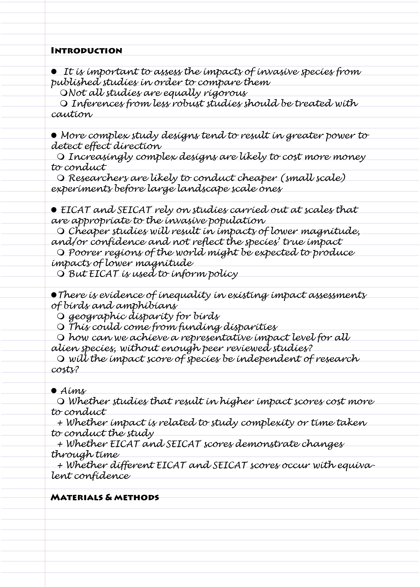

# Why use a formula to structure each chapter or paper? {#formula}

Very few people can sit down at a desk and write an academic paper from beginning to end. For most of us, it takes a lot of hard work over many weeks or even months to write something that can be submitted for peer review. In the third part of this book, I approach the writing of a chapter or a paper for peer review in the same formulaic way, and will refer to papers or chapters interchangeably. 

Sometimes it seems that every paper I read is just repeating the same formula over and over again. I even tend to forget that it's there until someone breaks the mould. Breaking the mould produces papers that really stand out, captivating the reader straight away. So why aren’t we writing those manuscripts every time we write a paper? Moreover, why don’t we teach students to write standout papers that will captivate everyone. Should we really be teaching formulaic writing?

Here I argue that not only is writing to a formula good practice, but it’s the best way to learn scientific writing. When you look to see who is writing those knock-out articles (i.e. "broken mould"), the answer is that they are really experienced researchers who have written hundreds of papers, and (unlike some of us) in doing so have learnt the essence of great writing. Such greatness is not innate and comes rarely to any researchers (even those who have written hundreds of papers). That's why I suggest to my students that they follow the formulas that are by now well recorded in many blogs and websites on scientific writing.

There is another reason why writing to a formula is recommended. Not only is it easier, but because it is so common and widespread, it also gives the reader a familiarity with reading your work. This means that editors are able to skim through and find exactly what makes your work worth publishing, and it means that those who are only semi-interested are more likely to find what they need to cite in your work.

## So what is the formula?

If we were in my office, at this point in the meeting I usually go to my white board and start drawing funnels (as a metaphor) and blocks. However, others have much better diagrams and here I’ve adapted an idea from Brian McGill’s blog [-@mcgill20165]. But you can also find other useful material in other papers [@turbek2016scientific; @plaxco2010art @tomaska2007teaching]. If you are of the Twitter persuasion, you get lots of useful tips and links from WriteThatPhD and Write4Research.

The diagram below (Figure \@ref(fig:formula)) is supposed to show the movement of a liquid medium from one vessel to another. This is to make you think of your readers' understanding moving fluidly from one section to another. The introduction concentrates the ideas into your particular approach, while the discussion allows the reader to understand how your results fit into the larger body of knowledge. 

(ref:formula) **Using a formulaic approach to writing your PhD chapter.** This diagram represents the formula of writing a paper or chapter that we will concentrate on in this book. Imagine the flow of the reader being like a liquid that passes from one section to the next. 

```{r formula, echo=FALSE, out.width = '95%', fig.cap="(ref:formula)"}
 knitr::include_graphics("figures/formula.png")
```

### My take on how to write a formula paper

But what goes into the top, and perhaps more importantly, what comes out of the bottom? I'd like for the discussion to end in a greater understanding of the system for the reader. But maybe if we could also inspire the reader to read more, that would be a great result.

My suggestion is that you now go and read 5 relevant papers in your field and annotate them to see how well they fit into the formula described above. This will give you a practical idea of how the formula is put into practice. 


### Start with an outline
__So now that you've got the idea that writing to a formula is a good idea, what next? __
Next, I suggest that you begin to plan out your formula as a bullet-point outline (Figure \@ref(fig:outline)). Start by writing a general sentence for the subject of each paragraph. Then use sub-points to plan each sentence within the paragraph. Lastly, annotate these with citations that you want to use. Personally, I'd prefer to see the bare outline, and then a fleshed outline before you start the writing proper. This allows advisor and student to get on the same page to be sure that what is planned is thought out. 

(ref:outline) **Example of an outline draft of the introduction.** In this outline taken from Measey et al. (2020), paragraphs are paragraphs are indicated by the solid dots, and points to make inside the paragraphs by hollow dots. Each paragraph has an argument sketched out within it.

```{r outline, echo=FALSE, out.width = '95%', fig.cap="(ref:outline)"}
 
```


In the above example, you may not know what EICAT and SEICAT are (they are scoring systems used for environmental - EICAT - or socio-economic - SEICAT - impacts of alien species), but I would hope that you can follow the broad argument of the introduction explaining why the study should be done. 

### Next flesh out the outline with citations

In the next stage, 'fleshing out', I ask that citations for statements above be added along with any examples. Figure \@ref(fig:outline-fleshed) is an example of the citations added to paragraph 4 above.

(ref:outline-fleshed) **Example of a fleshed out outline of a paragraph in the introduction.** In this outline taken from Measey et al. (2020), citations and relevant figures have been inserted for each of the statements. 

```{r outline-fleshed, echo=FALSE, out.width = '95%', fig.cap="(ref:outline-fleshed)"}
 knitr::include_graphics("figures/outline-fleshed.png")
```


### Lastly it’s time to write the text

And once you have the fleshed out outline, it’s time to start writing your first draft. Remember that the best way to start writing is to do just that. It's unlikely that your first effort will be the one that you will finally submit. But start writing. Then read, go back and polish. And keep polishing until you achieve your goal. 
