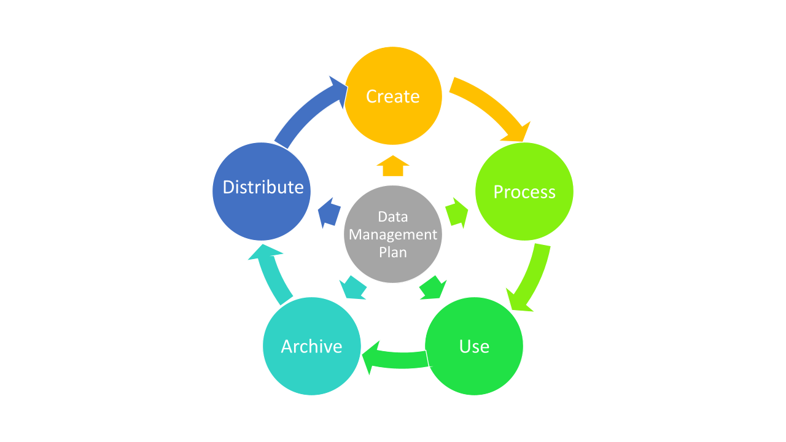

## Data Management {#data}

Almost everyone has had the experience of having written some really excellent work, and then had some terrible technology malfunction meaning that they lose everything. Some failure to backup stories are truly horrific. However, they all represent a failure on the part of the person involved to properly backup their work.

At the time of writing, it is very easy to keep copies of documents on the cloud, or even write straight onto the cloud. Talk to your advisor about what options are available in your institution for backing up your work. Make a plan early on, before you start with your study, and then stick with that backup plan as you move through your PhD. A really good option is to start working in one of the Open Science platforms. For example, OSF allows you to create a project where you can continue to use lots of different cloud based resources, and provides an integrated home for them (for an introductory video see here). OSF is also a great platform as it is free to use, and as long as individual files are less than 5 Gb, OSF will host them. This means that for most projects, raw data files can be stored on the cloud at no cost to the project.

### Should the cloud be the only copy of your data?

No. I suggest that you keep a hard drive with a copy of your data that you regularly deposit on a monthly basis, or after significant bouts of data collection such as field trips or experiments. A hard drive has the advantage that in the case of an internet outage, you always have access to your data.

Don't try to store data on a laptop or desktop computer. These are for working files only. Backup is a separate operation where you store files. While computers are good for computation, they are frail and much more likely to suffer from catastrophic failures. They are also objects that are prone to being stolen.

### Backing up in the field

If you are going to be doing lots of field work, then you might want to make a specific plan about backing up data to the cloud during the field time. It may seem expensive, but I'm sure that it won't be as expensive as losing the data. Alternatively, or in addition, you may want to take a portable storage option.

I still prefer field notes and data to be written into a book (preferably with waterproof paper such as [rite in the rain](https://www.riteintherain.com/)). This allows you to make a photographic backup of the hard copy. Similarly, you can design datasheets that you use in the field with a pencil, and then photograph them to make a hard copy. I don't like entering data directly into a laptop or other device. For me, the advantage is that it is too easy to mis-type a data point into a device, and then there is no record about what it should have been. These days there are multiple different ways to enter data into devices (including dictation), and so you should make your own plan about what you feel most comfortable with. If you do make a hard copy, you will then have to transcribe it later. If you make mistakes, you can go back to the hard copy.

### Make a data management plan, and stick to it

However you decide to manage your data, make sure that you have a plan and that you stick to it. Don't become a victim of some unexpected event that will lose your data. These events will still happen, but at least your existing data will be safe. Creating a secure data management plan (Figure \@ref(fig:Data-management)) is something that you should design and then talk through with your advisor. There is much more to data management than simply backing up your data. A great start is to read through the [British Ecological Society's guide to Data Management](https://www.britishecologicalsociety.org/wp-content/uploads/2019/06/BES-Guide-Data-Management-2019.pdf). [See part 3](SuppInfo.html) for information about how to archive and distribute your data.

(ref:Data-management) **The data management cycle.** It is possible to see your data as a cycle between creation and distribution. Your plan should aim to cover each of these steps (redrawn from the British Ecological Society's guide to Data Management).

```{r Data-management, echo=FALSE, out.width='95%', fig.cap="(ref:Data-management)"}
 
```

You probably won't be able to think about all the potential pitfalls that may happen during your PhD, but if there are some obvious ones, then do consider them and see whether you can mitigate the circumstances should they occur.
