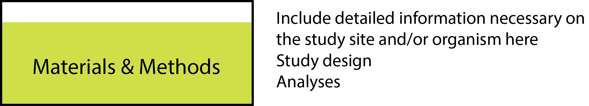

# The Materials and Methods {#methods}

You should start writing this section in your proposal, and you may have to alter parts of it when turning it into your thesis later (if you change your methods). For most people, it’s a relatively simple exercise, but here are some pointers to get you started.

The Materials and Methods section should be citation dense, especially if you have used standard methods that have been written up elsewhere. If there are different methods, you should also explain why you used one over the other, as reviewers or examiners may require this. 

If you are introducing new methodologies, then you can expect to write a lot in this section about exactly how this was done, as well as the background to the reasons why the new approach to the methodology was taken.

Your aim is to produce a coherent methodology that anyone in the next 200 years (or more) can pick up and follow in order to replicate your study. 

(ref:methods) **There's nothing to writing the methods except remaining methodical.** Your methods are likely to have some generic aspects to other study types in your field of biological sciences.
```{r methods, echo=FALSE, out.width = '95%', fig.cap="(ref:methods)"}

```


## Sections or subheadings

As ever, I’m going to recommend inserting section headers into your Materials and Methods to help you break it up into bite sized chunks (Figure \@ref(fig:methods)). These are principally for the reader, but will also make your job easier.

An important point here is to make sure that you keep your variables (what you are measuring to test your question) out of the sections like study organism and animal husbandry. Don’t be tempted to scatter variables and how you measured them throughout the Materials and Methods section. Keep them clear and maintain a logical flow, using a timeline if that makes sense. 

## Study organism or study system

Having already written the [introduction](#introduction), you will know that there isn’t too much space to write a lot of information about your study organism there. However, often there is important background information that is needed on the species, which would be distracting or lose the flow of the [introduction](#introduction). By having a ‘Study Organism’ section at the start of your Materials and Methods, you can add in all relevant information in a paragraph or two. 

For example, if you are working on mice, _Mus muculus_, as a model organism you will want to use this space to describe why they are a good system for this particular investigation. Alternatively, your study could be detailing their invasion biology, in which case this would be the section where you can explain their distribution, or that they are invasive on all continents. You probably won’t need all of these points, but just the aspects of this species’ biology that is relevant to your study. You should make sure you know whether or not the journal requires the taxonomic authority. If you are not sure, include it now ([see here for an explanation](#taxonomy)).

Similarly, if you are working on invasive zebra fish, _Danio rerio_, you can write in this section the known dates when they were introduced to Japan, and how we know where those animals came from. You can also give details of their natural range in South Asia. 

If you are working on a community of animals, or it is the geographical region that is more important than any single species, you should explain the study system here. For example, if your study is about the rainforest, then you should provide some background information about this kind of vegetation here. 

If relevant, you may need to provide a map with the location of samples that you used in this section. My preference is to try to provide a composite figure that will also include an image of your study organism (if relevant). 

## Animal husbandry / Growing conditions / Culturing techniques
If you have kept animals in the lab, grown plants or cultured bacteria in order to do your experiments, then you need to provide details of how you did this. For plants, this will include all relevant information on their source, propagation, growth medium and climatic regimes. For animals, you need to include their source, welfare, housing, feeding, light:dark cycles, temperature, etc. If you bred animals to produce your study life-history stage, all relevant information is needed here. All this information should be available from your ethics application. Some journals will want you to include the details of your ethics permission here. 

## Repetitive methodology
If you’ve used the same methodology for each part of your data collection (like DNA extraction, sequencing, etc.), you should have a section that explains all of this prior to any experimental manipulations done. I would suggest that this is detailed in the first relevant chapter of your thesis, and then referred to in later chapters ([see section on generative recycling](#generative)). It’s best to go to look to see what other people have reported on in order to know what level of detail to include. For example, 20 years ago, it would have been important to include detailed information of how you extracted DNA from tissues. Today, you can probably say that you used a standard extraction kit without saying more. 

## Do you need to include formulae?
Some of your methodologies will include calculations that rest on mathematical formula which can be written in mathematical notation. Certainly, there are plenty of examples in the biological sciences, especially in modelling, where these formulas are needed because they are developed within the methodology in order to produce the [results](#results). If your thesis involves this type of mathematical progression, then you will already know this is expected because all of the literature that you read will contain equations and formulas. However, if you are calculating (for example) the surface areas of a leaf, through a set of measurements, do you need to provide the formula you used in your materials and methods? 

I would move ahead on the premise that formulas that are well established in the literature need only be referenced, and not quoted. If you are building on any formula with new variables introduced by you in your study for the first time, then you will need to show the progression of these formulas. Remember that equations, formulas and theorems are all numbered in the text in a way that you can make reference to them later. 

## Experimental manipulations and data collection
If you have done more than one kind of experiment, it’s probably a good idea to give each a separate subheading. Be consistent with these subheadings between the Materials and Methods and the  [results](#results).

One very important point here is to fully explain the collection of all of the variables that are used in your analyses. Remember to use exactly the same names for your variables here, as you have in the [introduction](#introduction) (and will use in your [figures](#figures) and  [results](#results) sections). It’s very important that the reader gets this consistency across sections. Please also remember to include all units that you collect data in (there is a space between numbers and units!), and the accuracy of the measuring equipment used. 

Your variables may be sufficiently complicated that you need to add extra subsections in order to accommodate and explain them properly. This is fine. It’s also a good idea to use a table to explain a complicated sampling regime, or even a flow diagram. If you find yourself having trouble getting all of the information across in words, then go back to drawing a diagram that explains your data collection and ask around to see whether others find this an easier way to understand your setup. Diagrams and/or tables are there to replace words, so once you’ve decided which you want to include, you can delete the rest.

### Equipment

Many journals require that you name the company that you bought equipment from as well as the town and country where it was made. This is to help others that might want to buy the same equipment (although it’s a bit outdated in these days of multinational companies). You should try to get all of the model numbers of equipment as you do the work, so that you are not scrambling, later on, to find out what they were. It’s really quick and easy to take a picture of this at the time. 

If you have built or designed new equipment for your Materials and Methods, you can expect to make a diagram of this here, if it can’t be adequately described in a paragraph. 

## Data analysis
This section is getting increasingly longer as people do ever more intricate statistical manipulations. As above, it’s very important that you use the same names for the variables as you have introduced and collected them. In addition to explaining the specific tests that you performed, you should explain what roles the variables have as dependent, independent, or random variables in your model.

__The independent variable__ has variation that does not depend on that of any other measure. These are usually measured by you during the experiment.

__The dependent variable__ is usually the one that you are testing to see whether any of the independent variables explain it.

__Random variables__ are subject to variations outside of your experimental control but that you want to make sure do not influence your interpretation of the dependent variable. Examples of random variables might be the order in which you did the experiment, or the position in your experimental setup).

You should be familiar with the terms above from when you formulated your hypothesis (see [Part II](#hypothesis) for a refresher). 

Any transformation of any of the data that you collected (e.g. log, ln, cosine) should be mentioned here, along with tests that you performed to ensure that they adhere to the conditions required for the statistical test that you conducted. 

Give the name for each package in R that you use, together with its citation. Some journals will have particular software conventions that you need to respect and adhere to. Also, give a citation to R as well as the version that you used in your analysis. If you don’t use the latest version of R, then your reviewers may want to know why, so always remember to update your version of R when you do your analysis.

## Did you leave anything out?
By following your Materials and Methods, anyone else should be able to repeat your work. If there isn’t enough detail for someone else to conduct the same experiment or survey, then you will need to add this information somewhere. For example, a list of sampling points or a database of sequences might be needed in Supplementary Information.

The Materials and Methods section can often get overly long, and is relatively easy to edit to make it much shorter. In journals where there is a word count limit, you may want to move some of the Materials and Methods into a supplementation information section. But in your thesis, try to keep the Materials and Methods section as detailed as you can. 
