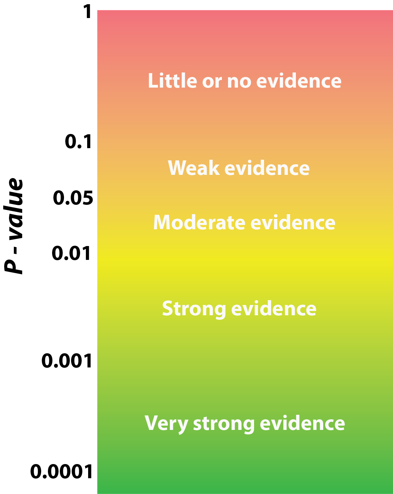

# The Results {#results}

This is perhaps the easiest section of your chapter or manuscript to write. However, there are still many mistakes that are made. Here, I will start with the approach that you should take, and then go through some of the common mistakes.


## Description of your data
Some studies have a set of descriptive results that, by convention, are placed without a section header at the start of the results. These normally convey the size of the dataset that entered into the rest of the analyses. If the size of the dataset varies by design in the methods, then you don’t need it here. But you can’t always control the sample size, so it needs to be established before moving on to the rest of the results. It may be that your methods do not always produce predictable results. In genetic studies, for example, this might include the number of samples that were collected and successfully sequenced, and thus entered into the rest of the analyses. 

Whenever you provide a summary of a variable (e.g. the mean), remember to include the variance; the range,  standard deviation, or standard error in brackets following the mean. If you collected a lot of variables, it may be more relevant to have them summarised in a table.

Once you have described the result, either make reference to the [Table](#tables), [Figure](#figures) or [Supplementary Information](#suppinfo) where this can be seen. If your tests are already in a [table](#tables), then they should not be repeated in your text. Instead, simply make a summary statement asserting the results and add “(see Table 1)”. 

It is important to include mention of how much data was missing compared to your aim in the [Material and Methods](#methods) section. For example, an entire replicate may have been compromised, or a collection date might have been skipped for logistical reasons. 

If you are [not testing an explicit hypothesis](#nohypothesis) your results will concentrate on the description of your data, and your analysis of the pertinent information that it contains. This may be done through tables, figures or models. If you modelled your data, you will need to show all models tested either in a table in the results, or in the [Supplementary Information](#suppinfo). You will also likely need to describe how you selected the best model and describe it. Although it is correct to describe your model here, do not try to interpret your findings. This is done in the [discussion](#discussion).


## Responding to your hypotheses
The easiest way to write the results is simply to have the questions or hypotheses that you posed at the end of the introduction and use them as subheadings for your results section (Figure \@ref(fig:results)). Once you have these subheadings, you simply assemble all of the results that address that hypothesis. You should already have all the tests that you used in the [Material and Methods](#methods) section. No additional tests should be listed in the results if they were not already described in the [Material and Methods](#methods) section.


(ref:results) **You may well find that your results section is the shortest section of your manuscript.** Only report what you need to in this section. Keep results that don't respond to your hypotheses for the Supplementary Information.

```{r results, echo=FALSE, out.width = '95%', fig.cap="(ref:results)"}
knitr::include_graphics('figures/results.png')
```

Remember that the most important aspect to your results is the size of any effect that you find and the confidence intervals, and **not** whether or not it is significant [@dushoff2019can]. This is not to say that significance should not be reported, this is important, and care should be taken to report the significance in a non-binary fashion [@dushoff2019can; @muff2021rewriting] - see [below](#binary).

The results section often includes a lot of statistical testing, resulting in lots of numbers inside brackets within the text. This is all expected and fine, but consider consolidating multiple iterations into a [table](#tables) (if appropriate).

When describing the relationship between two variables, make sure that you state the direction of the effect. This means not simply stating that they have a statistical relationship, but what that relationship is. For example, explaining that one increases with the other (a direct relationship), or one increases when the other decreases (an inverse relationship). Note that other types of variable relationships exist. When describing this relationship, you should also include the effect size (how much the relationship differs from no relationship), and the [power of your test](#increasing-the-statistical-power) (usually the number of replicates that allows you to avoid a [Type II error](#TypeI)). 

### Moving away from binary significance {#binary}

Traditionally, we would say that only if P is less than α (alpha is usually 0.05) should you use the word ‘significant’ when describing the effect. However, the statistical community (including the biological community) is waking up to the need to replace the idea of the binary reporting of significance ("significant" or "not significant"), with wording that better reflects the reality of statistical testing " [see @muff2021rewriting]. The reason for this is that it represents a misunderstanding of statistical testing, and can be very misleading to those that read the results. Instead, we must appreciate that the position of our estimate of the P statistic lies somewhere along a continuum of potential results, and should be reported as such. The suggested change in language can be simply implemented as shown in Figure \@ref(fig:results). 

(ref:replace-significance) **Help your reader to better interpret the meaning of your statistical testing by changing your language.** The figure shows some suggested language to use when writing about your results depending on the value of P that you find. These words should replace the binary outcome "significant" or "not significant" [see @muff2021rewriting].

```{r replace-significance, echo=FALSE, out.width = '45%', fig.cap="(ref:replace-significance)"}

```

While this approach succeeds in getting away from the significance dichotomy, there are still dissenting voices with the concept of P values representing continuous measures of evidence [@goodman1988evidence]. Another approach is to talk about the results of your significance tests in terms of the clarity that they provide about the relationship between the variables measured [@dushoff2019can]: whether they show a "statistically clear relationship" (aka significant), or "statistically unclear" (aka insigificant) [see @dushoff2019can for examples]. Here, I stress that if you have a lower value for P (e.g. equating to strong evidence) you haven't provided any additional evidence, you simply have more confidence in the non-compatibility of your data with your null hypothesis (H~0~). Your result is confined to the dataset that you are presenting. If you want additional evidence, then you need to run replicate experiments. Or, better still, find another mechanism in the biological sciences through which you can measure or test the same relationship.

There are better alternatives when it comes to statistical testing, but getting the inferential wording correct may still represent a challenge for non-statisticians.

If you have a statistical test with a P value, you do have to insert the results into the text, include the test statistic, degrees of freedom (which incorporates N - the sample size) and the value of P. My suggestion is that you also consider exactly what you can say about your result, the effect size, confidence intervals and inferred relationship between the variables, as well as any statistical significance.


## When to have a table or graph?
Most journals will allow you to have as many tables or graphs as you need to give your results. There are a few important things to consider. First, that data shouldn’t be repeated. So don’t have a table of results where the same results are also in a graph (or even two graphs that show the same data). Also, don’t repeat data from a figure or table in your text. You need to decide how best to present your data. If you can’t decide then discuss it with your advisor by presenting them with the alternatives. Good results should convey your findings clearly, and consulting with others should quickly help you decide which approach is effective.

See sections on [tables](#tables) and [figures](#figures) below.


## Responding to hypotheses
While I encourage you to present data that corresponds to hypotheses here in the results section, you should not formally accept or reject your hypothesis in the results. This is done in the discussion, and allows you to present caveats and other important issues.

## Common mistakes
- Having extra analyses in the results that you didn’t include in your methods. If you really didn’t anticipate conducting the extra tests, then these are actually _post hoc_ (after the event) tests (not anticipated before the study) and you should think carefully about how to treat these. Otherwise, you’ll need to rejig your methods to make sure that all tests are included.
- Meaningless precision. This can happen throughout a thesis or manuscript (e.g. in the Materials and Methods), but it is most common in the results when too many significant figures are reported. For example, the output of your analysis might tell you that flight feathers in one population are 2.6484332 mm longer than those of another (± 0.0654562 mm), but in your methods you only use callipers that have a precision of 0.01 mm. Reporting results beyond the precision whereby they can be measured becomes meaningless. Whenever you obtain the output of a statistical package, you need to make sure that you use your practical head to re-interpret these results and think about what they actually mean. 
- Repeating numbers in the text that are already in tables or graphs. The text is likely to be packed with numbers already, so don’t repeat any that are already represented elsewhere.
- Repeating text in different sections. As you’ve seen [elsewhere in this book](#plagiarise), repeating text simply isn’t acceptable. It doesn’t matter if you did the same thing many times, you can always write something in a different way. Having repeated text is the fastest way to bore the pants off your reader, and therefore must be avoided at all costs.
