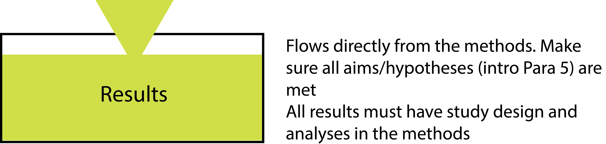

## The Results {#results}

This is perhaps the easiest section of your chapter or manuscript to write. However, there are still many mistakes that are made. Let’s start with the approach that you should take, and then go through some of the common mistakes.

### The correct approach - responding to your hypotheses
Yes, the easiest way to write the results is simply to have the questions or hypotheses that you posed at the end of the introduction and have them as subheadings for your results section. Once you have these subheadings, you simply assemble all of the results with respect to that hypothesis. You should already have all the tests that you used in the methods section. 

The results section often includes a lot of statistical testing, resulting in lots of numbers inside brackets within the text. This is all expected and fine, but consider consolidating multiple iterations into a table (if appropriate). And if your tests are already in a table, then they should not be repeated in your text. Instead, simply make your statement asserting the results and add “(see Table 1)”. 

When describing the relationship between two variables, make sure that you state the direction of the effect. This means not simply stating that they have a significant relationship, but what that relationship is. This means stating that one increases with the other (a direct relationship) or one increases when the other decreases (an inverse relationship). Once you have described the result, either make reference to the Table or Figure where this can be seen, or describe the results of the test in brackets.

If you do have to insert the results of a statistical test into the text, include the test statistic, degrees of freedom (which incorporates N - the sample size) and the value of P. Only if P is less than alpha (usually 0.05) can you use the word ‘significant’ when describing the effect. 

(ref:results) **You may well find that your results section is the shortest section of your manuscript.** Only report what you need to in this section. Keep results that don't respond to your hypotheses for the Supplementary Information.
```{r results, echo=FALSE, out.width = '95%', fig.cap="(ref:results)"}

```


### When to have a table or graph?
Most journals will allow you to have as many tables or graphs as you need to give your results. There are a few important things to consider. First, that data shouldn’t be repeated. So don’t have a table of results where the same results are also in a graph (or even two graphs that show the same data). Also, don’t repeat data from a figure or table in your text. You need to decide how best to present your data. If you can’t decide then discuss it with your advisor by presenting them with the alternatives. Good results should convey your findings clearly, and consulting with others should quickly help you decide which approach is effective.

See sections on [tables](tables.html) and [figures](figures.html) below.

### Descriptive results
Some studies have a set of descriptive results that, by convention, are placed without a section header at the start of the results. These normally convey the size of the dataset that entered into the rest of the analyses. If the size of the dataset varies by design in the methods, then you don’t need it here. But you can’t always control the sample size, so it needs to be established before moving on to the rest of the results. In genetic studies, for example, this might include the number of samples that were collected and successfully sequenced, and thus entered into the rest of the analyses. Your text can then be broken into sections that correspond with your questions, unless you only have one in which case further sections are not warranted.

### Responding to hypotheses
While I encourage you to present data that corresponds to hypotheses here in the results section, you should not formally accept or reject your hypothesis here. This is done in the discussion, and allows you to present caveats and other important issues.

### Common Mistakes
- Having extra analyses in the results that you didn’t include in your methods. If you really didn’t anticipate conducting the extra tests, then these are actually _post hoc_ (after the event) tests (not anticipated before the study) and you should think carefully about how to treat these. Otherwise, you’ll need to r-ejig your methods to make sure that all tests are included.
- Meaningless precision. This can happen throughout a thesis or manuscript (e.g. in the Materials and Methods), but it is most common in the results when too many significant figures are reported. For example, the output of your analysis might tell you that flight feathers in one population are 2.6484332 mm longer than those of another (± 0.0654562 mm), but in your methods you only use callipers that have a precision of 0.01 mm. Reporting results beyond the precision whereby they can be measured quickly becomes meaningless. Whenever you obtain the output of a statistical package, you need to make sure that you use your practical head to re-interpret these results and think about what they actually mean. 
- Repeating numbers in the text that are already in tables or graphs. The text is likely to be packed with numbers already, so don’t repeat any that are already represented elsewhere.
- Repeating text in different sections. As you’ve seen elsewhere in this book, repeating text simply isn’t acceptable. It doesn’t matter if you did the same thing many times, you can always write something in a different way. Having repeated text is the fastest way to bore the pants off your reader, and therefore must be avoided at all costs.
