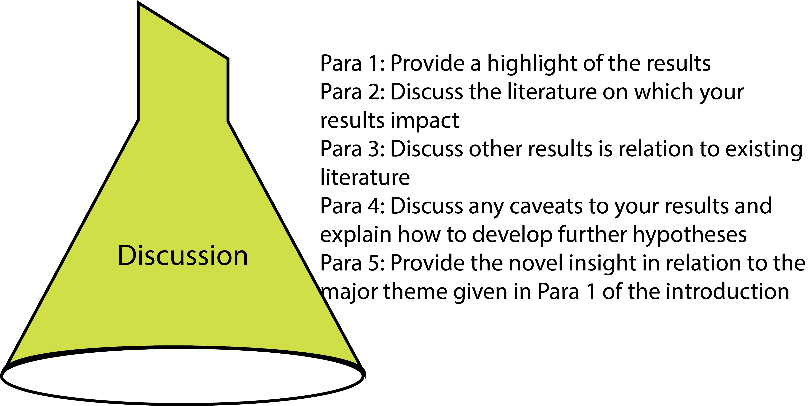

# The Discussion {#discussion}

The discussion should be the final section of your manuscript or chapter that you are going to write (given that the [abstract](#abstract) will come last). This is because for the discussion you must already know all of the rest of the manuscript, starting with the hypothesis, which dictates what will go into all of the other sections. While writing the other sections, I often make notes under the heading ‘discussion’ so that it acts as an _aide memoire_ to ideas that I’ve had during the study.

Before you start writing your discussion, make a plan and then discuss this plan with your advisor. I’d make this suggestion for all of the sections of your chapter or paper. It doesn’t take that long to do, and it provides an opportunity for you and your advisor to talk about the [results](#results) of your work and discuss them together. Such discussions should be eye opening for both of you, and they provide a great opportunity for you and your advisor to get excited about the work you’ve done, your [results](#results) and what they mean. I get a lot of enjoyment during these discussions, especially when sharing the excitement of the [results](#results). Sharing thoughts before you start writing is important because by talking about it, you and your advisor are more likely to come to a consensus about the best way in which to interpret your [results](#results). Conversely, presenting them with the discussion finished might not be the best way of pitching your ideas.

There is a convention that you do not refer to the [tables](#tables) or [figures](#figures) in the discussion. This is because they have already been referred to in the [results](#results), and a reader should have already consulted them there. Occasionally, you may want to have a new conceptual diagram in the discussion, but this is rare. Most often, you do not refer to figures or tables and no new ones appear in the discussion.

In general, the first and last paragraphs of the discussion are key to the reader, but the discussion must also consider caveats and limitations in the experimental design and interpretation of your [results](#results), as well as providing a concise discussion of the results in the context of existing literature (Figure \@ref(fig:discussion)). This is also your opportunity to suggest new hypotheses and how they could be tested.

(ref:discussion) **Your discussion needs structure too.** Let's remember that if you are struggling to write, there is the potential to follow a formula, such as the one I outlined previously. 

```{r discussion, echo=FALSE, out.width = '95%', fig.cap="(ref:discussion)"}

```

I'd like to repeat that the convention described above is a formula that is intended to help you getting started with writing. It is not the only way to write, and if you feel confident that another way is better then I encourage you to explore this with the support of your advisor. Be imaginative and don't feel that you are constrained or compelled to do anything in a formulaic way.

## First paragraph of the discussion
Your discussion begins by you responding to your hypothesis, clearly stating whether or not you accept it, and putting this into the wider context of the study (i.e. paragraph one or two of the [introduction](#introduction) with relevant literature). You can then follow these statements by emphasising what you consider to be the most important finding, and explain how it adds to existing knowledge. However, don’t be tempted to over-interpret your results, or claim that they mean more than they do ([see section on speculation](#speculation) below).

This first paragraph of the discussion doesn’t have to be very long (three to four sentences), but you should make sure that you end by providing a link to the following paragraph or explaining how you will move the discussion on in sections.

## To sub-section or not to sub-section the discussion?
My preference is to plan the discussion before you write it, just as you did for the [introduction](#introduction) using a bullet-pointed list. This will provide you with logical sub-section headers for the discussion under which you can write the first draft. When your chapter has a simple aim that is easily communicated, I’d suggest deleting these sub-section headings before you finish. However, many studies are more complex and contain multiple experiments or evidential approaches. It is then sometimes wise to leave sub-sections in your discussion so that your reader can more easily follow the text. Where possible, these should be the same sub-sections that you have broken your [methods](#methods) and [results](#results) into, especially where these relate to specific hypotheses or aims. Or it may be more appropriate to discuss the different approaches separately, specifically when the literature that you refer to falls into different groups.

If you are stuck and can’t decide which way is most appropriate for your work, spend more time on fleshing the outline specifically to include the literature that you want to cite. Try it one way, and then the other, and you should quickly be able to tell which makes more sense. Of course, you should also ask your advisor for their opinion – that’s what they are there for, after all.

When considering what sub-section to write first, go back to the order that you’ve presented the questions or approaches in the rest of your chapter or manuscript. Keeping the order consistent throughout is a really good way of helping your reader follow what you want to communicate. Shuffling the order in each section is almost guaranteed to get them lost and wishing that they hadn’t started reading.

**Next you need to discuss!**

The discussion is about explaining the meaning of your [results](#results) to the reader. I often find that people write a lot of inappropriate information in the discussion. Remember that this section is not going to provide background information, and is unlikely to bring up new topics that need introducing. It may be that your [results](#results) prompt you to introduce a new area of research that wasn’t covered in your [introduction](#introduction), and this is fine. But for the main part, you should discuss your [results](#results) in the context of existing literature. You can expect that the literature that you use in your discussion will only partially overlap with your [introduction](#introduction), with plenty of new citations. Similarly, it can be that discussing your [results](#results) will mean that you end up with paragraphs that have no citations.

In order to provide a critical evaluation of your research findings, you really need to present a reasoned argument [@jenicek2006how]. In some respects, when writing the discussion your walk a tightrope between inferring the meaning of your results for a wider audience, and making claims that are too broad (Table \@ref(tab:discuss)). Overreaching in the discussion (and consequently [abstract](#abstract)) is a common problem that examiners and reviewers regularly ask authors pull back on their claims.

When providing different sides of an [argument](#argument), try to use your [results](#results) to conclude that one side is supported more than the other. If your results don't help with this particular point, then it could be that you are trying to discuss something that isn't directly related to the work. This is a very common problem in discussions, and a good test is asking yourself how your [results](#results) add to the point you are trying to discuss. If they don't leave it out and move on.


Table: (\#tab:discuss) **Some discussion dos and don'ts (adapted from Jenicek 2006).** Balance your discussion so that you provide a reasoned argument that reflects what you found.

| **Do** | **Don't** |
|----|----|
| Provide a summary of your major findings | Use statements that are too broad |
| Interpret your results with respect to mechanisms | Over-represent your results |
| Give problems with methods and techniques | Provide unrealistic solutions to deficiencies |
| Compare similarities and contrasts with other studies | Ignore conflicting literature |
| Provide practical implications of your results | Be unrealistic about what could be done |
| Give directions for future research | Simply state what you have done elsewhere in your thesis |
| Restrain your conclusions to evidence from your data | Make unsubstantiated claims that overreach your evidence |
| Provide insight into unresolved questions, controversies and biases | [_Reductio ad absurdum_](#argument)  |
| Explain the study design's limitations and uncertainties | Inflate the importance of your findings |
| Highlight the strengths of your study | Forget to mention the limitations |
| Provide alternative interpretations and hypotheses | Go into tangential issues |
| Give unexpected results and anomalies | Avoid being critical of how your study could have produced unexpected results |
| Mention literature that contradicts your findings | Use your conclusions as a 'bully pulpit' |
| Provide arguments that are logical and coherent | Erect a ['straw man' or 'false dichotomy'](#argument) |
| Make conclusions based on your logic | Make emotional appeals to the reader |
| Make sure that you've discussed all results | Suddenly introduce new data or results not previously presented |
| Boast about your findings | Apologise or undermine your own work |
| Be concise | Waffle on |
| Take a look at target journal requirements and suggestions for a  discussion | Feel that journal advice is not relevant to you |

## Caveats and limitations
An important aspect of the discussion is to consider how the interpretation of your [results](#results) may be incorrect. For example, if you have done an experiment, how well controlled was it and how well could it be considered to scale up to real-world interactions? Could you have measured other variables? Almost every study will have caveats and limitations, and it is very important that you report them in a considered approach. You can also add ideas on how to improve your approach to eliminate important caveats that you have identified, even if this means suggesting something that adds evidence from a completely different field of biology.

My preference is not to provide all the caveats and limitations as a separate paragraph. Instead, mention them when you are discussing relevant aspects.


## Should you speculate in the discussion? {#speculation}
Reviewers will often be unhappy with speculation in the discussion section. Speculation isn’t that hard to spot, as it occurs when you make claims for which your [results](#results) have no foundation. I think that it is healthy to have one or two statements that are speculative, but clearly label them as such. After all, after writing this paper, you are going to be one of the world experts in the topic, and thus your deeper understanding is often worth relating to the reader. However, I suggest that you speculate in combination with suggesting what work could be done in future. Remember, if you really feel that the point has to be made, you must clearly label it as speculative.

Perhaps an easier trap to fall into is over-interpretation. This is when you suggest that your [results](#results) mean more than they do. It’s an easy trap to fall into, especially after setting up the study in relation to key topics in the discipline (presented in paragraph one or two of the [introduction](#introduction)). You will probably find it hard to see where you have over-interpreted, and this is something that having your work read by your advisor, or another colleague, will really help. You may then be asked to ‘tone down’ your claim, or to place it into the direct findings of your [results](#results).

Again, my preference is not to place all speculations or future hypotheses in the same paragraph of the discussion. These aspects should appear as the topics they relate to are discussed.

## Don’t beat up on others
Your [results](#results) may show that other researchers were wrong with their interpretation or findings. Whatever you may think of them, never use your discussion to be disrespectful to other researchers or their work. This has been referred to as the 'bully pulpit' or an [_ad hominem_ attack](#argument). As with all aspects of professional interactions, consider how you would like to be treated, and act accordingly. This is not to say that you shouldn’t point out mistakes that were made before, but be sure not to be emotive or insulting.

Things brings to mind Freud's narcissism of minor differences, in which he pointed out that bitter fights could start between groups when they, in fact, agree on 90% on issues. So it is likely to be true that someone you might disagree with one one point, is likely to be allied with you on nearly all of their other views and opinions. Making and maintaining allegiances is more likely to get you in a position where you can constructively discuss any minor disagreements. Consider this before you are tempted to launch a negative sounding social media post.

Generally, such comments won’t get through the peer review process, and remember that you might be insulting the examiner of your thesis (or the reviewer of your paper) – which is not likely to go down well!

## Where next?
The ‘where next’ aspect of your discussion is important as it may provide the reader with ideas for their own work. Of course, these are questions that you may wish to pursue in your own career, or they may require corroborating evidence from other disciplines that you will never undertake. Either way, making pointers for continuing aspects of the research is an important component of the discussion. Providing new lines of research may also allow you to speculate about what you consider to be the most important angle of this topic now that you have presented your [results](#results). This should be justifiable and not gratuitous. There's no point in suggesting what other studies could be done just for the sake of it, or just because you happen to have already done them in your thesis. But if there are legitimate parts of your thesis that link to your discussion of your chapter (and this is quite likely), then you should definitely point to them.


## Last paragraph
The last paragraph of the discussion is your take-home message. It’s a summary paragraph that sets out what you aimed to achieve, and what the new state of understanding of the topic is now that your [results](#results) are out. This should include the key literature that can now be reconsidered.

### Never repeat text
Please remember that while this might sound similar to your first paragraph, it is not the same. This final paragraph should not replicate any text that appears elsewhere in your chapter or manuscript (not even the abstract). Never repeat or copy text generally, even within your own chapter (or between chapters). For the reader, it’s very easy to spot and it gives the impression that you have nothing to say and are simply filling space. This is not the kind of impression that you want to give your reader, especially if they are examining your work!

As always, there are a number of other places to look for more advice to write your discussion, and I’d encourage you to read as widely as possible. For example, try Hess [-@hess2004how], Jenicek [-@jenicek2006how] and Şanlı [-@sanli2013how].

**Still struggling with your discussion?** Take advantage of a new workshop that specifically aims to help you write the discussion to your own thesis chapter (click [here](https://johnmeasey.github.io/Thesis-Writing-Guide/discuss.html)).
