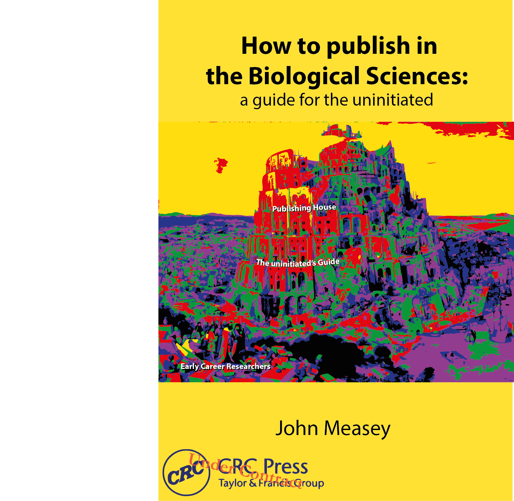

# The obligation to publish your work {.unnumbered #publish}


Now that you've submitted your PhD, you still need need to do something with it. For most of you this will be publishing it in a journal of your choice. Publication is important. Here is a list of reasons why you have some obligation to publish the work in your thesis:

- If your work is unpublished, then it will not be used. Without use, all the work that you put into it falls away.
- Your published work will become the foundation for future students and academics who are active in your field. This might well be in another country or on another continent.
- Your work was most likely paid for by tax-payers in the country where you studied. Publishing this work is a way of handing back the value of what you found. If it is published Open Access, the public can also read it for themselves. 
- Other funders of your thesis work may have made publication a prerequisite of the funding criteria.
- It is hoped that by publishing your work it will become more accessible to the scientific community.
- By publishing your work you will find that both you, and your work, become known by an international community that may well invite you to participate in the academic process further [@marks2013misuse].
- Both inside and outside of science as a career, peer-reviewed published papers are seen as an important accomplishment in addition to the production of your thesis.
- The work that you have already put into your thesis (especially if you have followed the advice in this book!), will mean that you are close to having chapters that can be submitted as publications. 
- Your advisor and lab colleagues who helped with your thesis work may depend on your publications. 
- There is a lot of satisfaction to be had by seeing your work published. It has been argued that this depends on who you are and where you come from [@husemann2017publicationism]. 
- The satisfaction of having someone say how enjoyable or inspiring your work is to read will certainly not be as frequent as if you managed to publish a novel or newspaper column. But when it does happen, it will bring a smile to your face.

This is by no means an exhaustive list, but I hope it will give you some insight into the importance of publishing your results. To counter this assertion, please be aware that there is also research that suggests that publication driven science is not healthy, and that we need a new paradigm to motivate science [e.g. @stergiou2014impact]. Indeed, it has been suggested that the ‘publish or perish’ mentality of academia has resulted in the retention (and even deterioration) of poor experimental design, and hence higher false positives in the behavioural sciences [@smaldino2016natural]. However, before you can join the debate about the future, I’d argue that you need to provide your credentials for the present.

Taking your work to the next level is not a trivial step, even though you already have your chapters written in the style of manuscripts. The challenges of publishing work, like other challenges in academia, are much easier if you possess inside knowledge of the system. The demystification of the next steps along the road in academia is the subject of another book.

```{r cover2, echo=FALSE, fig.align='centre', out.width='60%', fig.link='www.routledge.com/9781032116419'}

```

**The follow-up to this book, How to Publish in Biological Sciences: A Guide for the Uninitiated**  is available at [www.routledge.com/9781032116419](www.routledge.com/9781032116419).
