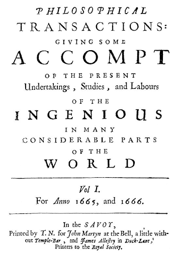

# Why did some journals go behind paywalls? {#paywall2}

Academics are not (usually) superstars, nor looking for enormous numbers of readers, but there would be little point to recording our work if we had no readers, or if our work were inaccessible, and so publishing is a necessity. However, we have got into a state in which much of our work is behind a paywall, and thus inaccessible to most would be readers. Whether or not we need our work to look pretty and appealing speaks more to our readers as humans than academics. Perhaps it goes without saying that an audience is likely to be larger the more appealing the presentation, and that’s not just the writing style but the layout and presentation of the text itself. And this is not new.

The first scientific journals appeared in 1665: _Journal des Sçavans_ (Figure \@ref(fig:scavans)), and three months later _Philosophical Transactions of the Royal Society of London_ (Figure \@ref(fig:PhilTransRoySoc)), which is still in print today. It is clear that the papers were type set and presented in the manner of a book, perhaps analogous to a collection of short stories. At the start, these were reports of studies that were presented at meetings. Producing proceedings of learned societies became the way in which most scientific journals began. Only later did it become possible to submit a manuscript that had not been presented. And later still when publishers began to manufacture their own scholarly journals in the absence of any academic society.

(ref:scavans) **The first issues of the World's first scientific journal**. The _Journal des Sçavans_ ceased publication in 1792 due to the French Revolution.

```{r scavans, echo=FALSE, out.width = '50%',  fig.cap="(ref:scavans)"}
knitr::include_graphics('figures/scavans.png')
```


(ref:PhilTransRoySoc) **The world's longest running journal**. The _Philosophical Transactions of the Royal Society of London_ continues to this day as the world’s longest running scientific journal. 

```{r PhilTransRoySoc, echo=FALSE, out.width = '50%',  fig.cap="(ref:PhilTransRoySoc)"}

```


Being the editor of a society journal means being elected by members of that society, and being responsible to an editorial board, normally made up of the society’s members. Until very recently, and I’m thinking back to my first interactions with editors for my first few publications, submitting to the journal meant producing three (or sometimes more) double spaced hard copies of a manuscript and mailing a large and heavy envelope to the editor. Editors of bigger journals had secretaries dedicated to handling the administration of the paper. Following a telephonic enquiry, the copies were sent out to referees by post and sent back to the editorial office with a typed report often together with the marked up manuscript. Once the editor had received all reports, they communicated their decision back to the corresponding author (i.e. the one to whom correspondence was addressed) and, once accepted, the article went into production. Prior to personal computers being commonplace (only 25 years ago), each journal would have had to have had a publisher to set the type and print the pages. Clearly, this was beyond the scope of individual societies and the publisher was a necessity. Libraries had to pay for copies of journals, as the cost of publishing had to be offset by the society.

The advent of desktop publishing changed the need for publishers and brought many small society journals onto a larger platform where they could produce attractive content (over the typewritten documents that had been stencil duplicated or similar) and sent around to members. However, for small societies there was no professionalism involved as it devolved to the editor to publish society material. This is where I entered the stage in 2009 when I took over as editor of the _African Journal of Herpetology_. Thankfully, email had taken the place of the postal service, but once a manuscript was accepted I was the one who needed to type-set the documents (in Quark) and send out proofs to authors (just as previous editors had done before me). Once proofs were corrected and the issue was ready, I had to find quotes from 3 printers, deliver discs and ultimately collect boxes of printed journals. Back at home, I also packed all of the copies into labelled envelopes (with some help from friends) and carried the boxes once again to the post office.

(ref:journal-video) Stuffing envelopes with journal copies seemed like an endless task. View [on YouTube](https://youtu.be/sJReMVz7Yxk).

```{r journal-video, echo=FALSE, fig.cap="(ref:journal-video)"}
if(knitr::is_html_output(excludes="markdown")) knitr::include_url("https://www.youtube.com/embed/sJReMVz7Yxk")
```

After the first issue, I realised that I could not do all of this work indefinitely. I knew that there were publishers who were interested in acquiring the journal into their stable, and I contacted them and started negotiations. In 2011, the first copy of _African Journal of Herpetology_ from a professional publisher emerged, and allowed me to go back to editing the content through peer review.

At the time, I was aware of Open Access and considered this as an option for the journal. Open Access would have required that someone pay for the type setting, and the society would still have to pay for an online dissemination platform, given that they did not have their own platform. This would have meant that authors paid for getting their manuscripts into print. And then, like today, the decision was that our authors would not be willing to pay. Other societies did opt to follow this Open Access route, with the costs being covered by the authors. For some this became an incredibly successful model, with submissions increasing as well as the [Impact Factor](#impactfactor). They demonstrate that Open Access is possible on an independent platform.

## Why don’t all society journals do without publishers, and go Open Access independently?
The first problem is that societies generate income from journals. Subscribers to print or virtual copies pay the society, and this can defray a large part of the cost of publishing otherwise carried by the members. Some make a profit, and this profit can enable the society to do more for their community of members. This could include providing small grants, subsidising conferences for students and other much appreciated initiatives. Going Open Access means losing this revenue, as well as taking on the extra costs.

The second problem for many societies is that their members are paying, and the councils or committees elected to represent the members do not feel that it is fair for their members to pay for open access for everyone else. Part of the privilege of being a member of the society is having a free (or more accurately paid through membership) copy of the society’s journals. The costs are not high, and the exclusivity of members having subscription access while it is denied to others is perhaps just a hangover from the days when the only other copies were in the library. Certainly, the costs are nothing like those which authors are now charged by publishers to turn their accepted manuscripts into Open Access.

But the current situation is unsustainable. Tax-payers (in the main) pay for science to be conducted at universities and other institutes. In places where Open Access is mandatory, the tax-payer pays again to have the research published at a cost that is far inflated from the actual production costs. Publishers are getting rich, and the losers are the scientists (whose funding is reduced to pay publication costs) and the tax-payers who end up footing the bill.


## How do publishers make their money? {#money}

In the original publishing model, scholarly societies, such as The Royal Society, paid publishers to type set and print their publications (see Figure \@ref(fig:PhilTransRoySoc)). These in turn were bought by the society for their members and any libraries who subscribed to the society. As institutions and their libraries grew internationally, so too did the subscription base such that there was a profit to be made from the cost of the subscriptions for the paper content. Even back in these early Victorian days of scholarly publishing, publishers to started their own journals (aside from any society) as they recognised their superiority in distribution [@brock1980development]. This model continued over many decades with some publishing houses growing as they acquired more journal titles from societies because there was a lot of profit to be made. The peculiarity of scholarly publishing includes the unpaid nature of authors, editors and reviewers (all of the content), and the non-equivalence of the output: that is to say that just because you have access to articles in _Nature_, they are not equivalent to those being published in _Science_ - as a scientist you need to read articles from both of these publications.

Interestingly, the dawn of the internet was predicted as the downfall of the academic publisher Elsevier, because it promised the ability for academics to share their content for free [@lariviere2015big]. Despite this Elsevier's profit in 2012-13 was USD 2 billion, with a profit margin of ~40% [@lariviere2015big]. This profit margin is so large that some have compared it favourably with street gangs selling drugs [@buranyi2017staggeringly]. In the Biological Sciences, Elsevier, Springer-Nature, Wiley and Taylor-Francis control around 50% of all papers published [@lariviere2015big]. Selling to university libraries is no longer made on print copies, but on packages of electronic journals from each of these big publishers. The deals made by individual libraries were (and are) made in strict confidence, the exact sums are unknown, but the deals made fall into the hundred and thousands of USD for a set of publications that cover (for example) the science content of one of these publishing houses. The penalty for not subscribing is that your researchers reach a [paywall](#paywall) when they try to access a particular paper. You will find, as I have, the luxury of visiting a very wealthy institution and having access to just about every journal title you can think of. If you are not at one of these elite institutions, then you will face a demand for money when you try to access a title that your institution does not subscribe to. 

The cost of accessing a single article comes at between 25 and 50 USD [@hagve2020money]. For me, and a great deal of other researchers, there are other ways to [get around the paywall](http://www.howtowriteaphd.org/paywall.html). But for some people, especially members of the public who simply want to access the information, they may simply pay the price. Imagine then the potential profit to be made from a society that has a large back-catalogue of content. There has been a scramble to sign up editors from society journals with tens of thousands of old journal articles at their command. The publisher offers to scan the entire back-catalogue and then offer it on sale. The society gets a paltry 10%, while the publisher fishes with tens of millions of articles. Even if they only sell 10% of these in 1 year, that makes their profit in the millions of USD. 

In 2014, universities in Germany abandoned all subscriptions of journals by the Dutch publishing house Elsevier, as they couldn't keep up with the 30% price increase over the previous five years, making the average cost ~$4700 per journal per year [@vogel2014german]. Despite this, Elsevier continued to allow these universities access to their content for free, before negotiating another (secret) more amenable deal to them. Somehow the publishers had managed to turn the ease of distribution of articles over the internet to their advantage, via effective paywalls. But this was not the last of their master strokes.

[Open Access](#openaccess) titles came about in the early 2000s as the need for hard printed copies fell away and academics became comfortable handling all of their publications as pdfs. In the Biological Sciences, _PLOS ONE_ was the title that revolutionised the market, quickly becoming the single biggest journal. What caught the eyes of the publishers was the article processing charge (APC) that academics seemed to be prepared to pay. When they first started, _PLOS ONE_ cost ~1300 USD for its APC [@khoo2019article]. Publishers quickly started titles with similar [no impact factor](#noif) goals. Competitive titles began at the same cost as _PLOS ONE_, but once these titles became established, with higher Impact Factors, they quickly increased their APC [@khoo2019article]. Commercial publications (as opposed to non-profit journals) have become adept at pricing their titles toward what libraries and authors are prepared to pay, such that commercial publications are regularly more expensive than non-profit journals [@bjork2015article]. In their analyses of drivers of APC for OA journals, Budzinski et al. [-@budzinski2020drivers] found several variables that explained the vast difference in APCs of different journals. Impact Factor played an important role, but so too did market power of the publishers (presumably the ability to distribute the title and content), the hybrid model ([Gold OA](#gold) or [Hybrid OA](#hybrid)), and the concentration of disciplines that they cover.

Librarians analysed content that was [Open Access](#openaccess) finding that it was more highly cited, and so academics began to look for the potential to publish [Open Access](#openaccess). The publishers were happy to oblige, and in the early days conducted 'double dipping' charging both the APC for the authors, and collecting full revenue for subscription to hybrid journals by universities [@pinfield2016total]. It was only in May 2018 that [Knowledge Unlatched](https://knowledgeunlatched.org/2018/05/knowledge-unlatched-announces-its-fifth-pledging-round-ku-select-2018-2/) formed an alliance to prevent double-dipping in Open Access publications. 

The end to double-dipping, as mandated by governments [@pinfield2016total], has led to even more complicated publishing deals known as **transformative publisher agreements** (Table \@ref(tab:profit). Unsurprisingly, these deals are said to lead to even greater profits for the publishers [@poynder2020information]. With these agreements, researchers from universities that have full subscriptions to certain publishers will receive free Gold OA for any journals in the package and their authors will be able to publish OA inside the same publisher's journals. In effect, the price of the OA is offset against the cost of the subscription. As you may have noticed, this will quickly start a bias in the publishing trends of academics from some (middle income) institutions publishing with certain titles, because they receive the benefit of OA. Those from privileged institutions will continue to publish anywhere they can, and the real losers will be those from poorer institutions and especially middle-income countries, who cannot afford transformative agreements, and cannot afford to provide their researchers with costs to cover APCs [@measey2018europe]. For these researchers, there will be a reduced set of journals that they can subscribe to. This is the current reality that increasing numbers of researchers find themselves in. 

On the face of it, Plan S makes total sense [@schiltz2018science]. If all papers published by European researchers are Open Access, then everyone can read them and there is no more need for paywalls. Unfortunately, the way in which Plan S has been implemented has only been for wealthy European institutions. Others are left to continue to pay a hefty APC price for OA publishing, and their libraries pay a subscription to access journal content [@hagve2020money]. There is a real possibility that the USA and China will take other routes to OA, causing a schizm in publishing, more complex agreements and even more profits for publishers [@poynder2020information].

Another way that publishers make money is through [copyright](#copyright) on the content of their very large back catalogues. There are a lot of text books written for undergraduate students, and this is a large profit making publishing model in and of itself. When you look at the examples given in text books, they are often taken directly from peer reviewed papers. The publishers of the text book will pay for the content that they get from the pages of journals where they are under copyright. This can be very lucrative for the publishers who retain copyright from the authors. Of course, the authors get nothing even though it was they that created the content. The governments that funded the authors also get nothing. The advent of Creative Commons licensing has meant that it is now very easy to make the content of journals available for anyone to use. Happily, most Open Access journals have taken this route. 

Table: (\#tab:profit) **How publishers make a profit**. Publishers are keen to move away from old models of publication fees, because their new transformative publisher agreements allow them to charge across the board.

 | Funding source | From society journals | From their own journals | From [Open Access](openaccess.html) | From [copyright](#copyright) |
| --------- | -- | -- | -- | -- | 
| Old subscription model (mostly obsolete) | X | X | - | - |
| Selling bundles to university libraries (undisclosed sums - millions of USD) | X | X | - | - |
| Selling articles of large back catalogues (~10% goes to society) | X | X | - | - |
| Article Process Charging | - | - | X | - |
| Double dipping  | X | X | - | - |
| Transformative publisher agreements | X | X | X | - |
| Copyright content  | X | X | - | X |

### How could such a profitable business lead to making a loss? {#loss}
To be fair, we should also consider that some publishers have not (always) been able to turn a profit, even when their turnover is in millions of USD. One such beleaguered publisher is PLOS. Despite growing exponentially in the early noughties, to become the world's biggest academic publisher in 2013, PLOS has not managed to turn a profit since 2015 [@davies2019plos]. At the time of writing (May 2021), the APC on a _PLOS ONE_ article was USD 1749, while other PLOS titles ranged from USD 2100 to 4000 (see [PLOS fees site](https://plos.org/publish/fees/)). This begs the question, how much does it cost to process an article? Data from the PLOS Financial Overview suggests that processing your article costs USD ~315, with another USD ~262 to keep it online.

So where does the rest of the money go? PLOS spend the bulk of your APCs on the editorial aspects of publishing. Remember that PLOS don't pay academic editors, but they do have huge financial burdens of the salaries of their own editorial staff. PLOS is based in San Francisco, California, which just happens to be one of the most expensive cities in the world to live in. Chief among their many options are to raise the costs of your APCs in order to pay their staff, or move their operation to somewhere cheaper. Interestingly, the other two large OA outfits, MDPI and Frontiers, are both based in Switzerland, possibly one of the most expensive countries in the world in which to pay salaried staff.

Most recently, PLOS announced a new funding model to keep themselves afloat that spreads the cost of their APC among the authors, and aims to cap profits at 10% [@else2021open-access]. The new scheme, Community Action Publishing, sees a return to the institutional subscription model where institutions will be charged proportionately at the rate their academics publish in PLOS. Great if your institutions can afford to opt in. If not, you can expect to face your proportion of the APC now as a co-author (instead of only the corresponding author paying). 

Time will tell whether PLOS can make their new financial model work in order to keep their staff in the comfort to which they have become accustomed. No doubt we will see more of these new funding models as the increasingly bloated OA market attempts to consolidate itself, while still feeding on the funds of the global tax payer.

In case you hadn't realised, there is no advertising (at least in Biological Sciences - some medical journals do have advertising). The only time you see adverts is when you are browsing the content of Nature and Science. Oddly, this doesn't make them any cheaper to publish in, but presumably does increase the profits for these particular titles.  
   
## What about academic books?
The story about the move from print to eBooks for academic books shows some even more remarkable disparities in the prices of eBooks compared to their physically printed paper counterparts (see Figure \@ref(fig:eBook-prices)). University libraries are required to buy versions that are specifically licensed for university use. The copyright law means that universities are not allowed to scan their paper copies and make these available. But in order to buy the university library copy, the price paid might be as much as 10 times that of the paper edition (Figure \@ref(fig:eBook-prices)).

(ref:eBook-prices) **The cost of eBooks compared to printed copies of the same books.** In crowdsourced data compiled by people in the Campaign to investigate the academic eBook market, you can see that most of the titles have a much more expensive eBook version. Note that in all cases the eBook licence is the equivalent of a single printed book: i.e. a 1 user copy. Data as entered on 17 May 2021.

```{r eBook-prices, echo=FALSE, fig.cap="(ref:eBook-prices)"}
if(knitr::is_html_output(excludes="markdown")) knitr::include_url("https://johnmeasey.github.io/eBooks-prices/index.html", height="450px") else knitr::include_graphics("figures/eBook-prices/eBook-prices.png")
```

More than this, publishers appear to inflate the prices of their eBooks without warning, by as much as 200% [@anderson2021campaign]. In addition, there are moves to make licensing annual for universities, with examples where once-off purchases have become unavailable as the publisher has moved them to an annual pricing model. While copyright law would protect you as an individual from any publisher that was undertaking such terrible behaviour, UK universities appear to be without recourse, such that they are now petitioning the Minister for Higher Education [@anderson2021campaign].


## What will it take to break the vicious cycle?
We need new models for publishing. Society journals are still kings in this game and ultimately hold the cards for moving away from filling the pockets of publishing companies. What we have seen in recent years is that journals can come from nowhere to become dominant players in the system. Think [_PLOS ONE_](#PLOS), and the even more recent meteoric rise of _Scientific Reports_. These mega Open Access journals didn’t exist ten years ago. And they don’t need to exist ten years from now. What is needed is for the actual costs of publishing (not that currently inflated by publishers) to be covered by the institutions that employ the academics. This could cover type-setting (fulfilling our irrational desire for '[fancy layouts](#layout)' and the additional IT infrastructure (on-line submission system and online dissemination platform). Most (if not all) societies are not-for-profit organisations, and only need to cover the costs of publishing.

### A role for scolarly societies and libraries {#societies}
Scholarly societies have an important role to play in leading change in the scientific publishing model. Not only do societies organise their own membership, and elect members to positions, but they have the potential to make sure that there is equity in their executive committees. Indeed, previous studies have shown that women leaders are promote more equitable societies, but globally most societies in the biological sciences are still dominated by men [@potvin2018diversity]. Promoting equity and representation of a society's membership is an important step on the road to [transparency](#transparent), and to make the shift from [closed to open science](#openscience). Societies be led by the desire of their members for [diamond Access](#diamond) society journals, now that it has been established that this is possible through [overlay journals](#overlay).

without publishers we still need to organise academics at a level beyond the individual and spanning institutions. This means elevating the importance of scholarly societies [@harington2020importance], with all of the additional benefits that these bring (e.g. networking, conference organisation, newsletters, socialising, mentoring, stewardship, community of practice, ethics, outreach, etc.). However, far from relying on the publishers be the sources of income for societies [@harington2020importance], we need a professional society model (such as is seen in medicine and other vocationally orientated disciplines) whereby the relationship between academics and their societies is strengthened through their institutions.

## Can we afford not to change?
If you are from a rich country or institution, then you can probably afford the current system. Those who cannot are researchers in developing countries and disadvantaged institutions. In some cases, the cost of publishing Open Access is greater than the cost of the research. These are insurmountable costs for many researchers. We have a massive hole in scientific contributions from the poorest of nations, and the current Open Access models will see their work being the most hidden from view, while the countries paying for their work do so disproportionately. But even developing countries could be winners in a new Open Access model. By sourcing the relevant IT skills in the country, governments of middle-income countries could facilitate the content of their own society’s with relative comfort.

## Societies need money. Editors can’t be publishers.
We desperately need good, free editorial management software. There are some free versions out there, but what we need are free versions that are at least as good, if not better, than existing platforms (e.g. ScholarOne; Editorial Manager). Galipeau et al. [-@galipeau2016scoping] make the point about the ever expanding role of editors in the modern publishing era. There is no scope for editors to take on extra work.

We need a free LaTeX interface with robust templates for all societal journals. Ideally, this would be packaged with the above editorial management software. This must have the ability to cope with figures and equations, and the unusual demands that some society journals have.

We need a solution for hosting and disseminating the Open Access society journals (and their supplementary information if not hosted elsewhere) in perpetuity. This last point is perhaps the most expensive, and almost certainly requires government assistance. Maybe this is an interesting use of the block-chain with libraries keeping the data. It would be an interesting way to build a doi with editor and referee unique IDs, and the document's information hanging off. 

We need to take back our content stuck behind paywalls. Yes, it’s time for you all to dig up those old submitted manuscripts and submit them to an institutional repository where it can be accessed for free.

## A paywall is never acceptable wherever you put it
Any paywall, whether it be high (i.e. EUR 9500 for Nature in 2020), or ‘considerably lower’ (i.e. EUR 900 for NeoBiota in 2020) is a wall that excludes many researchers, and certainly those from many developing countries. While previously I lobbied for the source of these publishing fees to become public [@measey2018europe], which I suggest would show that for a great majority of researchers, publishing fees are coming from research funds. Funds that would otherwise further knowledge are going directly into the pockets of publishers. Publishers instantly refused to do this. Now I think that our energies would be better spent demolishing the paywall. 

Until we have [Diamond Open Access](#diamond) for all, having the paywall after publication is the preferable reality for most of us, as most of us cannot afford to pay anything as we simply don’t have this type of discretionary funds. We do have to publish our work, and would rather that it was out there behind a paywall, than not out there at all. We have learned how to live with paywalls, and have inventive means of getting around them. Paying before publication simply stops us from publishing.

I am not advocating a paywall, but I disagree that by placing the paywall before publication (i.e. on acceptance) solves anything for anyone other than the most privileged researchers. In the words of Peterson et al. [-@peterson2019open], "do not replace one problem with another". Instead, what we need is to tear down the paywall with a completely new publishing model for academia. We are all quick and ready to agree that Open Access is the best way forward for all scientific results, so this means [Diamond Open Access](#diamond) for everyone. 

If current trends continue, scientists from low-income countries will be granted full fee waivers. Many journals use the [Hinari Eligibility list of countries](http://www.who.int/hinari/eligibility/en/) to separate Group A (free access) and Group B (low cost access – normally billed at a 50% reduction in fees). The lists are made up from five global economic and development criteria. Middle-income countries are missing from these lists, and receive no support for fee waivers. Their governments provide scientists with no means of paying fees. Scientists who pay fees often do so from their own research budgets. The increasing number of journals that charge unjustifiably high publishing costs are forcing middle-income scientists away from Open Access journals. 

Moreover, it is not just scientists from middle-income countries that are missing out. Many scientists do their research on a shoestring budget because they were unlucky with grant applications, or are not at a university that can provide any research grants. These scientists do great research, and are in some of the most wealthy countries. For them, the new paywall before publishing also represents a barrier to communicating their science.

## The answer lies inside our University Libraries 
University libraries have undergone a massive transformation over the last 20 years. During my PhD, I made a weekly visit to the library to physically pick up the latest issues of all the journals that came through the postal service from all over the world.Librarians arranged these issues on the shelves and eventually sent them off for binding into volumes and then worried about the physical space that was available inside the library as every year publication inflation [@lariviere2016how] meant more pages to be supported within their walls. 

For papers that I found out about but were not in the library, I had a stack of postcards that were specifically for reprint requests, and I enthusiastically filled them out and posted them off to researchers the world over. The post held a weekly haul of fat envelopes filled with offprints that were frequently more than I'd asked for. Many researchers would sign the top with personal messages - halcyon days perhaps. But there are better days ahead.

Like others, I think that the logical solution to our problem with publishers is to turn to our university libraries to curate our academic outputs [@fang2012reforming]. There are clear reasons why it makes sense for libraries to take on the roll as publishers. Most of us are employed by universities or research institutions that also fund libraries. Linking the work we do (writing, reviewing and editing) more closely with our institutions would result in a greater appreciation for this part of our workload. Libraries have fantastic networks, and are our professional long-term storage partners. They developed efficient and impressive information technology (IT) long before it hit most academic departments. Their inter-library networks are what we now need to disseminate the knowledge that we generate without any walls. The idea of libraries as the new publishers isn't new. Raju and Pietersen [@raju2017library] proposed this as a solution in Africa. Here I extend the same idea as an exclusive way of publishing academic journals for the world. 

## Do we need a fancy layout? {#layout}
Once the storage and dissemination of our contributions are taken care of, the only service left from the publishers is a fancy layout. This is mostly a historical legacy. I have to admit that I really like seeing my work being nicely produced and printed. But I’m happy to give this up if it means demolishing paywalls. In reality, LaTeX can solve most of these problems so that we simply use the journal (library) produced template, that will need minimal manipulation afterwards. I feel sure that those who are hung up on the importance of their layout can find undergraduates at their own institutions who will be happy to provide layout services for a reasonable fee. No doubt, there will be some institutions that will invest extra to have nicer layouts for their journals. But I feel confident that this will not change the impact factor, or any other journal metrics, as academics will value the papers for what they contain rather than what they look like. Nothing about the contents of the highest ranking journals suggests that impact factor is consistently related to research quality.

If our futures lie with the [overlay](#overlay) model of publishing, then I suggest that we need to have less reliance on international storage of (what are currently) 'preprints', and instead a closer relationship between university libraries and scholarly societies is needed for preprint storage. If you have read this far, then I hope that you will join the call for [Diamond Open Access](#diamond) - no paywalls for anyone.

## Giving up the obsession with metrics
Another key move will be having all academic institutions and funders adopting the [San Francisco Declaration on Research Assessment](https://sfdora.org/read/) (known as [DORA](#DORA)) in order to stop hiring staff based on their publishing metrics, and the negative impacts that this is known to have [@casadevall2012reforming]. This will have an impact on many aspects of science including the current way in which science is funded on a '[winner takes all](#winnertakesall)' basis [@casadevall2012reforming]. Many suggestions for reforming science are out there, but when the participants are still ruled by the cult of metrics, it is hard to imagine the necessary reforms taking place [@fang2012reforming]. 
